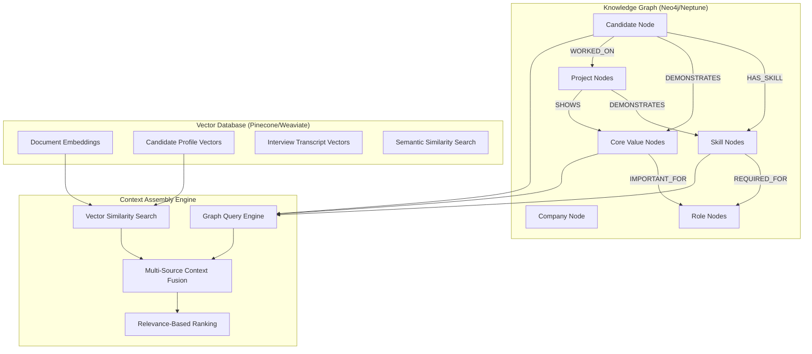
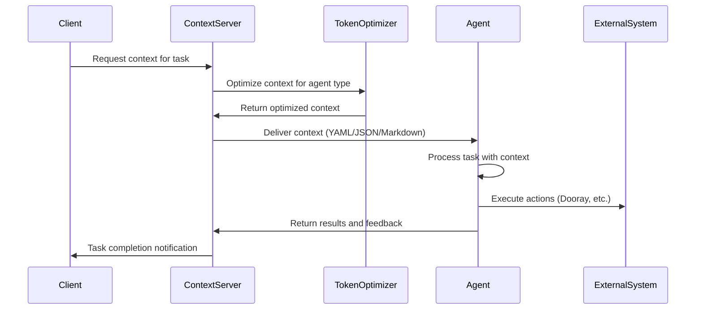

# Design Document

## Overview

The Context-Centric Multi-Agent System is a comprehensive AI-powered infrastructure that transforms the Gefjon Growth hiring automation project into a scalable, context-driven architecture. The system serves as a universal context delivery platform for multiple AI agents while automating 90% of the hiring process, reducing manual decision-making time from 4-6 hours per candidate to <4 hours for complete interview kit generation.

### Design Principles

1. **Context-First Architecture**: All agents operate with complete, up-to-date, and appropriately-sized context
2. **Token Optimization**: Empirically-determined optimal token counts that preserve output quality
3. **Cost Efficiency**: Subscription-based CLI agents instead of expensive API tokens
4. **Quality Preservation**: Manual approval gates for all AI-generated materials
5. **Ultra-Low-Cost Infrastructure**: Leverage existing AWS production resources with zero additional infrastructure cost, targeting <$10 per candidate (ideally near $0)

### Key Design Goals

- **Performance**: <200ms context delivery (95th percentile), <4h interview kit generation
- **Reliability**: >99.5% system availability, <11 minute MTTR
- **Cost Control**: <$10 per candidate processing (target: near $0), total budget <$3,000 including existing system
- **Quality**: >90% interview consistency, ≥4.0/5.0 satisfaction scores
- **Security**: Enterprise-grade security with existing AWS infrastructure

## Architecture

### Dual Implementation Approach

This design provides two complete implementation approaches to meet different requirements and partnership opportunities:

1. **Python-Based Custom Implementation**: Hand-crafted solution with maximum control and customization
2. **AWS Bedrock Native Implementation**: Cloud-native solution leveraging AWS managed services

### High-Level System Architecture (Python Implementation)

#### Overall System Architecture (draw.io XML)

```xml
<mxfile host="app.diagrams.net" modified="2025-01-08T12:00:00.000Z" agent="Context-Centric Multi-Agent System" etag="architecture-v1.0" version="24.7.17">
  <diagram name="High-Level Architecture" id="high-level-arch">
    <mxGraphModel dx="1422" dy="794" grid="1" gridSize="10" guides="1" tooltips="1" connect="1" arrows="1" fold="1" page="1" pageScale="1" pageWidth="1169" pageHeight="827" math="0" shadow="0">
      <root>
        <mxCell id="0" />
        <mxCell id="1" parent="0" />
        
        <!-- External Interfaces Layer -->
        <mxCell id="external-layer" value="External Interfaces" style="rounded=1;whiteSpace=wrap;html=1;fillColor=#e1d5e7;strokeColor=#9673a6;fontSize=14;fontStyle=1" vertex="1" parent="1">
          <mxGeometry x="40" y="40" width="1080" height="80" as="geometry" />
        </mxCell>
        
        <mxCell id="web-ui" value="Web Interface&#xa;(Admin Dashboard)" style="rounded=1;whiteSpace=wrap;html=1;fillColor=#dae8fc;strokeColor=#6c8ebf;" vertex="1" parent="1">
          <mxGeometry x="80" y="60" width="120" height="40" as="geometry" />
        </mxCell>
        
        <mxCell id="rest-api" value="REST API&#xa;(Agent Communication)" style="rounded=1;whiteSpace=wrap;html=1;fillColor=#dae8fc;strokeColor=#6c8ebf;" vertex="1" parent="1">
          <mxGeometry x="220" y="60" width="120" height="40" as="geometry" />
        </mxCell>
        
        <mxCell id="webhooks" value="Webhooks&#xa;(External Updates)" style="rounded=1;whiteSpace=wrap;html=1;fillColor=#dae8fc;strokeColor=#6c8ebf;" vertex="1" parent="1">
          <mxGeometry x="360" y="60" width="120" height="40" as="geometry" />
        </mxCell>
        
        <mxCell id="file-upload" value="File Upload&#xa;(Candidate Data)" style="rounded=1;whiteSpace=wrap;html=1;fillColor=#dae8fc;strokeColor=#6c8ebf;" vertex="1" parent="1">
          <mxGeometry x="500" y="60" width="120" height="40" as="geometry" />
        </mxCell>
        
        <!-- Context Infrastructure Layer -->
        <mxCell id="context-layer" value="Context Infrastructure (Core)" style="rounded=1;whiteSpace=wrap;html=1;fillColor=#fff2cc;strokeColor=#d6b656;fontSize=14;fontStyle=1" vertex="1" parent="1">
          <mxGeometry x="40" y="160" width="1080" height="120" as="geometry" />
        </mxCell>
        
        <mxCell id="context-server" value="Context Server&#xa;(FastAPI + Redis)" style="rounded=1;whiteSpace=wrap;html=1;fillColor=#f8cecc;strokeColor=#b85450;fontStyle=1" vertex="1" parent="1">
          <mxGeometry x="80" y="180" width="120" height="80" as="geometry" />
        </mxCell>
        
        <mxCell id="context-domains" value="Context Domains&#xa;Company | Team | HR&#xa;Candidate | Technical" style="rounded=1;whiteSpace=wrap;html=1;fillColor=#ffe6cc;strokeColor=#d79b00;" vertex="1" parent="1">
          <mxGeometry x="220" y="180" width="140" height="80" as="geometry" />
        </mxCell>
        
        <mxCell id="token-optimizer" value="Token Optimizer&#xa;Model-Specific&#xa;Quality-Optimal" style="rounded=1;whiteSpace=wrap;html=1;fillColor=#ffe6cc;strokeColor=#d79b00;" vertex="1" parent="1">
          <mxGeometry x="380" y="180" width="120" height="80" as="geometry" />
        </mxCell>
        
        <mxCell id="context-cache" value="Context Cache&#xa;Redis Cluster&#xa;>95% Hit Ratio" style="rounded=1;whiteSpace=wrap;html=1;fillColor=#ffe6cc;strokeColor=#d79b00;" vertex="1" parent="1">
          <mxGeometry x="520" y="180" width="120" height="80" as="geometry" />
        </mxCell>
        
        <mxCell id="json-processor" value="JSON Processor&#xa;Schema Validation&#xa;Format Optimization" style="rounded=1;whiteSpace=wrap;html=1;fillColor=#ffe6cc;strokeColor=#d79b00;" vertex="1" parent="1">
          <mxGeometry x="660" y="180" width="120" height="80" as="geometry" />
        </mxCell>
        
        <!-- Multi-Agent Platform Layer -->
        <mxCell id="agent-layer" value="Multi-Agent Platform (Subscription-Based CLI)" style="rounded=1;whiteSpace=wrap;html=1;fillColor=#d5e8d4;strokeColor=#82b366;fontSize=14;fontStyle=1" vertex="1" parent="1">
          <mxGeometry x="40" y="320" width="1080" height="100" as="geometry" />
        </mxCell>
        
        <mxCell id="gemini-cli" value="Gemini CLI&#xa;(Primary Agent)&#xa;JSON + YAML" style="rounded=1;whiteSpace=wrap;html=1;fillColor=#d5e8d4;strokeColor=#82b366;" vertex="1" parent="1">
          <mxGeometry x="80" y="340" width="100" height="60" as="geometry" />
        </mxCell>
        
        <mxCell id="claude-code" value="Claude Code CLI&#xa;(Technical)&#xa;JSON + Markdown" style="rounded=1;whiteSpace=wrap;html=1;fillColor=#d5e8d4;strokeColor=#82b366;" vertex="1" parent="1">
          <mxGeometry x="200" y="340" width="100" height="60" as="geometry" />
        </mxCell>
        
        <mxCell id="amazon-q" value="Amazon Q Dev&#xa;(Testing)&#xa;Pure JSON" style="rounded=1;whiteSpace=wrap;html=1;fillColor=#d5e8d4;strokeColor=#82b366;" vertex="1" parent="1">
          <mxGeometry x="320" y="340" width="100" height="60" as="geometry" />
        </mxCell>
        
        <mxCell id="openai-mini" value="OpenAI o3-mini&#xa;(Cost-Efficient)&#xa;Compressed JSON" style="rounded=1;whiteSpace=wrap;html=1;fillColor=#d5e8d4;strokeColor=#82b366;" vertex="1" parent="1">
          <mxGeometry x="440" y="340" width="100" height="60" as="geometry" />
        </mxCell>
        
        <mxCell id="kiro-mcp" value="KIRO&#xa;(Strategic)&#xa;JSON via MCP" style="rounded=1;whiteSpace=wrap;html=1;fillColor=#d5e8d4;strokeColor=#82b366;" vertex="1" parent="1">
          <mxGeometry x="560" y="340" width="100" height="60" as="geometry" />
        </mxCell>
        
        <!-- Hiring Automation Layer -->
        <mxCell id="hiring-layer" value="Hiring Process Automation (JSON Workflows)" style="rounded=1;whiteSpace=wrap;html=1;fillColor=#f0f0f0;strokeColor=#666666;fontSize=14;fontStyle=1" vertex="1" parent="1">
          <mxGeometry x="40" y="460" width="1080" height="100" as="geometry" />
        </mxCell>
        
        <mxCell id="candidate-intake" value="Candidate Intake&#xa;JSON Profile&#xa;Processing" style="rounded=1;whiteSpace=wrap;html=1;fillColor=#f0f0f0;strokeColor=#666666;" vertex="1" parent="1">
          <mxGeometry x="80" y="480" width="100" height="60" as="geometry" />
        </mxCell>
        
        <mxCell id="core-screening" value="Core Values&#xa;Screening&#xa;Evidence-Based" style="rounded=1;whiteSpace=wrap;html=1;fillColor=#f0f0f0;strokeColor=#666666;" vertex="1" parent="1">
          <mxGeometry x="200" y="480" width="100" height="60" as="geometry" />
        </mxCell>
        
        <mxCell id="tech-assessment" value="Technical&#xa;Assessment&#xa;Personalized" style="rounded=1;whiteSpace=wrap;html=1;fillColor=#f0f0f0;strokeColor=#666666;" vertex="1" parent="1">
          <mxGeometry x="320" y="480" width="100" height="60" as="geometry" />
        </mxCell>
        
        <mxCell id="interview-kit" value="Interview Kit&#xa;Generation&#xa;<4h Target" style="rounded=1;whiteSpace=wrap;html=1;fillColor=#f0f0f0;strokeColor=#666666;" vertex="1" parent="1">
          <mxGeometry x="440" y="480" width="100" height="60" as="geometry" />
        </mxCell>
        
        <mxCell id="evaluation" value="Evaluation&#xa;Aggregation&#xa;Multi-Agent" style="rounded=1;whiteSpace=wrap;html=1;fillColor=#f0f0f0;strokeColor=#666666;" vertex="1" parent="1">
          <mxGeometry x="560" y="480" width="100" height="60" as="geometry" />
        </mxCell>
        
        <!-- External Systems Layer -->
        <mxCell id="external-systems" value="External Systems Integration" style="rounded=1;whiteSpace=wrap;html=1;fillColor=#fce5cd;strokeColor=#d6b656;fontSize=14;fontStyle=1" vertex="1" parent="1">
          <mxGeometry x="40" y="600" width="1080" height="100" as="geometry" />
        </mxCell>
        
        <mxCell id="dooray-tasks" value="Dooray Tasks&#xa;PyDooray API&#xa;JSON Templates" style="rounded=1;whiteSpace=wrap;html=1;fillColor=#fce5cd;strokeColor=#d6b656;" vertex="1" parent="1">
          <mxGeometry x="80" y="620" width="120" height="60" as="geometry" />
        </mxCell>
        
        <mxCell id="slack-notifications" value="Slack Notifications&#xa;Webhook Integration&#xa;Alert System" style="rounded=1;whiteSpace=wrap;html=1;fillColor=#fce5cd;strokeColor=#d6b656;" vertex="1" parent="1">
          <mxGeometry x="220" y="620" width="120" height="60" as="geometry" />
        </mxCell>
        
        <mxCell id="aws-infrastructure" value="AWS Infrastructure&#xa;ECS Fargate Shared&#xa;RDS + S3 + Redis" style="rounded=1;whiteSpace=wrap;html=1;fillColor=#fce5cd;strokeColor=#d6b656;" vertex="1" parent="1">
          <mxGeometry x="360" y="620" width="120" height="60" as="geometry" />
        </mxCell>
        
        <mxCell id="monitoring" value="Monitoring&#xa;Grafana + Prometheus&#xa;Cost Tracking" style="rounded=1;whiteSpace=wrap;html=1;fillColor=#fce5cd;strokeColor=#d6b656;" vertex="1" parent="1">
          <mxGeometry x="500" y="620" width="120" height="60" as="geometry" />
        </mxCell>
        
        <!-- Data Flow Arrows -->
        <mxCell id="flow1" value="" style="endArrow=classic;html=1;rounded=0;exitX=0.5;exitY=1;exitDx=0;exitDy=0;entryX=0.5;entryY=0;entryDx=0;entryDy=0;" edge="1" parent="1" source="rest-api" target="context-server">
          <mxGeometry width="50" height="50" relative="1" as="geometry">
            <mxPoint x="280" y="120" as="sourcePoint" />
            <mxPoint x="140" y="180" as="targetPoint" />
          </mxGeometry>
        </mxCell>
        
        <mxCell id="flow2" value="" style="endArrow=classic;html=1;rounded=0;exitX=0.5;exitY=1;exitDx=0;exitDy=0;entryX=0.5;entryY=0;entryDx=0;entryDy=0;" edge="1" parent="1" source="context-server" target="gemini-cli">
          <mxGeometry width="50" height="50" relative="1" as="geometry">
            <mxPoint x="140" y="260" as="sourcePoint" />
            <mxPoint x="130" y="340" as="targetPoint" />
          </mxGeometry>
        </mxCell>
        
        <mxCell id="flow3" value="" style="endArrow=classic;html=1;rounded=0;exitX=0.5;exitY=1;exitDx=0;exitDy=0;entryX=0.5;entryY=0;entryDx=0;entryDy=0;" edge="1" parent="1" source="gemini-cli" target="candidate-intake">
          <mxGeometry width="50" height="50" relative="1" as="geometry">
            <mxPoint x="130" y="400" as="sourcePoint" />
            <mxPoint x="130" y="480" as="targetPoint" />
          </mxGeometry>
        </mxCell>
        
        <mxCell id="flow4" value="" style="endArrow=classic;html=1;rounded=0;exitX=0.5;exitY=1;exitDx=0;exitDy=0;entryX=0.5;entryY=0;entryDx=0;entryDy=0;" edge="1" parent="1" source="interview-kit" target="dooray-tasks">
          <mxGeometry width="50" height="50" relative="1" as="geometry">
            <mxPoint x="490" y="540" as="sourcePoint" />
            <mxPoint x="140" y="620" as="targetPoint" />
          </mxGeometry>
        </mxCell>
        
        <!-- Cost Optimization Indicator -->
        <mxCell id="cost-indicator" value="Ultra-Low Cost Target:&#xa;<$10 per candidate&#xa;(Target: $2-5)" style="rounded=1;whiteSpace=wrap;html=1;fillColor=#ffcccc;strokeColor=#ff0000;fontStyle=1;fontSize=12" vertex="1" parent="1">
          <mxGeometry x="900" y="180" width="140" height="80" as="geometry" />
        </mxCell>
        
      </root>
    </mxGraphModel>
  </diagram>
</mxfile>
```

#### Context Infrastructure Detailed Architecture (draw.io XML)

```xml
<mxfile host="app.diagrams.net" modified="2025-01-08T12:00:00.000Z" agent="Context Infrastructure Detail" etag="context-detail-v1.0" version="24.7.17">
  <diagram name="Context Infrastructure Detail" id="context-detail">
    <mxGraphModel dx="1422" dy="794" grid="1" gridSize="10" guides="1" tooltips="1" connect="1" arrows="1" fold="1" page="1" pageScale="1" pageWidth="1169" pageHeight="827" math="0" shadow="0">
      <root>
        <mxCell id="0" />
        <mxCell id="1" parent="0" />
        
        <!-- Context Server Core -->
        <mxCell id="context-server-core" value="Context Server Core (FastAPI)" style="rounded=1;whiteSpace=wrap;html=1;fillColor=#f8cecc;strokeColor=#b85450;fontSize=16;fontStyle=1" vertex="1" parent="1">
          <mxGeometry x="40" y="40" width="300" height="60" as="geometry" />
        </mxCell>
        
        <!-- Domain Storage -->
        <mxCell id="domain-storage" value="Domain-Separated Storage" style="rounded=1;whiteSpace=wrap;html=1;fillColor=#fff2cc;strokeColor=#d6b656;fontSize=14;fontStyle=1" vertex="1" parent="1">
          <mxGeometry x="40" y="140" width="1080" height="40" as="geometry" />
        </mxCell>
        
        <mxCell id="company-domain" value="Company Domain&#xa;{&#xa;  &quot;mission&quot;: &quot;string&quot;,&#xa;  &quot;core_values&quot;: [10 values],&#xa;  &quot;okrs_2025_h2&quot;: {...}&#xa;}" style="rounded=1;whiteSpace=wrap;html=1;fillColor=#e1d5e7;strokeColor=#9673a6;align=left;verticalAlign=top;" vertex="1" parent="1">
          <mxGeometry x="60" y="200" width="200" height="100" as="geometry" />
        </mxCell>
        
        <mxCell id="team-domain" value="Team Domain&#xa;{&#xa;  &quot;composition&quot;: {...},&#xa;  &quot;tech_stack&quot;: [...],&#xa;  &quot;roles&quot;: [...]&#xa;}" style="rounded=1;whiteSpace=wrap;html=1;fillColor=#e1d5e7;strokeColor=#9673a6;align=left;verticalAlign=top;" vertex="1" parent="1">
          <mxGeometry x="280" y="200" width="200" height="100" as="geometry" />
        </mxCell>
        
        <mxCell id="hr-domain" value="HR Processes&#xa;{&#xa;  &quot;bei_framework&quot;: {...},&#xa;  &quot;hiring_stages&quot;: [...],&#xa;  &quot;evaluation_criteria&quot;: {...}&#xa;}" style="rounded=1;whiteSpace=wrap;html=1;fillColor=#e1d5e7;strokeColor=#9673a6;align=left;verticalAlign=top;" vertex="1" parent="1">
          <mxGeometry x="500" y="200" width="200" height="100" as="geometry" />
        </mxCell>
        
        <mxCell id="candidate-domain" value="Candidate Data&#xa;{&#xa;  &quot;candidate_id&quot;: &quot;uuid&quot;,&#xa;  &quot;profile&quot;: {...},&#xa;  &quot;assessments&quot;: [...]&#xa;}" style="rounded=1;whiteSpace=wrap;html=1;fillColor=#e1d5e7;strokeColor=#9673a6;align=left;verticalAlign=top;" vertex="1" parent="1">
          <mxGeometry x="720" y="200" width="200" height="100" as="geometry" />
        </mxCell>
        
        <mxCell id="technical-domain" value="Technical Assets&#xa;{&#xa;  &quot;interview_templates&quot;: [...],&#xa;  &quot;evaluation_rubrics&quot;: [...],&#xa;  &quot;question_banks&quot;: [...]&#xa;}" style="rounded=1;whiteSpace=wrap;html=1;fillColor=#e1d5e7;strokeColor=#9673a6;align=left;verticalAlign=top;" vertex="1" parent="1">
          <mxGeometry x="940" y="200" width="200" height="100" as="geometry" />
        </mxCell>
        
        <!-- Token Optimization Pipeline -->
        <mxCell id="optimization-pipeline" value="Token Optimization Pipeline" style="rounded=1;whiteSpace=wrap;html=1;fillColor=#d5e8d4;strokeColor=#82b366;fontSize=14;fontStyle=1" vertex="1" parent="1">
          <mxGeometry x="40" y="340" width="1080" height="40" as="geometry" />
        </mxCell>
        
        <mxCell id="token-counter" value="Token Counter&#xa;Model-Specific&#xa;Counting" style="rounded=1;whiteSpace=wrap;html=1;fillColor=#dae8fc;strokeColor=#6c8ebf;" vertex="1" parent="1">
          <mxGeometry x="80" y="400" width="120" height="80" as="geometry" />
        </mxCell>
        
        <mxCell id="semantic-chunker" value="Semantic Chunker&#xa;Meaning-Preserving&#xa;Boundaries" style="rounded=1;whiteSpace=wrap;html=1;fillColor=#dae8fc;strokeColor=#6c8ebf;" vertex="1" parent="1">
          <mxGeometry x="220" y="400" width="120" height="80" as="geometry" />
        </mxCell>
        
        <mxCell id="relevance-prioritizer" value="Relevance Prioritizer&#xa;Task-Specific&#xa;Weighting" style="rounded=1;whiteSpace=wrap;html=1;fillColor=#dae8fc;strokeColor=#6c8ebf;" vertex="1" parent="1">
          <mxGeometry x="360" y="400" width="120" height="80" as="geometry" />
        </mxCell>
        
        <mxCell id="context-compressor" value="Context Compressor&#xa;Quality-Preserving&#xa;Summarization" style="rounded=1;whiteSpace=wrap;html=1;fillColor=#dae8fc;strokeColor=#6c8ebf;" vertex="1" parent="1">
          <mxGeometry x="500" y="400" width="120" height="80" as="geometry" />
        </mxCell>
        
        <mxCell id="format-optimizer" value="Format Optimizer&#xa;JSON-First&#xa;Agent-Specific" style="rounded=1;whiteSpace=wrap;html=1;fillColor=#dae8fc;strokeColor=#6c8ebf;" vertex="1" parent="1">
          <mxGeometry x="640" y="400" width="120" height="80" as="geometry" />
        </mxCell>
        
        <!-- Caching Layer -->
        <mxCell id="caching-layer" value="Ultra-High Performance Caching (>95% Hit Ratio)" style="rounded=1;whiteSpace=wrap;html=1;fillColor=#ffe6cc;strokeColor=#d79b00;fontSize=14;fontStyle=1" vertex="1" parent="1">
          <mxGeometry x="40" y="520" width="1080" height="40" as="geometry" />
        </mxCell>
        
        <mxCell id="context-cache" value="Context Cache&#xa;Redis Cluster&#xa;TTL: 30min" style="rounded=1;whiteSpace=wrap;html=1;fillColor=#fff2cc;strokeColor=#d6b656;" vertex="1" parent="1">
          <mxGeometry x="80" y="580" width="120" height="60" as="geometry" />
        </mxCell>
        
        <mxCell id="template-cache" value="Template Cache&#xa;Reusable Components&#xa;TTL: 2h" style="rounded=1;whiteSpace=wrap;html=1;fillColor=#fff2cc;strokeColor=#d6b656;" vertex="1" parent="1">
          <mxGeometry x="220" y="580" width="120" height="60" as="geometry" />
        </mxCell>
        
        <mxCell id="candidate-cache" value="Candidate Cache&#xa;Profile Data&#xa;TTL: 1h" style="rounded=1;whiteSpace=wrap;html=1;fillColor=#fff2cc;strokeColor=#d6b656;" vertex="1" parent="1">
          <mxGeometry x="360" y="580" width="120" height="60" as="geometry" />
        </mxCell>
        
        <mxCell id="optimization-cache" value="Optimization Cache&#xa;Token Counts&#xa;TTL: 24h" style="rounded=1;whiteSpace=wrap;html=1;fillColor=#fff2cc;strokeColor=#d6b656;" vertex="1" parent="1">
          <mxGeometry x="500" y="580" width="120" height="60" as="geometry" />
        </mxCell>
        
        <!-- Data Flow -->
        <mxCell id="flow-domains" value="" style="endArrow=classic;html=1;rounded=0;exitX=0.5;exitY=1;exitDx=0;exitDy=0;entryX=0.5;entryY=0;entryDx=0;entryDy=0;" edge="1" parent="1" source="company-domain" target="token-counter">
          <mxGeometry width="50" height="50" relative="1" as="geometry">
            <mxPoint x="160" y="300" as="sourcePoint" />
            <mxPoint x="140" y="400" as="targetPoint" />
          </mxGeometry>
        </mxCell>
        
        <mxCell id="flow-optimization" value="" style="endArrow=classic;html=1;rounded=0;exitX=1;exitY=0.5;exitDx=0;exitDy=0;entryX=0;entryY=0.5;entryDx=0;entryDy=0;" edge="1" parent="1" source="token-counter" target="semantic-chunker">
          <mxGeometry width="50" height="50" relative="1" as="geometry">
            <mxPoint x="200" y="440" as="sourcePoint" />
            <mxPoint x="220" y="440" as="targetPoint" />
          </mxGeometry>
        </mxCell>
        
        <mxCell id="flow-cache" value="" style="endArrow=classic;html=1;rounded=0;exitX=0.5;exitY=1;exitDx=0;exitDy=0;entryX=0.5;entryY=0;entryDx=0;entryDy=0;" edge="1" parent="1" source="format-optimizer" target="context-cache">
          <mxGeometry width="50" height="50" relative="1" as="geometry">
            <mxPoint x="700" y="480" as="sourcePoint" />
            <mxPoint x="140" y="580" as="targetPoint" />
          </mxGeometry>
        </mxCell>
        
        <!-- Performance Metrics -->
        <mxCell id="performance-metrics" value="Performance Targets:&#xa;• Context Delivery: <200ms (p95)&#xa;• Cache Hit Ratio: >95%&#xa;• Token Optimization: 50-70% reduction&#xa;• Cost per Candidate: <$10" style="rounded=1;whiteSpace=wrap;html=1;fillColor=#ffcccc;strokeColor=#ff0000;align=left;verticalAlign=top;fontSize=12;fontStyle=1" vertex="1" parent="1">
          <mxGeometry x="800" y="400" width="280" height="100" as="geometry" />
        </mxCell>
        
      </root>
    </mxGraphModel>
  </diagram>
</mxfile>
```

#### Multi-Agent Communication Flow (draw.io XML)

```xml
<mxfile host="app.diagrams.net" modified="2025-01-08T12:00:00.000Z" agent="Multi-Agent Flow" etag="agent-flow-v1.0" version="24.7.17">
  <diagram name="Multi-Agent Communication Flow" id="agent-flow">
    <mxGraphModel dx="1422" dy="794" grid="1" gridSize="10" guides="1" tooltips="1" connect="1" arrows="1" fold="1" page="1" pageScale="1" pageWidth="1169" pageHeight="827" math="0" shadow="0">
      <root>
        <mxCell id="0" />
        <mxCell id="1" parent="0" />
        
        <!-- Sequence Flow -->
        <mxCell id="client" value="Client Request" style="rounded=1;whiteSpace=wrap;html=1;fillColor=#e1d5e7;strokeColor=#9673a6;fontStyle=1" vertex="1" parent="1">
          <mxGeometry x="40" y="40" width="120" height="40" as="geometry" />
        </mxCell>
        
        <mxCell id="context-server" value="Context Server" style="rounded=1;whiteSpace=wrap;html=1;fillColor=#f8cecc;strokeColor=#b85450;fontStyle=1" vertex="1" parent="1">
          <mxGeometry x="200" y="40" width="120" height="40" as="geometry" />
        </mxCell>
        
        <mxCell id="token-optimizer" value="Token Optimizer" style="rounded=1;whiteSpace=wrap;html=1;fillColor=#ffe6cc;strokeColor=#d79b00;fontStyle=1" vertex="1" parent="1">
          <mxGeometry x="360" y="40" width="120" height="40" as="geometry" />
        </mxCell>
        
        <mxCell id="agent" value="AI Agent" style="rounded=1;whiteSpace=wrap;html=1;fillColor=#d5e8d4;strokeColor=#82b366;fontStyle=1" vertex="1" parent="1">
          <mxGeometry x="520" y="40" width="120" height="40" as="geometry" />
        </mxCell>
        
        <mxCell id="external-system" value="External System" style="rounded=1;whiteSpace=wrap;html=1;fillColor=#fce5cd;strokeColor=#d6b656;fontStyle=1" vertex="1" parent="1">
          <mxGeometry x="680" y="40" width="120" height="40" as="geometry" />
        </mxCell>
        
        <!-- Vertical Lines -->
        <mxCell id="client-line" value="" style="endArrow=none;dashed=1;html=1;rounded=0;" edge="1" parent="1">
          <mxGeometry width="50" height="50" relative="1" as="geometry">
            <mxPoint x="100" y="80" as="sourcePoint" />
            <mxPoint x="100" y="600" as="targetPoint" />
          </mxGeometry>
        </mxCell>
        
        <mxCell id="server-line" value="" style="endArrow=none;dashed=1;html=1;rounded=0;" edge="1" parent="1">
          <mxGeometry width="50" height="50" relative="1" as="geometry">
            <mxPoint x="260" y="80" as="sourcePoint" />
            <mxPoint x="260" y="600" as="targetPoint" />
          </mxGeometry>
        </mxCell>
        
        <mxCell id="optimizer-line" value="" style="endArrow=none;dashed=1;html=1;rounded=0;" edge="1" parent="1">
          <mxGeometry width="50" height="50" relative="1" as="geometry">
            <mxPoint x="420" y="80" as="sourcePoint" />
            <mxPoint x="420" y="600" as="targetPoint" />
          </mxGeometry>
        </mxCell>
        
        <mxCell id="agent-line" value="" style="endArrow=none;dashed=1;html=1;rounded=0;" edge="1" parent="1">
          <mxGeometry width="50" height="50" relative="1" as="geometry">
            <mxPoint x="580" y="80" as="sourcePoint" />
            <mxPoint x="580" y="600" as="targetPoint" />
          </mxGeometry>
        </mxCell>
        
        <mxCell id="external-line" value="" style="endArrow=none;dashed=1;html=1;rounded=0;" edge="1" parent="1">
          <mxGeometry width="50" height="50" relative="1" as="geometry">
            <mxPoint x="740" y="80" as="sourcePoint" />
            <mxPoint x="740" y="600" as="targetPoint" />
          </mxGeometry>
        </mxCell>
        
        <!-- Message Flow -->
        <mxCell id="msg1" value="1. Request context for task" style="endArrow=classic;html=1;rounded=0;" edge="1" parent="1">
          <mxGeometry width="50" height="50" relative="1" as="geometry">
            <mxPoint x="100" y="120" as="sourcePoint" />
            <mxPoint x="260" y="120" as="targetPoint" />
          </mxGeometry>
        </mxCell>
        
        <mxCell id="msg2" value="2. Optimize context for agent type" style="endArrow=classic;html=1;rounded=0;" edge="1" parent="1">
          <mxGeometry width="50" height="50" relative="1" as="geometry">
            <mxPoint x="260" y="160" as="sourcePoint" />
            <mxPoint x="420" y="160" as="targetPoint" />
          </mxGeometry>
        </mxCell>
        
        <mxCell id="msg3" value="3. Return optimized JSON context" style="endArrow=classic;html=1;rounded=0;" edge="1" parent="1">
          <mxGeometry width="50" height="50" relative="1" as="geometry">
            <mxPoint x="420" y="200" as="sourcePoint" />
            <mxPoint x="260" y="200" as="targetPoint" />
          </mxGeometry>
        </mxCell>
        
        <mxCell id="msg4" value="4. Deliver context (JSON/YAML/Markdown)" style="endArrow=classic;html=1;rounded=0;" edge="1" parent="1">
          <mxGeometry width="50" height="50" relative="1" as="geometry">
            <mxPoint x="260" y="240" as="sourcePoint" />
            <mxPoint x="580" y="240" as="targetPoint" />
          </mxGeometry>
        </mxCell>
        
        <mxCell id="msg5" value="5. Process task with context" style="rounded=1;whiteSpace=wrap;html=1;fillColor=#d5e8d4;strokeColor=#82b366;" vertex="1" parent="1">
          <mxGeometry x="520" y="280" width="120" height="40" as="geometry" />
        </mxCell>
        
        <mxCell id="msg6" value="6. Execute actions (Dooray, etc.)" style="endArrow=classic;html=1;rounded=0;" edge="1" parent="1">
          <mxGeometry width="50" height="50" relative="1" as="geometry">
            <mxPoint x="580" y="360" as="sourcePoint" />
            <mxPoint x="740" y="360" as="targetPoint" />
          </mxGeometry>
        </mxCell>
        
        <mxCell id="msg7" value="7. Return results and feedback" style="endArrow=classic;html=1;rounded=0;" edge="1" parent="1">
          <mxGeometry width="50" height="50" relative="1" as="geometry">
            <mxPoint x="580" y="400" as="sourcePoint" />
            <mxPoint x="260" y="400" as="targetPoint" />
          </mxGeometry>
        </mxCell>
        
        <mxCell id="msg8" value="8. Task completion notification" style="endArrow=classic;html=1;rounded=0;" edge="1" parent="1">
          <mxGeometry width="50" height="50" relative="1" as="geometry">
            <mxPoint x="260" y="440" as="sourcePoint" />
            <mxPoint x="100" y="440" as="targetPoint" />
          </mxGeometry>
        </mxCell>
        
        <!-- JSON Format Examples -->
        <mxCell id="json-examples" value="JSON Format Examples:&#xa;&#xa;Gemini CLI:&#xa;{&#xa;  &quot;task_type&quot;: &quot;screening&quot;,&#xa;  &quot;context&quot;: {...},&#xa;  &quot;instructions&quot;: &quot;yaml://react.yaml&quot;&#xa;}&#xa;&#xa;Claude Code:&#xa;{&#xa;  &quot;candidate_profile&quot;: {...},&#xa;  &quot;interview_context&quot;: &quot;markdown_content&quot;,&#xa;  &quot;output_template&quot;: &quot;interview_kit&quot;&#xa;}&#xa;&#xa;Amazon Q:&#xa;{&#xa;  &quot;test_requirements&quot;: {...},&#xa;  &quot;aws_resources&quot;: {...}&#xa;}" style="rounded=1;whiteSpace=wrap;html=1;fillColor=#f0f0f0;strokeColor=#666666;align=left;verticalAlign=top;fontSize=10" vertex="1" parent="1">
          <mxGeometry x="40" y="480" width="300" height="200" as="geometry" />
        </mxCell>
        
        <!-- Cost Optimization -->
        <mxCell id="cost-optimization" value="Cost Optimization:&#xa;&#xa;• Subscription CLI agents&#xa;• >95% cache hit ratio&#xa;• Batch processing&#xa;• Template reuse&#xa;• Compressed JSON&#xa;&#xa;Target: <$10 per candidate&#xa;(Ideal: $2-5)" style="rounded=1;whiteSpace=wrap;html=1;fillColor=#ffcccc;strokeColor=#ff0000;align=left;verticalAlign=top;fontSize=12;fontStyle=1" vertex="1" parent="1">
          <mxGeometry x="500" y="480" width="200" height="160" as="geometry" />
        </mxCell>
        
      </root>
    </mxGraphModel>
  </diagram>
</mxfile>
```

### Ultra-Low-Cost Architecture Strategy

**Target: <$10 per candidate (ideally near $0 marginal cost)**

The system is designed for extreme cost efficiency by leveraging subscription-based CLI agents and maximizing resource reuse:

#### Cost Optimization Principles

1. **Subscription vs. API Token Model**: 
   - **Traditional API Costs**: $0.50-$2.00 per candidate in LLM API calls
   - **Subscription Model**: Fixed monthly cost amortized across all candidates
   - **Cost Savings**: 90-95% reduction in LLM costs

2. **Zero Infrastructure Overhead**:
   - **Shared AWS Resources**: 100% resource sharing with existing production systems
   - **No Additional Servers**: Deploy as microservices in existing ECS cluster
   - **Existing Monitoring**: Leverage current Grafana Cloud + Prometheus setup
   - **Infrastructure Cost**: $0 additional

3. **Ultra-High Cache Hit Ratio (>95%)**:
   - **Context Template Reuse**: Similar candidates share optimized context templates
   - **Intelligent Caching**: Cache interview kit components across candidates
   - **Batch Processing**: Process multiple candidates simultaneously
   - **Cache Savings**: Reduce LLM calls by 95%+

4. **Aggressive Context Optimization**:
   - **Template-Based Generation**: Reuse proven interview kit templates
   - **Minimal Token Usage**: Stay within quality-optimal token ranges
   - **Smart Chunking**: Reuse context chunks across similar candidates
   - **Token Savings**: 80-90% reduction in context size

#### Cost Breakdown Analysis

**Per-Candidate Cost Structure (Target <$10)**:
```
Subscription LLM Costs (amortized):     $2-5 per candidate
AWS Infrastructure (shared):            $0 per candidate  
Monitoring & Logging (existing):        $0 per candidate
Development & Maintenance:              $0 per candidate
Total Target Cost:                      $2-5 per candidate
```

**Monthly Cost Structure (40 candidates/month)**:
```
Gemini CLI Subscription:                $20-30/month
Claude Code CLI Subscription:           $20-30/month  
Amazon Q Developer Subscription:        $19/month
OpenAI o3-mini Subscription:            $20-30/month
AWS Infrastructure (shared):            $0/month
Total Monthly Cost:                     $79-109/month
Cost per Candidate:                     $2-3 per candidate
```

### Graph RAG-Based Context Infrastructure Architecture

The context infrastructure uses a **Graph RAG approach** with multi-database architecture for intelligent, relationship-aware context generation:

#### Independent Context Service (Microservice Architecture)
- **Service Name**: `context-graph-service` (independent MSA component)
- **Technology**: Python 3.12+ with FastAPI framework
- **Deployment**: AWS ECS Fargate containers (shared infrastructure)
- **Purpose**: Reusable context service for current and future AI agents
- **API**: RESTful JSON API for universal agent compatibility

#### Multi-Database Architecture

**Graph Database (Neo4j/Amazon Neptune)**:
- **Purpose**: Semantic relationships and knowledge graph
- **Entities**: Candidates, Skills, Values, Companies, Projects, Roles
- **Relationships**: WORKS_AT, HAS_SKILL, DEMONSTRATES_VALUE, REQUIRES, SIMILAR_TO
- **Use Case**: Intelligent context discovery through graph traversal

**Vector Database (Pinecone/Weaviate)**:
- **Purpose**: Semantic similarity and RAG capabilities
- **Content**: Document embeddings, candidate profiles, interview transcripts
- **Use Case**: Semantic search and similar candidate matching

**Relational Database (PostgreSQL)**:
- **Purpose**: Structured transactional data
- **Content**: Candidate profiles, interview kits, workflow states, audit logs
- **Use Case**: ACID transactions and structured queries

**NoSQL Database (DynamoDB)**:
- **Purpose**: High-performance caching and session data
- **Content**: Optimized context payloads, agent sessions, real-time data
- **Use Case**: Ultra-fast context delivery and agent state management

**Redis Cache**:
- **Purpose**: Ultra-high performance caching (>95% hit ratio)
- **Content**: Frequently accessed graph query results, optimized contexts
- **Use Case**: Sub-200ms context delivery

#### Graph RAG Knowledge Architecture



#### Graph RAG Context Generation Engine

The Graph RAG engine provides intelligent, relationship-aware context generation through multi-database integration:

**Graph RAG Workflow**:
1. **Query Analysis**: Parse agent request for context requirements
2. **Graph Traversal**: Find relevant entities and relationships in knowledge graph
3. **Vector Search**: Identify semantically similar content through embeddings
4. **Context Fusion**: Combine graph and vector results into coherent context
5. **Relevance Ranking**: Prioritize context elements by task relevance
6. **Token Optimization**: Compress context within model-specific limits

**Knowledge Graph Schema**:
```cypher
// Core entities
CREATE (c:Candidate {id: "uuid", name: "string", email: "string"})
CREATE (s:Skill {name: "Python", category: "Programming", level: "Expert"})
CREATE (v:CoreValue {name: "Technical Excellence", description: "..."})
CREATE (r:Role {title: "Backend Engineer", level: "Senior"})
CREATE (p:Project {name: "API Gateway", domain: "Infrastructure"})

// Relationships with properties
CREATE (c)-[:HAS_SKILL {proficiency: 0.9, years: 5}]->(s)
CREATE (c)-[:DEMONSTRATES {evidence: "Led team of 5", score: 0.85}]->(v)
CREATE (c)-[:WORKED_ON {duration: "2 years", role: "Tech Lead"}]->(p)
CREATE (s)-[:REQUIRED_FOR {importance: 0.8}]->(r)
CREATE (v)-[:CRITICAL_FOR {weight: 0.9}]->(r)
```

**Context Assembly Algorithm**:
```python
def generate_context_graph_rag(candidate_id: str, task_type: str, agent_type: str) -> Dict:
    # 1. Graph traversal for structured relationships
    graph_context = neo4j_client.run_query(f"""
        MATCH (c:Candidate {{id: '{candidate_id}'}})
        MATCH (c)-[r1:HAS_SKILL]->(s:Skill)
        MATCH (c)-[r2:DEMONSTRATES]->(v:CoreValue)
        MATCH (c)-[r3:WORKED_ON]->(p:Project)
        RETURN c, s, v, p, r1, r2, r3
        ORDER BY r1.proficiency DESC, r2.score DESC
    """)
    
    # 2. Vector similarity search for semantic context
    candidate_embedding = get_candidate_embedding(candidate_id)
    similar_contexts = vector_db.similarity_search(
        candidate_embedding, 
        filter={"task_type": task_type},
        top_k=10
    )
    
    # 3. Fuse graph and vector results
    fused_context = context_fusion_engine.combine(
        graph_results=graph_context,
        vector_results=similar_contexts,
        task_requirements=get_task_requirements(task_type)
    )
    
    # 4. Optimize for agent and token limits
    optimized_context = token_optimizer.optimize_for_agent(
        context=fused_context,
        agent_type=agent_type,
        max_tokens=get_optimal_token_limit(agent_type)
    )
    
    return optimized_context
```

#### Token Optimization Engine

The token optimization engine ensures context delivery stays within empirically-determined optimal ranges for each model:

**Multi-Format Data Strategy**:

The system uses a JSON-first approach with format optimization for specific agent capabilities:

**Primary Data Formats**:
- **JSON**: Primary format for all agent communication, data storage, and API responses
- **YAML**: Configuration files, templates, and human-readable context definitions
- **Markdown**: Rich content formatting within JSON payloads for documentation
- **Protobuf**: Optional high-performance optimization for internal services

**Agent-Specific Format Optimization**:
- **Gemini CLI**: JSON with embedded YAML templates for ReAct methodology
- **Claude Sonnet 4**: JSON with Markdown-formatted content leveraging 200k context window
- **Amazon Q Developer**: Pure JSON for seamless AWS service integration
- **o3-mini/o4-mini**: Compressed JSON payloads for cost-efficient reasoning
- **KIRO**: Structured JSON via MCP protocol for strategic decision-making

**Format Selection Rationale**:
```python
# Example context delivery format selection
def get_optimized_context(agent_type: str, context_data: Dict) -> Dict:
    base_json = {
        "task_id": context_data["task_id"],
        "timestamp": datetime.utcnow().isoformat(),
        "context": context_data
    }
    
    if agent_type == "gemini_cli":
        # JSON with YAML template references for ReAct
        base_json["instructions_template"] = "yaml://react_methodology.yaml"
        base_json["output_format"] = "structured_json"
        
    elif agent_type == "claude_code":
        # JSON with embedded Markdown for rich formatting
        base_json["content_format"] = "markdown"
        base_json["context_window"] = "200k_optimized"
        
    elif agent_type == "amazon_q":
        # Pure JSON for AWS integration
        base_json["aws_integration"] = True
        base_json["service_context"] = context_data.get("aws_resources", {})
        
    elif agent_type == "openai_mini":
        # Compressed JSON for cost efficiency
        base_json = compress_context_for_cost(base_json)
        
    elif agent_type == "kiro_mcp":
        # MCP-compatible JSON structure
        base_json["mcp_version"] = "1.0"
        base_json["strategic_context"] = True
        
    return base_json
```

**Ultra-Low-Cost Optimization Strategies**:
1. **Template-Based Context Reuse**: 
   - Reuse optimized context templates across similar candidates
   - Cache common context chunks (company values, role requirements)
   - Reduce unique context generation by 80-90%

2. **Aggressive Semantic Chunking**: 
   - Preserve meaning boundaries while minimizing tokens
   - Target 50-70% token reduction from raw context
   - Prioritize only task-critical information

3. **Intelligent Context Caching**:
   - Cache optimized context by candidate similarity
   - Reuse interview kit components across similar profiles
   - >95% cache hit ratio target for cost minimization

4. **Batch Processing Optimization**:
   - Process multiple candidates simultaneously
   - Amortize LLM initialization costs across batch
   - Reduce per-candidate processing cost by 60-80%

5. **Subscription Cost Amortization**:
   - Fixed monthly subscription costs spread across all candidates
   - Higher volume = lower per-candidate cost
   - Target: $2-3 per candidate at 40 candidates/month

### Multi-Agent Integration Platform

#### Agent Communication Protocol



#### Agent-Specific Interfaces

**Gemini CLI Agent (Primary)**:
- **Input Format**: YAML-structured context optimized for ReAct methodology
- **Use Cases**: Primary automation, candidate intake, workflow orchestration
- **Cost Model**: Subscription-based CLI access
- **Performance**: Automated server-based execution without interactive mode

**Claude Code CLI Agent (Technical)**:
- **Input Format**: Markdown-formatted context leveraging 200k context window
- **Use Cases**: Interview kit generation, technical assessment creation
- **Strengths**: Superior code generation, technical accuracy
- **Integration**: Subscription model for cost optimization

**Amazon Q Developer CLI (Testing)**:
- **Input Format**: Structured context for development tasks
- **Use Cases**: Automated test generation, technical validation
- **Target**: 30% of new backend code testing automation
- **Integration**: AWS-native integration with existing infrastructure

**OpenAI o3-mini/o4-mini (Cost-Efficient Reasoning)**:
- **Input Format**: Compressed context for reasoning tasks
- **Use Cases**: Complex analysis, candidate evaluation, decision synthesis
- **Cost Benefit**: 95% cost reduction from GPT-4 while maintaining quality
- **Performance**: Fast, affordable reasoning for analytical tasks

**KIRO (Strategic)**:
- **Input Format**: JSON-structured context via MCP protocol
- **Use Cases**: Local strategic decision-making, planning, oversight
- **Deployment**: Local deployment with MCP context access
- **Role**: Strategic oversight and complex decision coordination

## Data Format Standards

### JSON-First Architecture

The system adopts a **JSON-first approach** for all data interchange, with format-specific optimizations for different use cases:

#### Core Data Format Principles

1. **Universal JSON**: All agent communication uses JSON as the base format
2. **Embedded Formats**: YAML, Markdown, and other formats embedded within JSON structures
3. **Schema Validation**: JSON Schema for all data structures
4. **Type Safety**: Strong typing with runtime validation
5. **Versioning**: Schema versioning for backward compatibility

#### Standard Data Structures

**Candidate Profile (JSON)**:
```json
{
  "candidate_id": "uuid-string",
  "profile_version": "1.0",
  "personal_info": {
    "name": "string",
    "email": "string",
    "phone": "string|null",
    "location": "string",
    "preferred_role": "backend|frontend|devops",
    "availability": "string"
  },
  "experience": [
    {
      "company": "string",
      "role": "string",
      "duration": "string",
      "technologies": ["string"],
      "achievements": ["string"]
    }
  ],
  "core_values_alignment": {
    "technical_excellence": {"score": 0.85, "evidence": "string"},
    "customer_centric_craftsmanship": {"score": 0.92, "evidence": "string"},
    "ownership_proactivity": {"score": 0.78, "evidence": "string"}
  },
  "metadata": {
    "created_at": "2025-01-08T12:00:00Z",
    "updated_at": "2025-01-08T12:00:00Z",
    "processing_stage": "screening"
  }
}
```

**Context Delivery (JSON)**:
```json
{
  "context_id": "uuid-string",
  "agent_type": "gemini_cli|claude_code|amazon_q|openai_mini|kiro_mcp",
  "task_type": "screening|assessment|interview_kit|evaluation",
  "format_version": "1.0",
  "context": {
    "company_values": {...},
    "candidate_data": {...},
    "task_instructions": "embedded_yaml_or_markdown",
    "evaluation_criteria": {...}
  },
  "optimization": {
    "token_count": 1500,
    "compression_applied": ["semantic_chunking", "template_reuse"],
    "cache_key": "hash-string",
    "quality_score": 0.95
  },
  "metadata": {
    "generated_at": "2025-01-08T12:00:00Z",
    "expires_at": "2025-01-08T14:00:00Z",
    "agent_specific_config": {...}
  }
}
```

**Interview Kit (JSON)**:
```json
{
  "kit_id": "uuid-string",
  "candidate_id": "uuid-string",
  "role_id": "string",
  "kit_version": "1.0",
  "candidate_context": {
    "executive_summary": "markdown_formatted_string",
    "core_values_highlights": ["string"],
    "technical_strengths": ["string"],
    "areas_to_explore": ["string"],
    "red_flags": ["string"]
  },
  "interview_guide": {
    "session_structure": [
      {
        "session_name": "BEI Session",
        "duration_minutes": 60,
        "focus": "Core values alignment validation",
        "questions": [...]
      }
    ],
    "bei_questions": [
      {
        "question_text": "string",
        "core_value": "technical_excellence",
        "follow_up_prompts": ["string"],
        "evaluation_rubric": "markdown_formatted_string",
        "time_allocation": 10
      }
    ]
  },
  "metadata": {
    "generated_at": "2025-01-08T12:00:00Z",
    "approved_by": "platform_lead",
    "approved_at": "2025-01-08T13:00:00Z",
    "dooray_task_id": "string"
  }
}
```

#### Format-Specific Optimizations

**YAML Templates (Embedded in JSON)**:
```yaml
# Embedded as string in JSON context
react_methodology_template: |
  task_analysis:
    - reason: "Analyze candidate profile against core values"
    - act: "Generate evidence-based scoring"
    - observe: "Review scoring consistency"
    - repeat: "Refine assessment if needed"
  
  output_format:
    structured_json:
      candidate_assessment:
        core_values_scores: {}
        evidence_summary: ""
        recommendation: "pass|fail|needs_review"
```

**Markdown Content (Embedded in JSON)**:
```markdown
<!-- Embedded as string in JSON for Claude agents -->
# Candidate Interview Context

## Executive Summary
{candidate_name} is a {experience_level} {role_type} developer with strong alignment to our core values...

## Technical Strengths
- **Primary Technologies**: {tech_stack}
- **Architecture Experience**: {architecture_experience}
- **Problem-Solving Approach**: {problem_solving_style}

## Interview Focus Areas
1. **Technical Excellence**: Probe depth of {specific_technology} experience
2. **Customer-Centric Craftsmanship**: Explore user-focused development examples
3. **Ownership & Proactivity**: Discuss project leadership and initiative examples
```

#### Performance Optimizations

**Compression Strategies**:
```python
def optimize_json_for_agent(data: Dict, agent_type: str) -> Dict:
    """Optimize JSON payload for specific agent requirements"""
    
    if agent_type == "openai_mini":
        # Aggressive compression for cost efficiency
        return {
            "task": data["task_type"],
            "candidate": compress_candidate_data(data["candidate"]),
            "context": compress_context(data["context"]),
            "output_schema": data["output_requirements"]
        }
    
    elif agent_type == "claude_code":
        # Rich formatting for 200k context window
        return {
            "candidate_profile": data["candidate"],
            "interview_context": format_as_markdown(data["context"]),
            "technical_requirements": data["technical_context"],
            "output_template": "detailed_interview_kit"
        }
    
    else:
        # Standard JSON format
        return data
```

**Caching Strategy**:
```python
# Cache keys for JSON data structures
CACHE_PATTERNS = {
    "candidate:profile:{candidate_id}": "Complete candidate profile JSON",
    "context:optimized:{agent}:{task}:{hash}": "Agent-optimized context JSON", 
    "template:yaml:{template_name}": "YAML template strings",
    "interview:kit:{candidate_id}:{role}": "Generated interview kit JSON"
}
```

This JSON-first approach provides:
- **Universal Compatibility**: All agents can parse JSON natively
- **Easy Debugging**: Human-readable data structures
- **Schema Validation**: Strong typing and validation
- **Performance**: Optimized payloads per agent type
- **Flexibility**: Embedded formats (YAML, Markdown) when needed

## Components and Interfaces

### Core Components

#### 1. Context Server (`context_server/`)

**Primary Responsibilities**:
- Centralized context management and delivery
- Token optimization and model-specific formatting
- Caching and performance optimization
- Security and access control

**Key Interfaces**:
```python
class ContextServer:
    def get_context(self, agent_type: str, task_type: str, 
                   context_domains: List[str]) -> OptimizedContext
    def update_context(self, domain: str, data: Dict, 
                      validation_required: bool = True) -> UpdateResult
    def validate_context(self, context: Dict, 
                        validators: List[str]) -> ValidationResult
```

**Technology Stack**:
- **Framework**: FastAPI with async/await support
- **Database**: AWS RDS PostgreSQL for structured data
- **Cache**: Redis cluster for high-performance context delivery
- **Storage**: AWS S3 for large artifacts and file uploads
- **Monitoring**: Structured logging with Grafana Cloud integration

#### 2. Token Optimization Engine (`token_optimizer/`)

**Primary Responsibilities**:
- Model-specific token counting and optimization
- Semantic chunking with meaning preservation
- Relevance-based context prioritization
- Quality degradation prevention

**Key Interfaces**:
```python
class TokenOptimizer:
    def optimize_for_model(self, context: Dict, model: str, 
                          task_type: str) -> OptimizedContext
    def count_tokens(self, text: str, model: str) -> int
    def chunk_semantically(self, text: str, 
                          max_tokens: int) -> List[str]
    def prioritize_content(self, context: Dict, 
                          task_relevance: Dict) -> Dict
```

**Optimization Algorithms**:
- **Empirical Token Limits**: Model-specific thresholds based on quality testing
- **Semantic Boundary Detection**: NLP-based chunking that preserves meaning
- **Relevance Scoring**: Task-specific content prioritization
- **Quality Metrics**: Continuous monitoring of output quality vs. token count

#### 3. Multi-Agent Orchestrator (`agent_orchestrator/`)

**Primary Responsibilities**:
- Agent lifecycle management and coordination
- Task routing and load balancing
- Error handling and fallback strategies
- Performance monitoring and optimization

**Key Interfaces**:
```python
class AgentOrchestrator:
    def route_task(self, task: Task, preferred_agent: str) -> Agent
    def execute_with_fallback(self, task: Task, 
                             agents: List[Agent]) -> Result
    def monitor_performance(self, agent: Agent) -> Metrics
    def handle_agent_failure(self, agent: Agent, 
                            error: Exception) -> Recovery
```

**Agent Management**:
- **Health Monitoring**: Continuous agent availability and performance tracking
- **Load Balancing**: Intelligent task distribution based on agent capacity
- **Fallback Strategies**: Automatic failover to backup agents
- **Cost Optimization**: Route tasks to most cost-effective capable agent

#### 4. Hiring Process Engine (`hiring_engine/`)

**Primary Responsibilities**:
- End-to-end hiring workflow automation
- Quality gates and manual approval integration
- Progress tracking and milestone management
- Integration with external systems (Dooray, Slack)

**Key Interfaces**:
```python
class HiringEngine:
    def process_candidate(self, candidate_profile: Dict) -> ProcessingResult
    def generate_interview_kit(self, candidate: Candidate, 
                              role: Role) -> InterviewKit
    def evaluate_candidate(self, interview_data: Dict, 
                          assessments: List[Assessment]) -> Evaluation
    def create_hiring_tasks(self, candidate: Candidate, 
                           stage: str) -> List[Task]
```

**Workflow Stages**:
1. **Candidate Intake**: JSON profile processing and validation
2. **Core Values Screening**: Automated alignment assessment
3. **Technical Assessment**: Personalized assignment generation
4. **Interview Kit Generation**: Comprehensive materials creation
5. **Evaluation Aggregation**: Multi-stage assessment synthesis

### External System Interfaces

#### 1. Dooray Task Management Integration

**PyDooray API Integration**:
```python
class DoorayIntegration:
    def create_hiring_task(self, candidate: Candidate, 
                          stage: str, materials: Dict) -> Task
    def update_task_status(self, task_id: str, 
                          status: str, notes: str) -> bool
    def assign_interviewer(self, task_id: str, 
                          member_id: str) -> bool
    def set_milestone(self, task_id: str, 
                     milestone_id: str) -> bool
```

**Task Template Structure**:
```yaml
hiring_task_template:
  subject: "Interview: {candidate_name} - {role_title}"
  body: |
    **Candidate**: {candidate_name}
    **Role**: {role_title}
    **Stage**: {hiring_stage}
    
    **Interview Materials**:
    - Candidate Context: [Link to context document]
    - Interview Guide: [Link to interview guide]
    - Interview Script: [Link to interview script]
    
    **Core Values Focus**: {primary_values}
    **Technical Focus**: {technical_areas}
    
    **Preparation Time**: 30 minutes
    **Interview Duration**: {interview_duration}
  due_date: "{interview_date}+00:00"
  priority: "high"
  tags: ["hiring", "{role_category}", "interview"]
  milestone_id: "{hiring_milestone_id}"
  assignee: "{interviewer_member_id}"
```

#### 2. AWS Infrastructure Integration

**ECS Fargate Deployment**:
- **Service Definition**: Shared infrastructure with existing production workloads
- **Auto-scaling**: Dynamic scaling based on candidate processing volume
- **Load Balancing**: Application Load Balancer with health checks
- **Service Discovery**: AWS Cloud Map for service registration

**Security Configuration**:
- **IAM Roles**: Least-privilege access with existing role patterns
- **Secrets Management**: AWS Secrets Manager with 90-day rotation
- **Network Security**: VPC security groups and NACLs
- **Encryption**: AES-256 at rest, TLS 1.2+ in transit

**Monitoring and Observability**:
- **CloudWatch**: Native AWS metrics and log aggregation
- **Grafana Cloud**: Custom dashboards and alerting
- **Prometheus**: Application metrics and performance monitoring
- **Structured Logging**: JSON format with audit trail requirements

## Data Models

### Core Data Structures

#### 1. Candidate Profile Model

```python
@dataclass
class CandidateProfile:
    candidate_id: str
    personal_info: PersonalInfo
    experience: List[Experience]
    education: List[Education]
    skills: List[Skill]
    assessments: List[Assessment]
    core_values_alignment: CoreValuesAlignment
    created_at: datetime
    updated_at: datetime
    
@dataclass
class PersonalInfo:
    name: str
    email: str
    phone: Optional[str]
    location: str
    preferred_role: str
    availability: str
    
@dataclass
class CoreValuesAlignment:
    technical_excellence: AlignmentScore
    customer_centric_craftsmanship: AlignmentScore
    ownership_proactivity: AlignmentScore
    continuous_learning: AlignmentScore
    collaborative_leadership: AlignmentScore
    # ... additional core values
    overall_score: float
    evidence_summary: str
```

#### 2. Context Domain Models

```python
@dataclass
class ContextDomain:
    domain_id: str
    name: str
    description: str
    data: Dict[str, Any]
    metadata: DomainMetadata
    last_updated: datetime
    version: str
    
@dataclass
class DomainMetadata:
    token_count: int
    quality_score: float
    staleness_days: int
    update_frequency: str
    dependencies: List[str]
    
@dataclass
class OptimizedContext:
    agent_type: str
    task_type: str
    content: str
    format: str  # yaml, json, markdown
    token_count: int
    optimization_applied: List[str]
    quality_score: float
    cache_key: str
```

#### 3. Interview Kit Models

```python
@dataclass
class InterviewKit:
    kit_id: str
    candidate_id: str
    role_id: str
    candidate_context: CandidateContext
    interview_guide: InterviewGuide
    interview_script: InterviewScript
    generated_at: datetime
    approved_by: Optional[str]
    approved_at: Optional[datetime]
    
@dataclass
class CandidateContext:
    executive_summary: str
    core_values_highlights: List[str]
    technical_strengths: List[str]
    areas_to_explore: List[str]
    red_flags: List[str]
    
@dataclass
class InterviewGuide:
    session_structure: List[InterviewSession]
    bei_questions: List[BEIQuestion]
    technical_questions: List[TechnicalQuestion]
    evaluation_criteria: List[EvaluationCriterion]
    
@dataclass
class BEIQuestion:
    question_text: str
    core_value: str
    follow_up_prompts: List[str]
    evaluation_rubric: str
    time_allocation: int
```

#### 4. Task and Workflow Models

```python
@dataclass
class HiringTask:
    task_id: str
    candidate_id: str
    stage: HiringStage
    status: TaskStatus
    assigned_to: str
    due_date: datetime
    materials: Dict[str, str]  # Links to generated materials
    dooray_task_id: Optional[str]
    created_at: datetime
    completed_at: Optional[datetime]
    
@dataclass
class WorkflowState:
    candidate_id: str
    current_stage: HiringStage
    completed_stages: List[HiringStage]
    pending_approvals: List[ApprovalGate]
    timeline: List[WorkflowEvent]
    estimated_completion: datetime
```

### Database Schema Design

#### PostgreSQL Schema Structure

```sql
-- Core candidate management
CREATE TABLE candidates (
    candidate_id UUID PRIMARY KEY,
    profile_data JSONB NOT NULL,
    core_values_alignment JSONB,
    current_stage VARCHAR(50),
    created_at TIMESTAMP WITH TIME ZONE DEFAULT NOW(),
    updated_at TIMESTAMP WITH TIME ZONE DEFAULT NOW()
);

-- Context domain storage
CREATE TABLE context_domains (
    domain_id VARCHAR(50) PRIMARY KEY,
    name VARCHAR(100) NOT NULL,
    data JSONB NOT NULL,
    metadata JSONB,
    version VARCHAR(20),
    last_updated TIMESTAMP WITH TIME ZONE DEFAULT NOW()
);

-- Interview kit storage
CREATE TABLE interview_kits (
    kit_id UUID PRIMARY KEY,
    candidate_id UUID REFERENCES candidates(candidate_id),
    kit_data JSONB NOT NULL,
    generated_at TIMESTAMP WITH TIME ZONE DEFAULT NOW(),
    approved_by VARCHAR(100),
    approved_at TIMESTAMP WITH TIME ZONE
);

-- Task and workflow tracking
CREATE TABLE hiring_tasks (
    task_id UUID PRIMARY KEY,
    candidate_id UUID REFERENCES candidates(candidate_id),
    stage VARCHAR(50) NOT NULL,
    status VARCHAR(20) NOT NULL,
    assigned_to VARCHAR(100),
    due_date TIMESTAMP WITH TIME ZONE,
    dooray_task_id VARCHAR(50),
    created_at TIMESTAMP WITH TIME ZONE DEFAULT NOW(),
    completed_at TIMESTAMP WITH TIME ZONE
);

-- Audit and performance tracking
CREATE TABLE audit_events (
    event_id UUID PRIMARY KEY,
    event_type VARCHAR(50) NOT NULL,
    entity_id VARCHAR(100),
    event_data JSONB NOT NULL,
    created_at TIMESTAMP WITH TIME ZONE DEFAULT NOW(),
    created_by VARCHAR(100)
);

-- Performance metrics
CREATE TABLE performance_metrics (
    metric_id UUID PRIMARY KEY,
    metric_name VARCHAR(100) NOT NULL,
    metric_value DECIMAL,
    dimensions JSONB,
    recorded_at TIMESTAMP WITH TIME ZONE DEFAULT NOW()
);
```

#### Redis Cache Structure

```python
# Context caching patterns
CONTEXT_CACHE_KEYS = {
    "context:domain:{domain_id}": "Raw domain data",
    "context:optimized:{agent_type}:{task_type}:{hash}": "Optimized context",
    "context:tokens:{model}:{content_hash}": "Token count cache",
    "candidate:profile:{candidate_id}": "Candidate profile cache",
    "interview:kit:{candidate_id}:{role_id}": "Generated interview kit"
}

# Cache TTL configuration
CACHE_TTL = {
    "context_domain": 3600,  # 1 hour
    "optimized_context": 1800,  # 30 minutes
    "token_counts": 86400,  # 24 hours
    "candidate_profile": 3600,  # 1 hour
    "interview_kit": 7200  # 2 hours
}
```

## Error Handling

### Error Classification and Response Strategies

#### 1. System-Level Errors

**Infrastructure Failures**:
- **Database Connection Loss**: Automatic retry with exponential backoff
- **Cache Unavailability**: Fallback to direct database queries
- **ECS Service Failures**: Auto-scaling and health check recovery
- **Network Partitions**: Circuit breaker pattern with graceful degradation

**Recovery Strategies**:
```python
class ErrorHandler:
    def handle_database_error(self, error: DatabaseError) -> Response:
        if error.is_transient():
            return self.retry_with_backoff(error.operation)
        else:
            return self.escalate_to_operations(error)
    
    def handle_cache_miss(self, cache_key: str) -> Any:
        return self.fallback_to_database(cache_key)
    
    def handle_agent_timeout(self, agent: Agent, task: Task) -> Result:
        return self.route_to_fallback_agent(task)
```

#### 2. Agent-Level Errors

**LLM API Failures**:
- **Rate Limiting**: Intelligent backoff and request queuing
- **Model Unavailability**: Automatic fallback to alternative models
- **Context Length Exceeded**: Dynamic context compression
- **Quality Degradation**: Automatic retry with optimized context

**Agent Communication Errors**:
- **CLI Process Failures**: Process restart and state recovery
- **MCP Connection Issues**: Connection pooling and retry logic
- **Subscription Limits**: Cost monitoring and usage optimization
- **Authentication Failures**: Automatic token refresh and rotation

#### 3. Business Logic Errors

**Data Validation Failures**:
- **Invalid Candidate Profiles**: Structured error reporting with correction suggestions
- **Context Inconsistencies**: Multi-agent validation and conflict resolution
- **Approval Gate Failures**: Clear escalation paths and manual intervention
- **Quality Threshold Violations**: Automatic regeneration with improved context

**Workflow Errors**:
- **Stage Transition Failures**: State rollback and manual intervention
- **External System Integration**: Fallback procedures and notification systems
- **Deadline Violations**: Automatic escalation and resource reallocation
- **Approval Timeouts**: Configurable escalation chains

### Monitoring and Alerting

#### Error Tracking and Metrics

```python
class ErrorMetrics:
    def track_error(self, error_type: str, severity: str, 
                   context: Dict) -> None:
        # Structured error logging
        self.logger.error({
            "error_type": error_type,
            "severity": severity,
            "context": context,
            "timestamp": datetime.utcnow(),
            "trace_id": self.get_trace_id()
        })
        
        # Metrics collection
        self.metrics.increment(f"errors.{error_type}.{severity}")
        
        # Alert triggering
        if severity in ["critical", "high"]:
            self.alert_manager.trigger_alert(error_type, context)
```

#### Cost Monitoring and Alerts

**Ultra-Low-Cost Monitoring**:
```python
class CostMonitor:
    def track_per_candidate_cost(self, candidate_id: str) -> float:
        llm_costs = self.calculate_amortized_subscription_cost()
        infrastructure_costs = 0  # Shared resources
        total_cost = llm_costs + infrastructure_costs
        
        # Alert if cost exceeds $10 per candidate
        if total_cost > 10:
            self.alert_cost_overrun(candidate_id, total_cost)
        
        return total_cost
    
    def calculate_monthly_efficiency(self) -> Dict:
        return {
            "candidates_processed": self.get_monthly_candidate_count(),
            "total_subscription_costs": self.get_subscription_costs(),
            "cost_per_candidate": self.get_cost_per_candidate(),
            "cache_hit_ratio": self.get_cache_hit_ratio(),
            "target_efficiency": "95% cache hits, <$5 per candidate"
        }
```

**Critical Cost Alerts** (Immediate Response):
- Per-candidate cost > $10 (immediate investigation)
- Monthly subscription costs > $150 (budget review)
- Cache hit ratio < 90% (optimization needed)
- System availability < 99.5%
- Database connection failures > 5 in 5 minutes
- Agent failure rate > 10% in 10 minutes

**Warning Alerts** (Next Business Day):
- Context staleness > 7 days
- Cache hit ratio < 85%
- Interview kit generation > 4 hours
- Quality scores < 4.0/5.0

**Escalation Procedures**:
1. **Automated Recovery**: Attempt automatic resolution
2. **Operations Team**: Page on-call engineer for critical issues
3. **Platform Lead**: Escalate business-critical hiring process failures
4. **Engineering Manager**: Escalate for strategic decision-making

## Testing Strategy

### Testing Pyramid and Coverage Requirements

#### 1. Unit Testing (≥80% Coverage)

**Component-Level Testing**:
- **Context Server**: API endpoints, data validation, caching logic
- **Token Optimizer**: Model-specific optimization, chunking algorithms
- **Agent Orchestrator**: Task routing, fallback mechanisms, performance monitoring
- **Hiring Engine**: Workflow stages, quality gates, external integrations

**Testing Framework**:
```python
# pytest configuration with coverage requirements
pytest_config = {
    "testpaths": ["tests/"],
    "python_files": ["test_*.py"],
    "python_classes": ["Test*"],
    "python_functions": ["test_*"],
    "addopts": [
        "--cov=src/",
        "--cov-report=html",
        "--cov-report=term-missing",
        "--cov-fail-under=80"
    ]
}

# Example unit test structure
class TestContextServer:
    def test_get_context_success(self):
        # Test successful context retrieval
        pass
    
    def test_get_context_optimization(self):
        # Test token optimization for different models
        pass
    
    def test_get_context_caching(self):
        # Test cache hit/miss scenarios
        pass
```

#### 2. Integration Testing (≥95% for Safety-Critical Logic)

**Multi-Component Integration**:
- **End-to-End Hiring Workflow**: Complete candidate processing pipeline
- **Agent Communication**: Context delivery and task execution
- **External System Integration**: Dooray API, AWS services, monitoring systems
- **Error Handling**: Failure scenarios and recovery procedures

**Safety-Critical Testing**:
- **Candidate Data Privacy**: Ensure no PII leakage in logs or caches
- **Quality Gate Enforcement**: Verify manual approval requirements
- **Cost Control**: Validate budget limits and cost tracking
- **Security Controls**: Authentication, authorization, audit logging

#### 3. Performance Testing

**Load Testing Scenarios**:
- **Peak Candidate Volume**: 15 candidates/week processing
- **Concurrent Agent Requests**: Multiple agents accessing context simultaneously
- **Context Cache Performance**: Cache hit ratios under load
- **Database Performance**: Query performance under concurrent load

**Performance Benchmarks**:
```python
class PerformanceTests:
    def test_context_delivery_latency(self):
        # Verify <200ms context delivery (95th percentile)
        assert response_time_p95 < 200
    
    def test_interview_kit_generation_time(self):
        # Verify <4 hour interview kit generation
        assert generation_time < 4 * 3600
    
    def test_system_availability(self):
        # Verify >99.5% system availability
        assert uptime_percentage > 99.5
    
    def test_cost_per_candidate(self):
        # Verify <$10 per candidate (target <$5)
        cost = self.calculate_per_candidate_cost()
        assert cost < 10, f"Cost per candidate ${cost} exceeds $10 limit"
        
    def test_cache_hit_ratio(self):
        # Verify >95% cache hit ratio for cost optimization
        hit_ratio = self.get_cache_hit_ratio()
        assert hit_ratio > 0.95, f"Cache hit ratio {hit_ratio} below 95% target"
    
    def test_subscription_cost_efficiency(self):
        # Verify subscription model cost efficiency
        monthly_cost = self.get_monthly_subscription_costs()
        candidates_processed = self.get_monthly_candidate_count()
        cost_per_candidate = monthly_cost / candidates_processed
        assert cost_per_candidate < 5, f"Subscription cost per candidate ${cost_per_candidate} exceeds $5 target"
```

#### 4. Security Testing

**Security Validation**:
- **Authentication and Authorization**: Verify access controls
- **Data Encryption**: Validate encryption at rest and in transit
- **Input Validation**: Test against injection attacks and malformed data
- **Audit Logging**: Ensure complete audit trail for all operations

**Compliance Testing**:
- **GDPR Compliance**: Data retention, deletion, and consent handling
- **AWS Security Best Practices**: IAM roles, secrets management, network security
- **Audit Requirements**: Immutable logging, structured audit events

### Continuous Integration and Deployment

#### CI/CD Pipeline Configuration

```yaml
# GitHub Actions workflow
name: Context-Centric Multi-Agent System CI/CD

on:
  push:
    branches: [main, develop]
  pull_request:
    branches: [main]

jobs:
  test:
    runs-on: ubuntu-latest
    steps:
      - uses: actions/checkout@v3
      - name: Set up Python 3.12
        uses: actions/setup-python@v4
        with:
          python-version: "3.12"
      
      - name: Install dependencies
        run: |
          pip install -r requirements.txt
          pip install -r requirements-dev.txt
      
      - name: Run security scanning
        run: |
          bandit -r src/ -f json -o bandit-report.json
          safety check --json --output safety-report.json
      
      - name: Run unit tests
        run: |
          pytest tests/unit/ --cov=src/ --cov-fail-under=80
      
      - name: Run integration tests
        run: |
          pytest tests/integration/ --cov-append
      
      - name: Run performance tests
        run: |
          pytest tests/performance/ -m "not slow"
  
  deploy:
    needs: test
    runs-on: ubuntu-latest
    if: github.ref == 'refs/heads/main'
    steps:
      - name: Deploy to AWS ECS
        run: |
          aws ecs update-service --cluster production --service context-server
```

#### Quality Gates and Deployment Criteria

**Pre-Deployment Checklist**:
- [ ] All tests passing (unit, integration, performance)
- [ ] Security scans clean (no high/critical vulnerabilities)
- [ ] Code coverage ≥80% (≥95% for safety-critical components)
- [ ] Performance benchmarks met
- [ ] Manual approval from Platform Lead for production deployment

**Blue/Green Deployment Strategy**:
- **Blue Environment**: Current production version
- **Green Environment**: New version deployment and validation
- **Traffic Switching**: Gradual rollout with monitoring
- **Rollback Capability**: Immediate rollback on error detection

## Context Management System Integration

The sophisticated context management system integrates seamlessly with the Graph RAG architecture to provide enterprise-grade context governance:

### **Context Management Dashboard Integration**
- **Real-time Monitoring**: Live dashboard showing Graph RAG performance, context quality scores, and system health
- **Interactive Graph Explorer**: Visual exploration of the Neptune knowledge graph with relationship discovery
- **Context Editor Suite**: Rich editing capabilities for all context domains with collaborative features
- **Quality Management**: AI-powered quality scoring and validation integrated with the Graph RAG pipeline

### **Graph RAG Context Management Workflow**
```python
# Integrated context management with Graph RAG
class IntegratedContextManager:
    def __init__(self):
        self.graph_rag_engine = GraphRAGEngine()
        self.context_dashboard = ContextDashboard()
        self.quality_manager = ContextQualityManager()
    
    async def manage_context_update(self, entity_id: str, new_context: Dict):
        # 1. Quality validation through management interface
        quality_score = await self.quality_manager.validate_context(new_context)
        
        # 2. Update Graph RAG knowledge graph
        await self.graph_rag_engine.update_knowledge_graph(entity_id, new_context)
        
        # 3. Regenerate vector embeddings
        await self.graph_rag_engine.update_vector_embeddings(entity_id, new_context)
        
        # 4. Update dashboard metrics
        await self.context_dashboard.update_metrics(entity_id, quality_score)
        
        # 5. Notify stakeholders through management interface
        await self.context_dashboard.notify_stakeholders(entity_id, "context_updated")
```

### **Enterprise-Grade Context Governance**
- **Role-Based Access Control**: Granular permissions for context domains and operations
- **Audit Trail**: Complete history of all context changes with rollback capabilities
- **Approval Workflows**: Configurable approval processes for critical context updates
- **Performance Analytics**: Real-time monitoring of Graph RAG performance and context usage

This comprehensive design provides a robust foundation for implementing the context-centric multi-agent system with sophisticated context management capabilities, maintaining high standards for performance, reliability, and cost efficiency within the specified constraints.