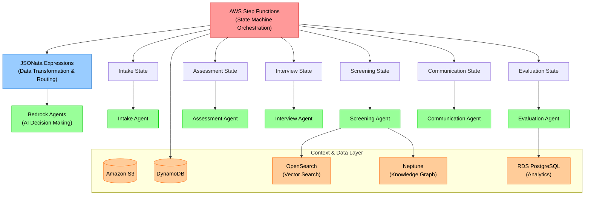
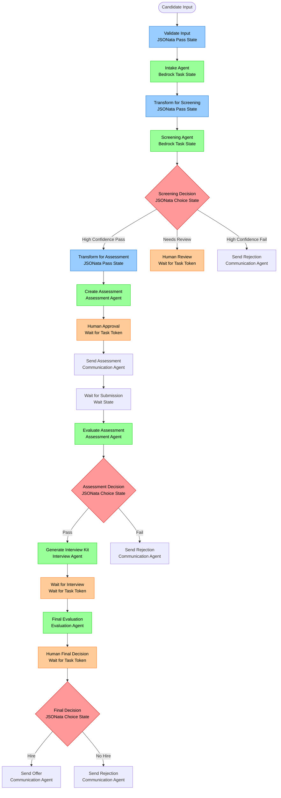
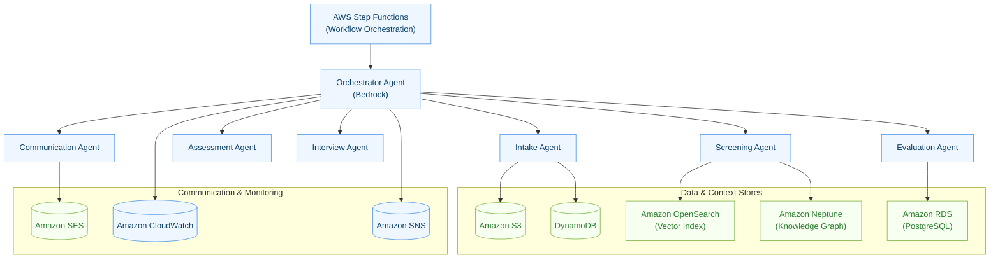
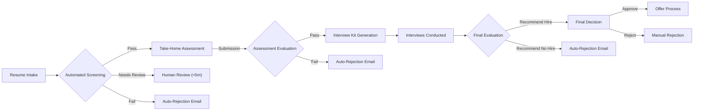
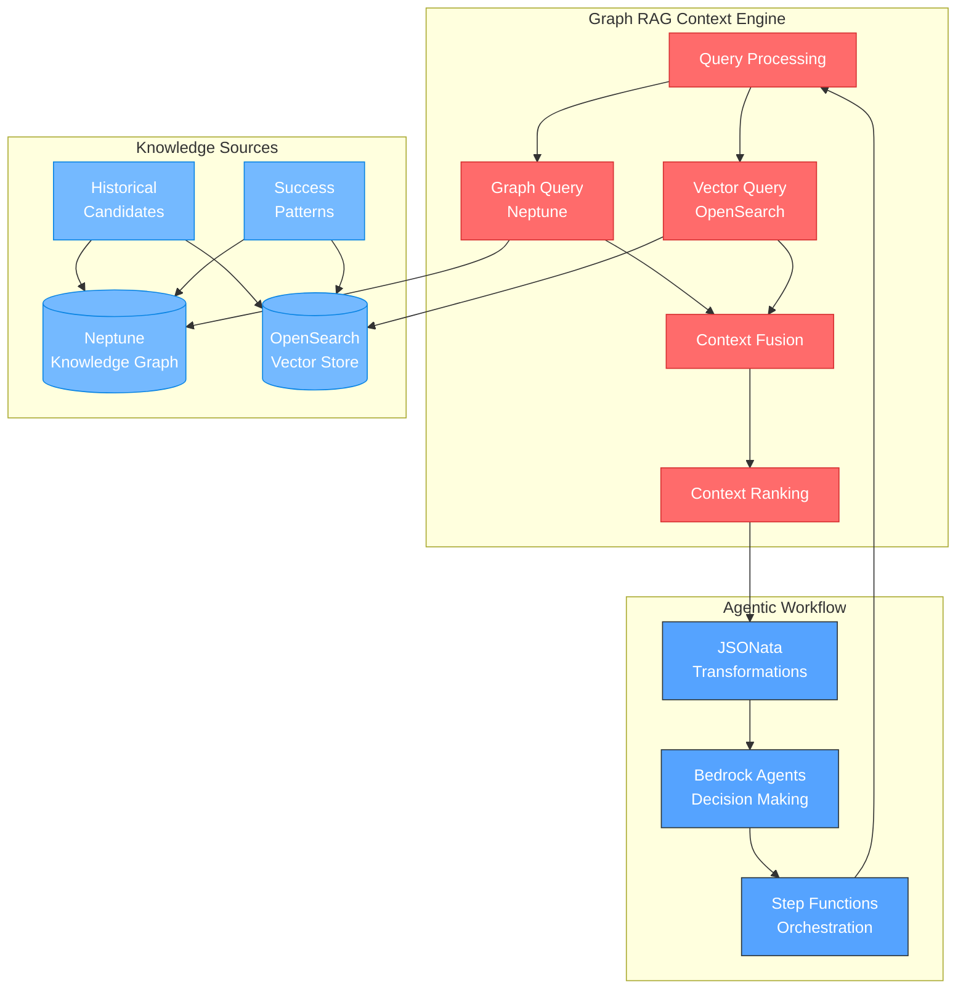

# Submission Package: Agentic Hiring Workflow with Step Functions + JSONata + Bedrock
**Project Kickoff: August 2025 - Devcraft Session Implementation**

**Note:** This document is a comprehensive package for our AWS kickoff meeting, updated to reflect **Devcraft session requirements** for implementing **Agentic Workflows** using **AWS Step Functions with JSONata** and **Amazon Bedrock Agents**. It synthesizes all relevant planning, architecture, and workflow documents into a single, cohesive overview optimized for the recommended technical approach.

---

## 1. Executive Summary & Business Opportunity

**The Goal:** Transform our hiring process from a manual **4-6 hours per candidate to under 20 minutes** of human review time using **Agentic Workflows**.

**The Problem:** The current process is characterized by high operational costs, long hiring cycles, and potential for inconsistency. This limits our ability to scale hiring efficiently.

**The Solution (Updated for Devcraft):** We are building an advanced **Agentic Workflow** system using **AWS Step Functions with JSONata** and **Amazon Bedrock Agents**. This approach provides:
- **Visual Workflow Orchestration:** Complete hiring process defined as state machines
- **Intelligent Data Transformation:** JSONata expressions handle all routing and data manipulation
- **AI-Powered Decision Making:** Specialized Bedrock Agents for each hiring stage
- **Built-in Auditability:** Complete execution history and state transitions
- **Human-in-the-Loop Integration:** Native support for approval workflows

**Projected ROI:**
- **Annual Savings:** Over **$300,000**.
- **ROI Timeline:** 3-month break-even with a projected 3-year ROI exceeding 1,000%.
- **Per-Candidate Cost Target:** < $10.

---

## 2. Agentic Workflow Architecture (Devcraft Implementation)

### 2.1. Step Functions + JSONata + Bedrock Integration

Following Devcraft session guidance, our architecture centers on **state machine-driven workflows** with intelligent data transformations and AI decision-making:



### 2.2. Core Technical Stack (Updated)

| Service | Usage | Devcraft Integration | Business Value |
|---|---|---|---|
| **AWS Step Functions** | Primary workflow orchestration engine | State machine definition with visual workflows | Reliable, auditable process automation |
| **JSONata** | Data transformation and conditional routing | Embedded in Pass and Choice states | Intelligent data manipulation without code |
| **Amazon Bedrock Agents** | AI-powered decision making | Task states with specialized agents | Context-aware, consistent AI decisions |
| **Amazon Neptune** | Knowledge graph for contextual relationships | Bedrock agent tool integration | Deep semantic understanding |
| **Amazon OpenSearch** | Vector similarity search | Bedrock agent knowledge base | Advanced pattern recognition |
| **AWS Lambda** | Human approval handlers | waitForTaskToken integration | Seamless human-in-the-loop workflows |
| **Amazon DynamoDB** | Workflow state persistence | Step Functions native integration | Real-time state management |
| **Amazon S3** | Document & artifact storage | Direct integration with all services | Scalable document management |

### 2.3. Agentic Workflow Implementation

**Complete State Machine Pattern:**
```json
{
  "Comment": "AI-Powered Hiring Agentic Workflow",
  "StartAt": "ValidateInput",
  "States": {
    "ValidateInput": {
      "Type": "Pass",
      "Comment": "JSONata validation and normalization",
      "Parameters": {
        "validatedCandidate.$": "$exists($.candidateData.resume) and $exists($.candidateData.email) ? $.candidateData : $error('Invalid input')",
        "processId.$": "$uuid()",
        "timestamp.$": "$now()"
      },
      "Next": "IntakeAgent"
    },
    "IntakeAgent": {
      "Type": "Task",
      "Resource": "arn:aws:bedrock:region:account:agent/intake-agent",
      "Parameters": {
        "sessionId.$": "$.processId",
        "inputText.$": "$string($.validatedCandidate)"
      },
      "ResultPath": "$.intakeResult",
      "Next": "TransformForScreening"
    },
    "TransformForScreening": {
      "Type": "Pass",
      "Parameters": {
        "screeningInput.$": "$merge([$.intakeResult.candidateProfile, {\"context\": $.companyContext}])"
      },
      "Next": "ScreeningAgent"
    }
  }
}
```

---

## 3. End-to-End Agentic Workflow

The workflow leverages Step Functions' native capabilities for orchestration, error handling, and human approvals:



**Key Workflow Characteristics:**
- **Built-in Error Handling:** Automatic retries and failure recovery
- **Visual Monitoring:** Real-time workflow status in Step Functions console
- **Audit Trail:** Complete execution history for compliance
- **Human Integration:** Native waitForTaskToken pattern for approvals

---

## 4. JSONata-Powered Data Transformations

### 4.1. Intelligent Routing Examples

**Screening Decision Logic:**
```javascript
// Multi-criteria routing with JSONata
$.screeningResult.recommendation = "PASS" and 
$.screeningResult.confidence > 0.8 and 
$.screeningResult.overallScore > 7.5 ? "DirectToAssessment" :

$.screeningResult.recommendation = "PASS" and 
$.screeningResult.confidence <= 0.8 ? "HumanReview" :

$.screeningResult.recommendation = "NEEDS_REVIEW" ? "HumanReview" :

$.screeningResult.recommendation = "FAIL" and 
$.screeningResult.confidence > 0.8 ? "AutoReject" : "HumanReview"
```

**Context Aggregation:**
```javascript
// Merge candidate data with company context
$merge([
  $.intakeResult.candidateProfile,
  {
    "evaluationContext": {
      "companyValues": $.companyContext.coreValues,
      "jobRequirements": $.jobDescription.requirements,
      "roleLevel": $.jobDescription.level
    },
    "candidateMetadata": {
      "processId": $.processId,
      "completenessScore": $.intakeResult.completenessScore,
      "experienceLevel": $.intakeResult.experienceLevel
    }
  }
])
```

### 4.2. Data Quality & Validation

**Input Validation:**
```javascript
// Comprehensive validation with error handling
$exists($.candidateData.resume) and $exists($.candidateData.email) ? 
  $merge([
    $.candidateData,
    {
      "normalizedEmail": $lowercase($trim($.candidateData.email)),
      "validationStatus": "passed"
    }
  ]) : $error("Missing required fields: resume or email")
```

---

## 5. Key Topics for Discussion with AWS

We are seeking your guidance and expertise on the following **Devcraft-specific** topics:

1.  **Step Functions Best Practices:** Optimal patterns for long-running workflows with human approvals, error handling strategies, and cost optimization for our use case.

2.  **JSONata Advanced Patterns:** Complex data transformation patterns, performance optimization for large candidate datasets, and debugging strategies for JSONata expressions.

3.  **Bedrock Agents Integration:** Best practices for agent-to-agent communication, knowledge base optimization, and tool integration patterns for our multi-agent system.

4.  **Graph RAG Implementation:** Optimal patterns for combining Neptune knowledge graphs with OpenSearch vector search within Bedrock agents. How to structure knowledge graphs for hiring contexts, and best practices for graph query optimization and context fusion.

5.  **Human-in-the-Loop Workflows:** Recommended patterns for waitForTaskToken implementation, timeout handling, and approval workflow UX integration.

6.  **Knowledge Graph + Vector Search:** Optimal integration patterns between Neptune and OpenSearch within Bedrock agents, data consistency strategies, query federation approaches, and Graph RAG performance optimization.

7.  **Context Management at Scale:** Strategies for managing Graph RAG context across multiple concurrent candidates, caching strategies for frequently accessed relationship data, and context freshness vs. performance trade-offs.

8.  **Cost Optimization:** Right-sizing strategies for Step Functions (Express vs Standard), Bedrock model selection, Neptune serverless vs. provisioned, and OpenSearch reserved instances to meet our sub-$10 per-candidate target.

9.  **Observability & Monitoring:** Best practices for monitoring agentic workflows, debugging failed executions, Graph RAG query performance monitoring, and end-to-end pipeline optimization.

10. **Scalability Considerations:** Architecture patterns for scaling from 60 to 600+ candidates/month without significant re-architecture, Graph RAG performance at scale, and knowledge graph growth management.

### **Graph RAG Specific Questions:**

- **Knowledge Graph Schema Design:** Best practices for modeling hiring domain entities and relationships in Neptune
- **Vector + Graph Fusion:** Optimal strategies for combining graph traversal results with vector similarity search
- **Context Caching:** Efficient caching patterns for Graph RAG results to minimize query latency
- **Real-time Updates:** Strategies for keeping knowledge graph current with new hiring outcomes
- **Query Optimization:** Performance tuning for complex multi-hop graph queries in hiring contexts

---

## 6. Implementation Roadmap (Updated for Devcraft)

### 16-Week Agentic Workflow Implementation Plan

**Phase 1: Foundation (Weeks 1-4)**
- **Step Functions Setup:** Design and implement core state machine with basic JSONata transformations
- **Bedrock Agents:** Deploy initial agents with simple prompts and basic tool integration
- **Data Layer:** Set up DynamoDB, S3, and basic RDS structure
- **Human Approval:** Implement waitForTaskToken pattern with basic Lambda functions

**Phase 2: Intelligence (Weeks 5-8)**
- **Advanced JSONata:** Implement complex routing logic and data transformations
- **Agent Enhancement:** Add knowledge bases, vector search, and advanced tool integration
- **Context Layer:** Deploy Neptune knowledge graph and OpenSearch vector search
- **Error Handling:** Implement comprehensive retry logic and failure recovery

**Phase 3: Integration (Weeks 9-12)**
- **External Systems:** Connect task management and email systems
- **End-to-End Testing:** Complete workflow testing with real candidate data
- **Performance Tuning:** Optimize Step Functions execution and Bedrock agent performance
- **Security Hardening:** Implement IAM policies, encryption, and compliance controls

**Phase 4: Production (Weeks 13-16)**
- **Production Deployment:** Gradual rollout with monitoring and alerting
- **Observability:** CloudWatch dashboards, X-Ray tracing, and custom metrics
- **Success Validation:** Measure against target metrics and iterate
- **Documentation:** Complete technical documentation and runbooks

### Core Success Metrics (Updated)

| Metric | Current State | Target | Measurement Method |
|---|---|---|---|
| **Human Processing Time** | 4-6 hours | < 20 minutes | Step Functions execution metrics |
| **Workflow Success Rate** | N/A | > 99% | Step Functions success/failure ratio |
| **Cost per Candidate** | High (manual) | < $10 | CloudWatch cost tracking |
| **Decision Consistency** | 60-70% | > 90% | Bedrock agent evaluation metrics |
| **JSONata Transformation Latency** | N/A | < 100ms | Step Functions state timing |
| **Human Approval Response Time** | N/A | < 24 hours | waitForTaskToken metrics |

---

## 7. Appendix: Sample Implementation Artifacts

### 7.1. State Machine Definition (Excerpt)
```json
{
  "Comment": "Production Hiring Agentic Workflow",
  "StartAt": "ValidateInput",
  "TimeoutSeconds": 2592000,
  "States": {
    "ValidateInput": {
      "Type": "Pass",
      "Parameters": {
        "validatedCandidate.$": "$exists($.candidateData.resume) ? $.candidateData : $error('Missing resume')",
        "processId.$": "$uuid()"
      },
      "Next": "IntakeAgent"
    }
  }
}
```

### 7.2. Bedrock Agent Configuration (Sample)
```yaml
ScreeningAgent:
  foundationModel: "anthropic.claude-3-5-sonnet-20241022-v2:0"
  instruction: "Evaluate candidates against company values with evidence-based reasoning"
  knowledgeBases: ["companyCoreValues", "screeningCriteria"]
  tools: ["vector_search", "knowledge_graph_query", "bias_detector"]
```

### 7.3. JSONata Transformation (Sample)
```javascript
// Intelligent screening result evaluation
$.screeningResult.confidence > 0.8 and $.screeningResult.overallScore > 7.5 ? 
  "PROCEED_TO_ASSESSMENT" : "REQUIRES_HUMAN_REVIEW"
```

This updated submission package reflects our commitment to implementing the **Agentic Workflow** approach using **AWS Step Functions with JSONata** and **Amazon Bedrock Agents** as recommended in the Devcraft session, providing a robust foundation for scalable, intelligent hiring automation.



### 2.2. Core Technical Stack

| Service | Usage | Business Value |
|---|---|---|
| **Amazon Bedrock** | Multi-agent orchestration & execution | Managed, scalable, and secure LLM infrastructure. |
| **Amazon Neptune** | Knowledge graph for contextual relationships | Deep semantic understanding of candidate data. |
| **Amazon OpenSearch** | Vector similarity search | Advanced pattern recognition and profile matching. |
| **AWS Step Functions** | Hiring workflow automation | Visual, resilient, and auditable process orchestration. |
| **AWS Lambda/ECS**| Serverless & containerized compute | Auto-scaling, cost-optimized microservice deployment. |
| **Amazon S3** | Document & artifact storage | Durable, scalable storage for resumes, reports, etc. |
| **Amazon RDS/DynamoDB** | Structured & state data | Reliable persistence for candidate data and workflow state. |
| **Amazon SQS/SNS** | Asynchronous messaging | Decoupled and resilient inter-agent communication. |
| **Amazon SES** | Email communication | Scalable, integrated email services for notifications. |

### 2.3. Agent Responsibilities

- **Orchestrator Agent:** Manages the end-to-end workflow state via Step Functions.
- **Intake Agent:** Ingests and normalizes candidate data from external sources (e.g., email, task management systems).
- **Screening Agent:** Assesses candidates against core company values and job requirements using the Neptune/OpenSearch context fabric.
- **Assessment Agent:** Generates personalized take-home assignments and evaluates submissions.
- **Interview Agent:** Creates comprehensive, personalized interview kits for the hiring team.
- **Evaluation Agent:** Aggregates all data points to produce a final, evidence-based hiring recommendation.
- **Communication Agent:** Manages all external communications with candidates and internal notifications to HR.

---

## 3. End-to-End Automated Workflow

The workflow is designed for over 90% automation, with minimal human-in-the-loop (HITL) decision points.



**Key Human Decision Points:**
1.  **Screening Approval (≈5 min):** Review the Screening Agent's recommendation (Pass/Fail/Needs Review).
2.  **Assessment Approval (≈2 min):** Quickly validate the auto-generated take-home assignment before it's sent.
3.  **Final Hiring Decision (≈10 min):** Review the Evaluation Agent's comprehensive report and make the final hire/no-hire decision.

---

## 4. Graph RAG-Powered Context Management

### 4.1. Advanced Context Strategy with Graph RAG

Our system implements **Graph RAG (Retrieval-Augmented Generation)** as the core context management strategy, combining Amazon Neptune's knowledge graph capabilities with OpenSearch vector search to provide unprecedented contextual intelligence to our Bedrock Agents.



### 4.2. Graph RAG Implementation Benefits

**1. Contextual Intelligence Beyond Keywords**
- **Skill Relationship Networks:** Understand how skills cluster and complement each other
- **Career Progression Patterns:** Identify successful career trajectories and growth paths
- **Cultural Fit Indicators:** Map candidate experiences to company value demonstrations
- **Performance Predictors:** Correlate candidate characteristics with hiring success

**2. Personalized Decision Making**
- **Dynamic Assessments:** Generate assignments based on candidate's specific skill graph
- **Contextual Benchmarks:** Evaluate candidates against similar successful profiles
- **Relevant Interview Questions:** Personalize questions based on experience networks
- **Evidence-Based Recommendations:** All decisions backed by relationship data

**3. Continuous Learning System**
- **Pattern Discovery:** Automatically identify new success indicators and relationships
- **Context Evolution:** Knowledge graph grows and improves with each candidate
- **Performance Correlation:** Track which contextual factors predict long-term success
- **Bias Reduction:** Objective relationship-based context reduces subjective bias

### 4.3. Graph RAG Query Examples

**Screening Context Retrieval:**
```cypher
// Find similar successful candidates with shared skills
MATCH (candidate:Candidate {id: $candidateId})-[:HAS_SKILL]->(skill:Skill)
MATCH (successful:Candidate)-[:HAS_SKILL]->(skill)
WHERE successful.outcome = 'HIRED' AND successful.performance_rating >= 8.0
RETURN successful, count(skill) as skill_overlap,
       collect(skill.name) as shared_skills
ORDER BY skill_overlap DESC LIMIT 5
```

**Assessment Personalization:**
```cypher
// Find relevant technical challenges based on skill network
MATCH (candidate:Candidate {id: $candidateId})-[:HAS_SKILL]->(skill:Skill)
MATCH (skill)-[:RELATED_TO]->(related:Skill)
MATCH (related)-[:REQUIRED_FOR]->(challenge:TechnicalChallenge)
WHERE challenge.difficulty_level = $candidateLevel
RETURN challenge, related, skill
```

### 4.4. Integration with Step Functions + JSONata

**Graph RAG Context Preparation:**
```javascript
// JSONata transformation with Graph RAG context
$merge([
  $.candidateProfile,
  {
    "graphRagContext": {
      "skillNetwork": $.enrichedContext.skillRelationships,
      "similarCandidates": $.enrichedContext.similarSuccessfulCandidates[0:5],
      "contextualBenchmarks": $.enrichedContext.performanceBenchmarks,
      "successPatterns": $.enrichedContext.successPatterns
    }
  }
])
```

**Enhanced Bedrock Agent Integration:**
```yaml
ScreeningAgent:
  instruction: |
    You have access to Graph RAG context that provides:
    - Skill relationship networks showing how competencies cluster
    - Similar successful candidates for comparison benchmarks
    - Career progression patterns that led to success
    - Cultural fit indicators from historical performance data
    
    Use this rich context to make evidence-based decisions that go beyond surface-level resume matching.
  
  tools:
    - name: "graph_rag_query"
      description: "Query Graph RAG system for contextual candidate information"
```

---

## 5. Key Topics for Discussion with AWS

We are seeking your guidance and expertise on the following topics:

1.  **Bedrock Agents:** Recommended patterns for inter-agent communication, tool use, and long-term memory management.
2.  **Knowledge Graph + Vector Search:** Best practices for combining Neptune and OpenSearch for real-time context retrieval. How should we handle data consistency, updates, and query federation?
3.  **Orchestration:** Optimal design patterns for using Step Functions to manage long-running, multi-day workflows with human-in-the-loop approvals.
4.  **Cost Optimization:** Guidance on right-sizing compute (Lambda/ECS), database tiers (Neptune/OpenSearch), and Bedrock model selection to meet our sub-$10 per-candidate cost target.
5.  **Observability & Security:** Best practices for implementing robust monitoring, tracing, and logging across this distributed architecture. What are the recommended IAM boundaries and data protection strategies for a multi-tenant AI system handling PII?
6.  **Scalability:** The system will initially handle 60+ candidates/month. What architectural considerations should we make now to scale 10x without significant re-architecture?

---

## 6. High-Level Roadmap & Success Metrics

### 16-Week Implementation Plan
- **Weeks 1-4:** Foundational AWS infrastructure setup (Neptune, OpenSearch, Bedrock configuration).
- **Weeks 5-8:** Core multi-agent development and populating the context fabric.
- **Weeks 9-12:** System integration, end-to-end testing, and production deployment.
- **Weeks 13-16:** Performance tuning, monitoring setup, and success validation.

### Core Success Metrics
| Metric | Current State | Target |
|---|---|---|
| **Avg. Human Processing Time** | 4-6 hours | < 20 minutes |
| **Cost per Candidate** | High (manual effort) | < $10 |
| **Hiring Decision Consistency** | 60-70% | > 90% |
| **Context Retrieval Latency** | N/A | < 200ms (p95) |
| **Monthly Candidate Capacity** | 40 | 60+ (initial) |

---

## 7. Appendix: Sample I/O

*The following are redacted, representative samples. For more detail, please see the full I/O document.*

**Canonical Input (Batch Candidates JSON):**
```json
{
  "run_id": "demo_2025-08-21",
  "role": "Backend Engineer",
  "candidates": [
    {
      "candidate_id": "cand_001",
      "display_name": "Candidate A",
      "resume_url": "s3://redacted/resumes/cand_001.pdf"
    }
  ]
}
```

**Screening Report Output (Minimal):**
```json
{
  "candidate_id": "cand_001",
  "stage": "screening",
  "recommendation": "PASS",
  "confidence": "HIGH",
  "top_strengths": ["Backend depth", "AWS exposure"],
  "concerns": []
}
```

**Final Evaluation Output (Consolidated):**
```json
{
  "candidate_id": "cand_001",
  "stage": "final_evaluation",
  "overall_recommendation": "Hire",
  "justification_summary": "Strong backend fit; moderate testing gaps acceptable with mentorship.",
  "human_decision": { "approved": true }
}
```
