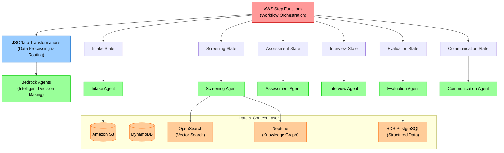
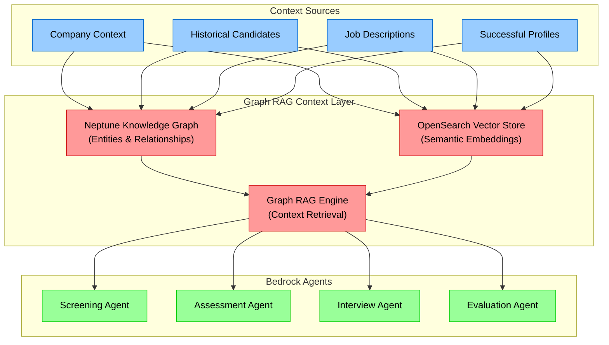

# Agentic Workflow Architecture for Hiring Process Automation
*Updated for Devcraft Session: Step Functions + JSONata + Bedrock Agents*

## Executive Summary

This document outlines a comprehensive **Agentic Workflow** system using **AWS Step Functions with JSONata** and **Amazon Bedrock Agents** to automate our hiring processes. Following Devcraft session guidance, we're implementing a state machine-driven approach where each hiring stage is orchestrated through Step Functions, with JSONata handling data transformations, and Bedrock Agents providing intelligent decision-making capabilities.

**Key Goals:**
- Leverage **AWS Step Functions** as the primary workflow orchestration engine
- Use **JSONata** for all data transformations and routing logic
- Implement **Bedrock Agents** for intelligent, context-aware decision making
- Achieve 90% automation with minimal human intervention
- Maintain audit trails and state management through Step Functions

---

## Agentic Workflow Design Philosophy

### Step Functions + JSONata + Bedrock Integration

Following the Devcraft session recommendations, our architecture centers on:



### Core Architecture Components

## 1. **AWS Step Functions State Machine**
*Primary Workflow Orchestration Engine*

**Role:** Central state machine managing the entire hiring pipeline with built-in error handling, retries, and human approval workflows.

**Key Features:**
- **Visual Workflow Definition:** Complete hiring process defined as a state machine
- **JSONata Integration:** All data transformations handled through JSONata expressions
- **Human-in-the-Loop States:** Built-in approval states for human decision points
- **Error Handling:** Automatic retry logic and failure recovery
- **Audit Trail:** Complete execution history and state transitions

**State Machine Structure:**
```json
{
  "Comment": "Hiring Process Agentic Workflow",
  "StartAt": "IntakeState",
  "States": {
    "IntakeState": {
      "Type": "Task",
      "Resource": "arn:aws:bedrock:region:account:agent/intake-agent",
      "Parameters": {
        "input.$": "$.candidateData"
      },
      "ResultPath": "$.intakeResult",
      "Next": "TransformForScreening"
    },
    "TransformForScreening": {
      "Type": "Pass",
      "Parameters": {
        "screeningInput.$": "$merge([$.intakeResult, {\"timestamp\": $now()}])"
      },
      "Next": "ScreeningState"
    }
  }
}
```

---

## 2. **JSONata Data Transformation Layer**
*Intelligent Data Processing & Routing*

**Role:** Handle all data transformations, conditional routing, and state preparation between workflow stages.

**Key Functions:**
- **Data Normalization:** Transform candidate data between different agent formats
- **Conditional Logic:** Route candidates based on screening results and scores
- **State Preparation:** Prepare input data for each Bedrock Agent invocation
- **Result Aggregation:** Combine outputs from multiple agents into consolidated reports

**Example JSONata Expressions:**
```javascript
// Transform candidate data for screening
$merge([
  $.candidateProfile,
  {
    "screeningContext": {
      "coreValues": $.companyContext.values,
      "roleRequirements": $.jobDescription.requirements,
      "timestamp": $now()
    }
  }
])

// Conditional routing based on screening score
$.screeningResult.score >= 7.5 ? "AssessmentState" : 
$.screeningResult.score >= 5.0 ? "HumanReviewState" : "RejectionState"

// Aggregate final evaluation data
{
  "finalRecommendation": {
    "candidateId": $.candidateId,
    "overallScore": $average([
      $.screeningResult.score,
      $.assessmentResult.score,
      $.interviewResult.score
    ]),
    "recommendation": $.evaluationResult.decision,
    "evidence": $merge([
      $.screeningResult.evidence,
      $.assessmentResult.evidence,
      $.interviewResult.evidence
    ])
  }
}
```

---

## 3. **Bedrock Agents Specifications**

### **Intake Agent**
*Resume Processing & Data Normalization*

**Bedrock Agent Configuration:**
- **Foundation Model:** Claude 3.5 Sonnet (for complex document processing)
- **Tools:** PDF parser, email processor, data validator
- **Knowledge Base:** Resume parsing patterns, data normalization rules

**Agent Prompt:**
```
You are an Intake Agent responsible for processing candidate resumes and normalizing data.

Your tasks:
1. Extract structured information from resumes (PDF/DOC)
2. Normalize data into standard JSON format
3. Validate completeness and flag missing information
4. Generate unique candidate identifiers

Output format: Standardized candidate profile JSON
```

### **Screening Agent**
*Intelligent Candidate Evaluation*

**Bedrock Agent Configuration:**
- **Foundation Model:** Claude 3.5 Sonnet (for complex reasoning)
- **Tools:** Vector search (OpenSearch), knowledge graph query (Neptune)
- **Knowledge Base:** Company values, screening criteria, historical decisions

**Agent Prompt:**
```
You are a Screening Agent that evaluates candidates against company core values.

Your tasks:
1. Analyze candidate profile against 10 core company values
2. Map specific achievements to value criteria with evidence
3. Generate confidence scores and identify red flags
4. Provide clear PASS/FAIL/NEEDS_REVIEW recommendation

Use the knowledge graph to understand skill relationships and vector search for similar candidate patterns.
```

### **Assessment Agent**
*Dynamic Assignment Creation & Evaluation*

**Bedrock Agent Configuration:**
- **Foundation Model:** Claude 3.5 Sonnet (for technical evaluation)
- **Tools:** Code analyzer, plagiarism detector, rubric generator
- **Knowledge Base:** Assignment templates, evaluation rubrics, technical standards

**Agent Prompt:**
```
You are an Assessment Agent that creates and evaluates take-home assignments.

Your tasks:
1. Generate personalized assignments based on candidate level and skills
2. Create detailed evaluation rubrics with scoring criteria
3. Evaluate submitted solutions against technical and cultural criteria
4. Provide detailed feedback and pass/fail recommendations

Ensure assignments are challenging but fair, and evaluations are consistent and unbiased.
```

### **Interview Agent**
*Personalized Interview Kit Generation*

**Bedrock Agent Configuration:**
- **Foundation Model:** Claude 3.5 Sonnet (for personalization)
- **Tools:** Question bank, BEI generator, script formatter
- **Knowledge Base:** Interview best practices, BEI questions, technical problems

### **Evaluation Agent**
*Comprehensive Decision Making*

**Bedrock Agent Configuration:**
- **Foundation Model:** Claude 3.5 Sonnet (for complex decision making)
- **Tools:** Multi-criteria analysis, bias detector, report generator
- **Knowledge Base:** Hiring criteria, historical outcomes, legal compliance

### **Communication Agent**
*Professional Communications*

**Bedrock Agent Configuration:**
- **Foundation Model:** Claude 3.5 Haiku (for efficient communication)
- **Tools:** Email templates, calendar integration, notification system
- **Knowledge Base:** Communication templates, company branding, legal language

---

## 4. **Step Functions Workflow States**

### **Complete State Machine Definition**

```json
{
  "Comment": "AI-Powered Hiring Agentic Workflow",
  "StartAt": "IntakeState",
  "States": {
    "IntakeState": {
      "Type": "Task",
      "Resource": "arn:aws:bedrock:region:account:agent/intake-agent",
      "Parameters": {
        "input.$": "$.candidateData"
      },
      "ResultPath": "$.intakeResult",
      "Retry": [
        {
          "ErrorEquals": ["States.TaskFailed"],
          "IntervalSeconds": 30,
          "MaxAttempts": 3
        }
      ],
      "Next": "TransformForScreening"
    },
    
    "TransformForScreening": {
      "Type": "Pass",
      "Parameters": {
        "screeningInput.$": "$merge([$.intakeResult.candidateProfile, {\"context\": $.companyContext, \"timestamp\": $now()}])"
      },
      "Next": "ScreeningState"
    },
    
    "ScreeningState": {
      "Type": "Task",
      "Resource": "arn:aws:bedrock:region:account:agent/screening-agent",
      "Parameters": {
        "input.$": "$.screeningInput"
      },
      "ResultPath": "$.screeningResult",
      "Next": "ScreeningDecision"
    },
    
    "ScreeningDecision": {
      "Type": "Choice",
      "Choices": [
        {
          "Variable": "$.screeningResult.recommendation",
          "StringEquals": "PASS",
          "Next": "TransformForAssessment"
        },
        {
          "Variable": "$.screeningResult.recommendation",
          "StringEquals": "NEEDS_REVIEW",
          "Next": "HumanScreeningReview"
        }
      ],
      "Default": "SendRejectionEmail"
    },
    
    "HumanScreeningReview": {
      "Type": "Task",
      "Resource": "arn:aws:states:::lambda:invoke.waitForTaskToken",
      "Parameters": {
        "FunctionName": "human-review-function",
        "Payload": {
          "taskToken.$": "$$.Task.Token",
          "reviewData.$": "$.screeningResult"
        }
      },
      "Next": "ProcessHumanDecision"
    },
    
    "TransformForAssessment": {
      "Type": "Pass",
      "Parameters": {
        "assessmentInput.$": "$merge([$.screeningResult, {\"candidateLevel\": $.intakeResult.experienceLevel}])"
      },
      "Next": "AssessmentCreationState"
    },
    
    "AssessmentCreationState": {
      "Type": "Task",
      "Resource": "arn:aws:bedrock:region:account:agent/assessment-agent",
      "Parameters": {
        "action": "create",
        "input.$": "$.assessmentInput"
      },
      "ResultPath": "$.assessmentCreated",
      "Next": "HumanAssessmentApproval"
    },
    
    "HumanAssessmentApproval": {
      "Type": "Task",
      "Resource": "arn:aws:states:::lambda:invoke.waitForTaskToken",
      "Parameters": {
        "FunctionName": "assessment-approval-function",
        "Payload": {
          "taskToken.$": "$$.Task.Token",
          "assessment.$": "$.assessmentCreated"
        }
      },
      "Next": "SendAssessmentToCandidate"
    },
    
    "SendAssessmentToCandidate": {
      "Type": "Task",
      "Resource": "arn:aws:bedrock:region:account:agent/communication-agent",
      "Parameters": {
        "action": "send_assessment",
        "input.$": "$merge([$.assessmentCreated, $.intakeResult.contactInfo])"
      },
      "Next": "WaitForAssessmentSubmission"
    },
    
    "WaitForAssessmentSubmission": {
      "Type": "Wait",
      "Seconds": 259200,
      "Next": "CheckAssessmentSubmission"
    },
    
    "CheckAssessmentSubmission": {
      "Type": "Task",
      "Resource": "arn:aws:states:::lambda:invoke",
      "Parameters": {
        "FunctionName": "check-submission-function",
        "Payload": {
          "candidateId.$": "$.intakeResult.candidateId"
        }
      },
      "Next": "AssessmentSubmissionDecision"
    },
    
    "AssessmentSubmissionDecision": {
      "Type": "Choice",
      "Choices": [
        {
          "Variable": "$.submissionStatus",
          "StringEquals": "SUBMITTED",
          "Next": "EvaluateAssessment"
        }
      ],
      "Default": "SendAssessmentReminder"
    },
    
    "EvaluateAssessment": {
      "Type": "Task",
      "Resource": "arn:aws:bedrock:region:account:agent/assessment-agent",
      "Parameters": {
        "action": "evaluate",
        "input.$": "$.submissionData"
      },
      "ResultPath": "$.assessmentResult",
      "Next": "AssessmentEvaluationDecision"
    },
    
    "AssessmentEvaluationDecision": {
      "Type": "Choice",
      "Choices": [
        {
          "Variable": "$.assessmentResult.recommendation",
          "StringEquals": "PASS",
          "Next": "GenerateInterviewKit"
        }
      ],
      "Default": "SendAssessmentRejection"
    },
    
    "GenerateInterviewKit": {
      "Type": "Task",
      "Resource": "arn:aws:bedrock:region:account:agent/interview-agent",
      "Parameters": {
        "input.$": "$merge([$.screeningResult, $.assessmentResult, $.intakeResult])"
      },
      "ResultPath": "$.interviewKit",
      "Next": "NotifyInterviewTeam"
    },
    
    "NotifyInterviewTeam": {
      "Type": "Task",
      "Resource": "arn:aws:bedrock:region:account:agent/communication-agent",
      "Parameters": {
        "action": "notify_interview_team",
        "input.$": "$.interviewKit"
      },
      "Next": "WaitForInterviewCompletion"
    },
    
    "WaitForInterviewCompletion": {
      "Type": "Task",
      "Resource": "arn:aws:states:::lambda:invoke.waitForTaskToken",
      "Parameters": {
        "FunctionName": "interview-completion-function",
        "Payload": {
          "taskToken.$": "$$.Task.Token",
          "candidateId.$": "$.intakeResult.candidateId"
        }
      },
      "Next": "FinalEvaluation"
    },
    
    "FinalEvaluation": {
      "Type": "Task",
      "Resource": "arn:aws:bedrock:region:account:agent/evaluation-agent",
      "Parameters": {
        "input.$": "$merge([$.screeningResult, $.assessmentResult, $.interviewResult])"
      },
      "ResultPath": "$.finalEvaluation",
      "Next": "HumanFinalDecision"
    },
    
    "HumanFinalDecision": {
      "Type": "Task",
      "Resource": "arn:aws:states:::lambda:invoke.waitForTaskToken",
      "Parameters": {
        "FunctionName": "final-decision-function",
        "Payload": {
          "taskToken.$": "$$.Task.Token",
          "evaluation.$": "$.finalEvaluation"
        }
      },
      "Next": "ProcessFinalDecision"
    },
    
    "ProcessFinalDecision": {
      "Type": "Choice",
      "Choices": [
        {
          "Variable": "$.humanDecision",
          "StringEquals": "HIRE",
          "Next": "SendOfferNotification"
        }
      ],
      "Default": "SendFinalRejection"
    },
    
    "SendOfferNotification": {
      "Type": "Task",
      "Resource": "arn:aws:bedrock:region:account:agent/communication-agent",
      "Parameters": {
        "action": "send_offer_notification",
        "input.$": "$merge([$.finalEvaluation, $.intakeResult.contactInfo])"
      },
      "End": true
    },
    
    "SendRejectionEmail": {
      "Type": "Task",
      "Resource": "arn:aws:bedrock:region:account:agent/communication-agent",
      "Parameters": {
        "action": "send_rejection",
        "stage": "screening",
        "input.$": "$merge([$.screeningResult, $.intakeResult.contactInfo])"
      },
      "End": true
    },
    
    "SendAssessmentRejection": {
      "Type": "Task",
      "Resource": "arn:aws:bedrock:region:account:agent/communication-agent",
      "Parameters": {
        "action": "send_rejection",
        "stage": "assessment",
        "input.$": "$merge([$.assessmentResult, $.intakeResult.contactInfo])"
      },
      "End": true
    },
    
    "SendFinalRejection": {
      "Type": "Task",
      "Resource": "arn:aws:bedrock:region:account:agent/communication-agent",
      "Parameters": {
        "action": "send_rejection",
        "stage": "final",
        "input.$": "$merge([$.finalEvaluation, $.intakeResult.contactInfo])"
      },
      "End": true
    }
  }
}
```

---

## 5. **Human-in-the-Loop Integration**

### **Approval Workflow Pattern**

Each human decision point uses the Step Functions `waitForTaskToken` pattern:

1. **Step Functions** pauses execution and generates a task token
2. **Lambda function** sends approval request to human reviewer
3. **Human** reviews and makes decision through web interface
4. **System** resumes Step Functions execution with human decision

### **Human Decision Points:**
- **Screening Approval (5 min):** Review AI screening recommendation
- **Assessment Approval (2 min):** Validate generated take-home assignment  
- **Final Decision (10 min):** Confirm final hiring recommendation

## 6. **Graph RAG Context Management Strategy**

### **Graph RAG Implementation with Neptune + OpenSearch**

Our system implements **Graph RAG (Retrieval-Augmented Generation)** as the core context management strategy, combining Amazon Neptune's knowledge graph capabilities with OpenSearch vector search to provide rich, contextual information to our Bedrock Agents.

#### **Graph RAG Architecture**


#### **Graph RAG Components**

**1. Knowledge Graph (Neptune)**
- **Entities:** Candidates, Skills, Companies, Roles, Projects, Technologies
- **Relationships:** HAS_SKILL, WORKED_AT, SIMILAR_TO, REQUIRES, LEADS_TO
- **Contextual Queries:** Multi-hop relationship traversal for deep context

**2. Vector Store (OpenSearch)**
- **Semantic Embeddings:** Candidate profiles, job descriptions, success patterns
- **Similarity Search:** Find contextually similar candidates and requirements
- **Hybrid Search:** Combine keyword and semantic search capabilities

**3. Graph RAG Retrieval Engine**
- **Context Fusion:** Combine graph relationships with vector similarity
- **Dynamic Context:** Real-time context assembly based on query intent
- **Relevance Ranking:** Score and rank context by relevance to current decision

#### **Graph RAG Query Patterns**

**Screening Context Retrieval:**
```cypher
// Find similar successful candidates with shared skills and values
MATCH (candidate:Candidate {id: $candidateId})-[:HAS_SKILL]->(skill:Skill)
MATCH (successful:Candidate)-[:HAS_SKILL]->(skill)
WHERE successful.outcome = 'HIRED' AND successful.performance_rating >= 8.0
MATCH (successful)-[:DEMONSTRATES]->(value:CoreValue)
RETURN successful, skill, value, 
       count(skill) as skill_overlap,
       collect(value.name) as demonstrated_values
ORDER BY skill_overlap DESC
LIMIT 5
```

**Assessment Context Retrieval:**
```cypher
// Find relevant technical challenges and evaluation criteria
MATCH (candidate:Candidate {id: $candidateId})-[:HAS_SKILL]->(skill:Skill)
MATCH (skill)-[:REQUIRED_FOR]->(challenge:TechnicalChallenge)
MATCH (challenge)-[:EVALUATED_BY]->(criteria:EvaluationCriteria)
MATCH (similar:Candidate)-[:COMPLETED]->(challenge)
WHERE similar.assessment_score >= 8.0
RETURN challenge, criteria, similar.assessment_score,
       similar.feedback as success_patterns
ORDER BY similar.assessment_score DESC
```

**Interview Context Retrieval:**
```cypher
// Find personalized interview questions based on experience
MATCH (candidate:Candidate {id: $candidateId})-[:WORKED_AT]->(company:Company)
MATCH (candidate)-[:HAS_EXPERIENCE_IN]->(domain:Domain)
MATCH (domain)-[:SUGGESTS_QUESTIONS]->(question:InterviewQuestion)
MATCH (company)-[:IN_INDUSTRY]->(industry:Industry)
MATCH (industry)-[:COMMON_CHALLENGES]->(challenge:Challenge)
RETURN question, challenge, 
       company.name as experience_context,
       domain.name as technical_context
```

#### **Vector + Graph Hybrid Retrieval**

**Combined Context Assembly:**
```python
def retrieve_graph_rag_context(candidate_id: str, query_intent: str) -> dict:
    """
    Graph RAG context retrieval combining Neptune and OpenSearch
    """
    # 1. Graph-based relationship context
    graph_context = neptune_client.execute_query(f"""
        MATCH (c:Candidate {{id: '{candidate_id}'}})
        MATCH (c)-[r*1..3]-(related)
        WHERE related:Skill OR related:Company OR related:Project
        RETURN c, r, related, type(r) as relationship_type
    """)
    
    # 2. Vector-based semantic similarity
    candidate_embedding = get_candidate_embedding(candidate_id)
    vector_context = opensearch_client.search(
        index="hiring_context",
        body={
            "query": {
                "knn": {
                    "content_embedding": {
                        "vector": candidate_embedding,
                        "k": 10,
                        "filter": {
                            "term": {"context_type": query_intent}
                        }
                    }
                }
            }
        }
    )
    
    # 3. Fuse graph and vector contexts
    fused_context = {
        "graph_relationships": graph_context,
        "semantic_similarities": vector_context,
        "contextual_insights": generate_insights(graph_context, vector_context),
        "relevance_score": calculate_relevance(graph_context, vector_context, query_intent)
    }
    
    return fused_context
```

#### **Context-Aware Agent Prompting**

**Enhanced Agent Instructions with Graph RAG:**
```yaml
ScreeningAgent:
  instruction: |
    You are a Screening Agent with access to Graph RAG context management.
    
    For each candidate evaluation:
    1. Query the knowledge graph to understand skill relationships and career patterns
    2. Use vector search to find similar successful candidates for comparison
    3. Analyze the candidate's profile in the context of:
       - Similar candidates who were successfully hired
       - Skill progression patterns in our knowledge graph
       - Company value demonstrations from historical data
    
    Graph RAG Context Available:
    - Skill relationship networks (what skills typically cluster together)
    - Career progression patterns (how successful candidates advanced)
    - Company culture fit indicators (value demonstration patterns)
    - Technical competency benchmarks (skill depth assessments)
    
    Use this rich context to make more informed, evidence-based decisions.
  
  tools:
    - name: "graph_rag_query"
      description: "Query Graph RAG system for contextual candidate information"
      schema:
        type: "object"
        properties:
          candidate_id:
            type: "string"
          query_intent:
            type: "string"
            enum: ["screening", "assessment", "interview", "evaluation"]
          context_depth:
            type: "integer"
            description: "Number of relationship hops (1-3)"
```

#### **Graph RAG Benefits for Hiring**

**1. Contextual Understanding**
- **Skill Relationships:** Understand how skills relate and complement each other
- **Career Patterns:** Identify successful career progression paths
- **Cultural Fit:** Map candidate experiences to company value demonstrations

**2. Improved Decision Quality**
- **Evidence-Based:** Decisions backed by historical patterns and relationships
- **Consistency:** Similar candidates evaluated against similar contextual benchmarks
- **Bias Reduction:** Objective relationship-based context reduces subjective bias

**3. Personalized Assessments**
- **Dynamic Challenges:** Generate assessments based on candidate's specific skill graph
- **Relevant Questions:** Interview questions tailored to candidate's experience network
- **Contextual Evaluation:** Evaluate candidates against similar successful profiles

**4. Continuous Learning**
- **Pattern Recognition:** System learns from successful hires and their characteristics
- **Relationship Discovery:** Automatically discovers new skill and experience relationships
- **Context Evolution:** Knowledge graph grows and improves with each candidate

#### **Implementation in Step Functions**

**Graph RAG Integration in Workflow:**
```json
{
  "ScreeningWithGraphRAG": {
    "Type": "Task",
    "Resource": "arn:aws:bedrock:region:account:agent/screening-agent",
    "Parameters": {
      "sessionId.$": "$.candidateId",
      "inputText.$": "$string($.screeningInput)",
      "sessionAttributes": {
        "graphRagContext.$": "$.graphRagContext",
        "contextDepth": "2",
        "queryIntent": "screening"
      }
    },
    "ResultPath": "$.screeningResult",
    "Next": "EvaluateScreeningResult"
  }
}
```

**JSONata Context Preparation:**
```javascript
// Prepare Graph RAG context for agents
{
  "graphRagContext": {
    "candidateId": $.candidateId,
    "skillNetwork": $.graphContext.skillRelationships,
    "similarCandidates": $.vectorContext.similarProfiles[0:5],
    "contextualInsights": $.fusedContext.insights,
    "relevanceScore": $.fusedContext.relevanceScore
  },
  "enhancedScreeningInput": $merge([
    $.screeningInput,
    {
      "contextualBenchmarks": $.graphRagContext.similarCandidates,
      "skillRelationships": $.graphRagContext.skillNetwork,
      "historicalPatterns": $.graphRagContext.contextualInsights
    }
  ])
}
```

This Graph RAG implementation provides our Bedrock Agents with rich, contextual information that goes far beyond simple keyword matching, enabling more intelligent and nuanced hiring decisions based on deep relationship understanding and historical patterns.

---

## 7. **Implementation Roadmap**

### **Phase 1: Core Step Functions Workflow (Weeks 1-4)**
- Design and implement complete state machine
- Set up Bedrock Agents with basic functionality
- Implement JSONata transformations for data flow
- Create human approval Lambda functions

### **Phase 2: Agent Intelligence & Context (Weeks 5-8)**
- Enhance Bedrock Agents with knowledge bases
- Integrate OpenSearch and Neptune for context retrieval
- Implement advanced JSONata logic for conditional routing
- Add error handling and retry mechanisms

### **Phase 3: Integration & Testing (Weeks 9-12)**
- Connect external systems (email, task management)
- End-to-end testing with real candidate data
- Performance optimization and cost tuning
- Security hardening and compliance validation

### **Phase 4: Production & Monitoring (Weeks 13-16)**
- Production deployment with monitoring
- CloudWatch dashboards and alerting
- Performance metrics and optimization
- Success validation and iteration

---

## 8. **Success Metrics & Monitoring**

### **Step Functions Metrics:**
- Execution success rate: >99%
- Average execution time: <2 hours (excluding human wait times)
- Error rate by state: <1%
- Human approval response time: <24 hours

### **Bedrock Agent Performance:**
- Agent response time: <30 seconds per invocation
- Decision consistency: >95% alignment with historical patterns
- Cost per candidate: <$10 total
- Quality scores: >9.0/10 average

This architecture leverages the full power of AWS Step Functions, JSONata, and Bedrock Agents to create a robust, scalable, and intelligent hiring automation system that maintains human oversight while dramatically reducing manual effort.
