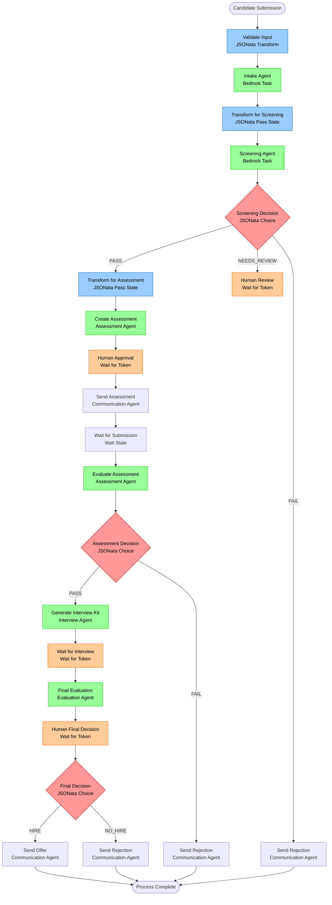

# Agentic Hiring Workflow: Step Functions + JSONata + Bedrock
*Updated for Devcraft Session Requirements*

## Executive Summary

This document details the end-to-end **Agentic Workflow** for hiring automation using **AWS Step Functions with JSONata** and **Amazon Bedrock Agents**. Following Devcraft session guidance, our workflow is implemented as a state machine that reduces manual intervention from 4-6 hours per candidate to ~17 minutes of decision confirmation time.

The system leverages **Step Functions** for orchestration, **JSONata** for intelligent data transformations, and **Bedrock Agents** for AI-powered decision making, creating a robust and auditable hiring pipeline.

---

## Workflow Architecture Overview

### **State Machine-Driven Process Flow**


### **Key Workflow Characteristics**
- **Total Human Time Per Candidate:** 17 minutes across 3 decision points
- **Total Process Time:** 5-7 days (vs. current 2-3 weeks)
- **Automation Rate:** 90%+ with intelligent routing
- **Audit Trail:** Complete state machine execution history
- **Error Handling:** Built-in retries and failure recovery

---

## Detailed Stage-by-Stage Implementation

## Stage 1: Input Validation & Resume Intake
**Step Functions States:** ValidateInput → IntakeAgent → TransformForScreening  
**Duration:** Real-time processing (2-3 minutes)  
**Human Involvement:** None

### **State 1: ValidateInput (Pass State with JSONata)**
```json
{
  "ValidateInput": {
    "Type": "Pass",
    "Comment": "JSONata validation and normalization of candidate input",
    "Parameters": {
      "validatedCandidate.$": "$exists($.candidateData.resume) and $exists($.candidateData.email) ? $.candidateData : $error('Missing required fields: resume or email')",
      "processId.$": "$uuid()",
      "timestamp.$": "$now()",
      "source.$": "$.candidateData.source ? $.candidateData.source : 'unknown'",
      "normalizedEmail.$": "$lowercase($trim($.candidateData.email))"
    },
    "ResultPath": "$.validated",
    "Next": "IntakeAgent"
  }
}
```

**JSONata Transformations:**
- **Input Validation:** Ensures required fields (resume, email) are present
- **Data Normalization:** Standardizes email format, generates unique process ID
- **Source Tracking:** Identifies candidate source (task management, email, etc.)
- **Timestamp Generation:** Records exact processing start time

### **State 2: IntakeAgent (Bedrock Task State)**
```json
{
  "IntakeAgent": {
    "Type": "Task",
    "Comment": "Bedrock Agent for resume processing and data extraction",
    "Resource": "arn:aws:bedrock:us-east-1:account:agent/intake-agent-id",
    "Parameters": {
      "sessionId.$": "$.validated.processId",
      "inputText.$": "$string($.validated.validatedCandidate)",
      "enableTrace": true,
      "sessionAttributes": {
        "stage": "intake",
        "candidateSource.$": "$.validated.source"
      }
    },
    "ResultPath": "$.intakeResult",
    "Retry": [
      {
        "ErrorEquals": ["Bedrock.ThrottlingException"],
        "IntervalSeconds": 2,
        "MaxAttempts": 3,
        "BackoffRate": 2.0
      },
      {
        "ErrorEquals": ["Bedrock.ValidationException"],
        "IntervalSeconds": 1,
        "MaxAttempts": 2
      }
    ],
    "Catch": [
      {
        "ErrorEquals": ["States.ALL"],
        "Next": "HandleIntakeError",
        "ResultPath": "$.error"
      }
    ],
    "Next": "TransformForScreening"
  }
}
```

**Bedrock Agent Configuration:**
```yaml
IntakeAgent:
  foundationModel: "anthropic.claude-3-haiku-20240307-v1:0"  # Fast, cost-effective
  instruction: |
    You are an Intake Agent responsible for processing candidate resumes and extracting structured information.
    
    Your tasks:
    1. Parse resume content (PDF, DOC, or text format)
    2. Extract key information: contact details, experience, education, skills
    3. Normalize data into standard JSON format
    4. Validate completeness and flag missing information
    5. Generate candidate profile summary
    
    Output format: JSON with candidateProfile, contactInfo, experienceLevel, and completenessScore
  
  tools:
    - name: "pdf_parser"
      description: "Extract text and structure from PDF resumes"
    - name: "data_validator" 
      description: "Validate extracted candidate data against schema"
    - name: "duplicate_checker"
      description: "Check for existing candidates in database"
```

**Automated Actions:**
1. **Document Processing**
   - Parse PDF/DOC resume files using integrated tools
   - Extract text content and maintain formatting structure
   - Handle multiple file formats and encoding issues

2. **Data Extraction**
   - Contact information (name, email, phone, location)
   - Professional experience with dates and descriptions
   - Education background and certifications
   - Technical and soft skills identification

3. **Data Normalization**
   - Standardize date formats and experience calculations
   - Normalize skill names and categorization
   - Generate experience level assessment (Entry/Mid/Senior)
   - Create unique candidate identifier

4. **Quality Validation**
   - Completeness scoring (0-100% based on available information)
   - Data consistency checks (dates, contact info validation)
   - Duplicate candidate detection using email and name matching

### **State 3: TransformForScreening (Pass State with JSONata)**
```json
{
  "TransformForScreening": {
    "Type": "Pass",
    "Comment": "JSONata transformation to prepare screening context",
    "Parameters": {
      "screeningInput.$": "$merge([$.intakeResult.candidateProfile, {\"companyContext\": $.companyContext, \"jobRequirements\": $.jobDescription.requirements, \"screeningCriteria\": $.companyContext.coreValues, \"candidateMetadata\": {\"processId\": $.validated.processId, \"source\": $.validated.source, \"intakeTimestamp\": $.validated.timestamp, \"completenessScore\": $.intakeResult.completenessScore}}])",
      "candidateId.$": "$.intakeResult.candidateId",
      "stage": "screening",
      "nextStagePrep": {
        "requiresHumanReview.$": "$.intakeResult.completenessScore < 80",
        "experienceLevel.$": "$.intakeResult.experienceLevel",
        "primarySkills.$": "$.intakeResult.candidateProfile.skills[0:5]"
      }
    },
    "ResultPath": "$.screeningPrep",
    "Next": "ScreeningAgent"
  }
}
```

**JSONata Context Preparation:**
- **Company Context Integration:** Merges candidate data with company values and job requirements
- **Metadata Enrichment:** Adds process tracking and quality metrics
- **Conditional Logic Setup:** Prepares flags for downstream decision making
- **Skill Prioritization:** Identifies top 5 skills for focused evaluation

### **Output Generated:**
```json
{
  "intakeResult": {
    "candidateId": "cand_20250821_001",
    "candidateProfile": {
      "name": "John Doe",
      "email": "john.doe@email.com",
      "phone": "+1-555-0123",
      "location": "San Francisco, CA",
      "experience": [
        {
          "company": "Tech Corp",
          "role": "Senior Backend Engineer", 
          "duration": "2020-2024",
          "description": "Led development of microservices architecture..."
        }
      ],
      "education": [
        {
          "degree": "BS Computer Science",
          "school": "Stanford University",
          "year": "2020"
        }
      ],
      "skills": ["Python", "AWS", "Docker", "PostgreSQL", "REST APIs"]
    },
    "contactInfo": {
      "email": "john.doe@email.com",
      "phone": "+1-555-0123",
      "preferredContact": "email"
    },
    "experienceLevel": "Senior",
    "completenessScore": 95
  },
  "screeningPrep": {
    "screeningInput": {
      "candidateProfile": "...",
      "companyContext": "...",
      "jobRequirements": "...",
      "candidateMetadata": "..."
    },
    "nextStagePrep": {
      "requiresHumanReview": false,
      "experienceLevel": "Senior",
      "primarySkills": ["Python", "AWS", "Docker", "PostgreSQL", "REST APIs"]
    }
  }
}
```

### **Automatic State Transitions:**
- **Success:** Automatically proceeds to ScreeningAgent state
- **Validation Error:** Routes to HandleIntakeError for manual intervention
- **Bedrock Throttling:** Automatic retry with exponential backoff
- **Data Quality Issues:** Flags for human review in next stage

---

## Stage 2: Intelligent Candidate Screening
**Step Functions States:** ScreeningAgent → EvaluateScreeningResult → [HumanReview | TransformForAssessment | RejectCandidate]  
**Duration:** 15-20 minutes processing + 5 minutes human review (if needed)  
**Human Involvement:** 5 minutes (decision confirmation for borderline cases)

### **State 1: ScreeningAgent (Bedrock Task State)**
```json
{
  "ScreeningAgent": {
    "Type": "Task",
    "Comment": "Bedrock Agent for intelligent candidate screening against company values",
    "Resource": "arn:aws:bedrock:us-east-1:account:agent/screening-agent-id",
    "Parameters": {
      "sessionId.$": "$.screeningPrep.candidateId",
      "inputText.$": "$string($.screeningPrep.screeningInput)",
      "enableTrace": true,
      "sessionAttributes": {
        "stage": "screening",
        "experienceLevel.$": "$.screeningPrep.nextStagePrep.experienceLevel",
        "primarySkills.$": "$join($.screeningPrep.nextStagePrep.primarySkills, ', ')"
      }
    },
    "ResultPath": "$.screeningResult",
    "Retry": [
      {
        "ErrorEquals": ["Bedrock.ThrottlingException"],
        "IntervalSeconds": 5,
        "MaxAttempts": 3,
        "BackoffRate": 2.0
      }
    ],
    "Next": "EvaluateScreeningResult"
  }
}
```

**Bedrock Agent Configuration:**
```yaml
ScreeningAgent:
  foundationModel: "anthropic.claude-3-5-sonnet-20241022-v2:0"  # Advanced reasoning
  instruction: |
    You are a Screening Agent that evaluates candidates against company core values and job requirements.
    
    Your tasks:
    1. Analyze candidate profile against 10 company core values systematically
    2. Map specific achievements and experiences to value criteria with evidence
    3. Evaluate technical skills alignment with job requirements
    4. Identify potential red flags or concerns that need human attention
    5. Generate confidence scores and clear recommendations
    
    Use vector search to find similar successful candidates for comparison.
    Provide evidence-based reasoning for all assessments.
    
    Output format: JSON with recommendation (PASS/FAIL/NEEDS_REVIEW), confidence score, evidence mapping, and detailed reasoning.
  
  knowledgeBases:
    - companyCoreValues
    - screeningCriteria  
    - historicalDecisions
    - successfulCandidateProfiles
  
  tools:
    - name: "vector_search"
      description: "Find similar candidate profiles using OpenSearch"
    - name: "knowledge_graph_query"
      description: "Query relationships between skills and success factors"
    - name: "bias_detector"
      description: "Detect potential bias in evaluation"
    - name: "evidence_mapper"
      description: "Map candidate achievements to company values"
```

**Automated Screening Actions:**
1. **Core Value Assessment**
   - Systematic evaluation against all 10 company core values
   - Evidence extraction from resume and experience descriptions
   - Scoring each value on 1-10 scale with supporting rationale

2. **Technical Skill Evaluation**
   - Match candidate skills against job requirements
   - Assess skill depth based on experience descriptions
   - Identify skill gaps and growth potential

3. **Experience Analysis**
   - Career progression evaluation and growth trajectory
   - Leadership and impact assessment from role descriptions
   - Industry relevance and domain expertise evaluation

4. **Red Flag Detection**
   - Employment gap analysis with context consideration
   - Skill claim validation against actual experience
   - Cultural fit risk assessment based on company values

### **State 2: EvaluateScreeningResult (Choice State with JSONata)**
```json
{
  "EvaluateScreeningResult": {
    "Type": "Choice",
    "Comment": "JSONata-based intelligent routing based on screening results",
    "Choices": [
      {
        "Comment": "Strong pass - proceed directly to assessment",
        "And": [
          {
            "Variable": "$.screeningResult.recommendation",
            "StringEquals": "PASS"
          },
          {
            "Variable": "$.screeningResult.confidence",
            "NumericGreaterThan": 0.8
          },
          {
            "Variable": "$.screeningResult.overallScore",
            "NumericGreaterThan": 7.5
          }
        ],
        "Next": "TransformForAssessment"
      },
      {
        "Comment": "Borderline pass - requires human review",
        "And": [
          {
            "Variable": "$.screeningResult.recommendation", 
            "StringEquals": "PASS"
          },
          {
            "Variable": "$.screeningResult.confidence",
            "NumericLessThan": 0.8
          }
        ],
        "Next": "HumanScreeningReview"
      },
      {
        "Comment": "Needs review - human decision required",
        "Variable": "$.screeningResult.recommendation",
        "StringEquals": "NEEDS_REVIEW",
        "Next": "HumanScreeningReview"
      },
      {
        "Comment": "Clear fail with high confidence",
        "And": [
          {
            "Variable": "$.screeningResult.recommendation",
            "StringEquals": "FAIL"
          },
          {
            "Variable": "$.screeningResult.confidence",
            "NumericGreaterThan": 0.8
          }
        ],
        "Next": "SendScreeningRejection"
      }
    ],
    "Default": "HumanScreeningReview"
  }
}
```

**JSONata Routing Logic:**
- **Automatic Pass:** High confidence (>0.8) + high score (>7.5) + PASS recommendation
- **Human Review Required:** Low confidence (<0.8) or NEEDS_REVIEW recommendation
- **Automatic Rejection:** High confidence (>0.8) + FAIL recommendation
- **Default Safety:** Any edge cases route to human review

### **State 3A: HumanScreeningReview (Wait for Task Token)**
```json
{
  "HumanScreeningReview": {
    "Type": "Task",
    "Comment": "Human review for borderline screening decisions",
    "Resource": "arn:aws:states:::lambda:invoke.waitForTaskToken",
    "Parameters": {
      "FunctionName": "human-screening-review-function",
      "Payload": {
        "taskToken.$": "$$.Task.Token",
        "candidateId.$": "$.screeningPrep.candidateId",
        "screeningData": {
          "recommendation.$": "$.screeningResult.recommendation",
          "confidence.$": "$.screeningResult.confidence",
          "overallScore.$": "$.screeningResult.overallScore",
          "coreValueScores.$": "$.screeningResult.coreValueScores",
          "strengths.$": "$.screeningResult.strengths",
          "concerns.$": "$.screeningResult.concerns",
          "evidence.$": "$.screeningResult.evidence"
        },
        "candidateProfile": {
          "name.$": "$.intakeResult.candidateProfile.name",
          "experience.$": "$.intakeResult.candidateProfile.experience[0:3]",
          "skills.$": "$.intakeResult.candidateProfile.skills[0:8]",
          "experienceLevel.$": "$.intakeResult.experienceLevel"
        },
        "reviewInstructions": "Review AI screening recommendation. Focus on concerns and evidence quality. Approve, reject, or request additional information."
      }
    },
    "ResultPath": "$.humanScreeningDecision",
    "TimeoutSeconds": 86400,
    "Next": "ProcessHumanScreeningDecision"
  }
}
```

### **Human Decision Interface:**
**What You See:**
```json
{
  "candidateName": "John Doe",
  "aiRecommendation": "PASS",
  "confidenceScore": 0.75,
  "overallScore": 7.2,
  "coreValueScores": {
    "Innovation": 8.5,
    "Collaboration": 7.0,
    "Excellence": 8.0,
    "Integrity": 7.5,
    "CustomerFocus": 6.5
  },
  "keyStrengths": [
    "Strong technical leadership experience",
    "Proven track record of system scalability",
    "Cross-functional collaboration skills"
  ],
  "concerns": [
    "Limited customer-facing experience",
    "No mention of mentoring junior developers"
  ],
  "evidence": {
    "Innovation": "Led migration to microservices architecture, reducing system latency by 40%",
    "Excellence": "Consistently delivered projects on time with high quality standards"
  }
}
```

**Your Action Required (5 minutes):**
- Review AI analysis and evidence quality
- Consider concerns in context of role requirements
- Make decision: ✅ **APPROVE** ❌ **REJECT** 🔍 **REQUEST_MORE_INFO**
- Add optional notes for borderline cases

### **State 3B: ProcessHumanScreeningDecision (Choice State)**
```json
{
  "ProcessHumanScreeningDecision": {
    "Type": "Choice",
    "Comment": "Process human screening decision",
    "Choices": [
      {
        "Variable": "$.humanScreeningDecision.decision",
        "StringEquals": "APPROVE",
        "Next": "TransformForAssessment"
      },
      {
        "Variable": "$.humanScreeningDecision.decision", 
        "StringEquals": "REQUEST_MORE_INFO",
        "Next": "RequestAdditionalInfo"
      }
    ],
    "Default": "SendScreeningRejection"
  }
}
```

### **Screening Output Generated:**
```json
{
  "screeningResult": {
    "candidateId": "cand_20250821_001",
    "recommendation": "PASS",
    "confidence": 0.85,
    "overallScore": 8.2,
    "coreValueScores": {
      "Innovation": 8.5,
      "Collaboration": 8.0,
      "Excellence": 8.5,
      "Integrity": 8.0,
      "CustomerFocus": 7.5,
      "Ownership": 8.0,
      "GrowthMindset": 8.5,
      "Transparency": 7.5,
      "Diversity": 8.0,
      "Impact": 8.5
    },
    "strengths": [
      "Strong technical leadership with proven scalability achievements",
      "Excellent problem-solving skills demonstrated through architecture decisions",
      "Clear growth trajectory and continuous learning mindset"
    ],
    "concerns": [
      "Limited direct customer interaction experience",
      "Could benefit from more mentoring/coaching experience"
    ],
    "evidence": {
      "Innovation": "Led migration to microservices, implemented CI/CD pipeline",
      "Excellence": "Consistently delivered high-quality code, 99.9% uptime",
      "Impact": "Reduced system latency by 40%, improved team productivity by 25%"
    },
    "redFlags": [],
    "similarCandidates": [
      {
        "candidateId": "successful_hire_2023_15",
        "similarity": 0.87,
        "outcome": "Strong performer after 18 months"
      }
    ]
  }
}
```

### **Automatic State Transitions:**
- **High Confidence Pass:** → TransformForAssessment
- **Low Confidence/Borderline:** → HumanScreeningReview  
- **High Confidence Fail:** → SendScreeningRejection
- **Human Approval:** → TransformForAssessment
- **Human Rejection:** → SendScreeningRejection

### **Error Handling & Monitoring:**
- **Bedrock Throttling:** Automatic retry with exponential backoff
- **Human Review Timeout:** 24-hour timeout with escalation notification
- **Quality Metrics:** Track screening accuracy vs. final hire outcomes
- **Bias Detection:** Automated alerts for potential bias patterns

---

## Stage 3: Take-Home Assessment Creation & Management
**Agent:** Assessment Agent  
**Duration:** 30 minutes creation + 2-3 days candidate completion  
**Human Involvement:** 2 minutes (assessment approval)

### Automated Actions:
1. **Assessment Personalization**
   - Analyze candidate's technical background and experience level.
   - Select appropriate difficulty level (Entry/Mid/Senior).
   - Customize problems based on their claimed skills and interests.
   - Generate role-specific scenarios and requirements.

2. **Assessment Package Creation**
   - Create detailed problem description with clear requirements.
   - Generate evaluation rubric with specific scoring criteria.
   - Set realistic time expectations and submission guidelines.
   - Include company context and technical environment details.

3. **Quality Assurance**
   - Validate problem complexity against candidate level.
   - Ensure clear instructions and acceptance criteria.
   - Check for potential ambiguities or missing information.

### Human Decision Point:
**What You See:**
- Generated take-home assessment with full details.
- Estimated completion time and difficulty level.
- Evaluation rubric and scoring criteria.
- Recommendation: SEND/MODIFY/REJECT.

**Your Action Required:**
- Quick review of assessment relevance (2 minutes).
- Confirm sending: ✅ Send ✏️ Minor edits needed 🔄 Regenerate.

**System Response:**
- SEND: Communication Agent emails assessment to candidate.
- MODIFY: Brief feedback loop for adjustments.
- REGENERATE: Create alternative assessment approach.

### Automated Follow-up:
- Send assessment via email with clear instructions.
- Set up automatic reminder system (48-hour intervals).
- Track submission status and candidate engagement.

---

## Stage 4: Assessment Evaluation
**Agent:** Assessment Agent  
**Duration:** 45-60 minutes after submission  
**Human Involvement:** 5 minutes (review and confirmation)

### Automated Actions:
1. **Code Repository Cloning & Analysis**
   - Clone the candidate's submission from their Git repository.
   - Analyze code structure, dependencies, and overall project layout.

2. **Agent-First Technical Evaluation**
   - An AI agent evaluates the submission against a detailed rubric.
   - The agent assesses code quality, functionality, testing, and problem-solving approach.

3. **Evaluation Report Generation**
   - The agent generates a detailed report with scores, evidence from the code, and commentary.
   - The report includes a clear pass/fail recommendation with reasoning.

### Human Decision Point:
- Review the AI-generated evaluation report.
- Confirm the pass/fail recommendation.

### Automatic Decision Making:
- **Score ≥ Threshold:** Automatic pass to interview stage.
- **Score < Threshold:** Automatic fail with detailed feedback, pending human confirmation.

---

## Stage 5: Interview Kit Generation
**Agent:** Interview Agent  
**Duration:** 45 minutes  
**Human Involvement:** None (full automation)

### Automated Actions:
1. **Candidate Context Generation**
   - Executive summary with key highlights.
   - Core value evidence mapping from all previous stages.
   - Technical competency assessment summary.
   - Interview strategy recommendations.

2. **Personalized Interview Guide Creation**
   - BEI questions targeting specific candidate experiences.
   - Technical deep-dive questions based on assessment performance.
   - Problem-solving scenarios appropriate for their level.
   - Cultural fit validation questions.

3. **Complete Interview Script Development**
   - Full interviewer script with timing and transitions.
   - Personalized opening based on candidate's impressive achievements.
   - STAR method prompts for behavioral questions.
   - Closing script with next steps explanation.

4. **Technical Problem Selection**
   - Choose problems from existing bank based on candidate's assessment performance.
   - Select difficulty level matching their demonstrated abilities.
   - Prepare alternative problems for different interview lengths.

### Output Delivered:
- `candidate_context.md`: Briefing document for interview panel.
- `interview_guide.md`: Detailed plan for each interview stage.
- `interview_script.md`: Complete verbatim script for interviewers.

### Automatic Notifications:
- Interview materials delivered to interview team.
- Calendar invites sent to candidate and interviewers.
- Reminder notifications scheduled.

---

## Stage 6: Final Evaluation & Decision
**Agent:** Evaluation Agent  
**Duration:** 30 minutes post-interview  
**Human Involvement:** 10 minutes (final decision confirmation)

### Automated Actions:
1. **Data Aggregation**
   - Compile screening scores and evidence.
   - Include assessment evaluation and technical scores.
   - Integrate interview feedback and ratings.
   - Weight all factors according to role requirements.

2. **Comprehensive Analysis**
   - Cross-reference performance across all stages.
   - Identify consistency patterns and potential concerns.
   - Compare against successful hire profiles.
   - Generate risk assessment and confidence metrics.

3. **Final Recommendation Generation**
   - Clear HIRE/NO HIRE recommendation.
   - Detailed justification with supporting evidence.
   - Salary band recommendation based on performance.
   - Onboarding timeline and team fit suggestions.

### Human Decision Point:
**What You See:**
- Comprehensive evaluation summary.
- Clear recommendation with confidence score.
- Supporting evidence from all stages.
- Risk factors and mitigation strategies.

**Your Action Required:**
- Review final recommendation (7 minutes).
- Consider any additional context or concerns (3 minutes).
- Make final decision: ✅ HIRE ❌ NO HIRE 🤔 NEED MORE INFO.

**System Response:**
- HIRE: Initiates offer process and HR notification.
- NO HIRE: Sends professional rejection with feedback.
- NEED MORE INFO: Schedules additional evaluation or interview.

---

## Stage 7: HR Communication & Documentation
**Agent:** Communication Agent  
**Duration:** 15 minutes  
**Human Involvement:** None (full automation)

### Automated Actions:
1. **HR Notification Email**
   - Send detailed report to HR.
   - Include full evaluation summary and recommendation.
   - Attach all relevant documentation and scoring details.
   - Provide timeline and next steps.

2. **Candidate Communication**
   - HIRE: Send congratulatory email with next steps.
   - NO HIRE: Send professional rejection with constructive feedback.
   - Follow up on any pending actions or requirements.

3. **Documentation & Audit Trail**
   - Create complete hiring decision record.
   - Store all evaluation data and agent decisions.
   - Generate compliance documentation.
   - Update candidate tracking systems.

### Email Template to HR:
```
Subject: Hiring Decision - [Candidate Name] - [Position] - RECOMMENDED FOR HIRE

Dear HR Team,

The automated hiring evaluation for [Candidate Name] has been completed. 

FINAL RECOMMENDATION: HIRE

EVALUATION SUMMARY:
- Screening: Strong cultural fit
- Assessment: Excellent technical skills
- Interview: Outstanding communication

DETAILED REPORT: [Attached]
NEXT STEPS: Offer preparation and background check initiation.

Best regards,
Hiring Automation System
```

---

## Quality Assurance & Monitoring

### Real-Time Monitoring:
- Dashboard showing pipeline status for all candidates.
- Agent performance metrics and error rates.
- Decision consistency tracking across stages.
- Time-to-hire measurement and optimization.

### Quality Controls:
- Automated bias detection in all decisions.
- Consistency checks across similar candidates.
- Performance correlation tracking with eventual hire success.
- Regular calibration against manual evaluation samples.

### Audit & Compliance:
- Complete decision trail for every candidate.
- GDPR-compliant data handling and retention.
- Regular bias and fairness auditing.
- Legal compliance verification for all communications.

---

## Success Metrics

### Efficiency Gains:
- **Time Reduction:** 70%+ decrease in time-to-hire.
- **Cost Savings:** 80%+ reduction in manual evaluation time.
- **Consistency:** 95%+ decision alignment across similar candidates.
- **Quality:** Maintained or improved hire success rates.

### Performance Targets:
- False positive rate: <5% (good candidates rejected).
- False negative rate: <3% (unqualified candidates advanced).
- Average processing time: 5-7 days per candidate.
- Human intervention time: <20 minutes per candidate.

This workflow transforms your hiring process from a manual, time-intensive operation into a streamlined, AI-driven system that maintains quality while dramatically reducing your personal time investment.
