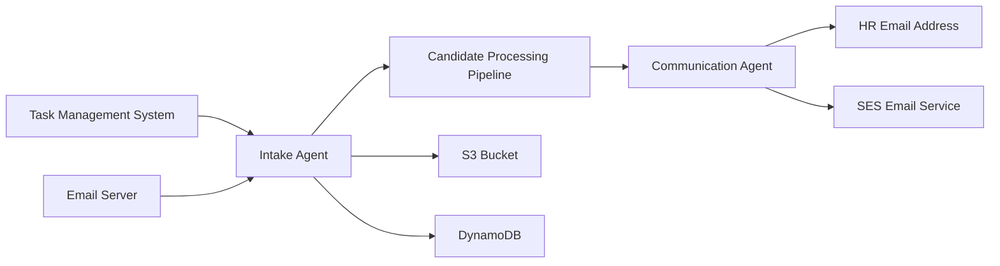

# External System Integration Specifications

## Executive Summary

This document details the specific integrations required to connect the AI hiring automation system with existing external systems, such as a task management system for candidate submissions, an email server for resumes, and HR communication via email. Each integration includes authentication methods, API specifications, data formats, and error handling procedures.

---

## Integration Architecture Overview



---

## 1. Task Management System Integration

### Overview
Automated monitoring of the task management system for new candidate submissions with resume attachments.

### Authentication Configuration

```python
class TaskManagerConfig:
    """Task Management System API Configuration"""
    BASE_URL = "https://api.your-task-manager.com"
    API_VERSION = "v2"
    
    # Authentication
    TOKEN_TYPE = "Bearer"
    TOKEN_ENDPOINT = "https://api.your-task-manager.com/oauth2/token"
    
    # Project Configuration
    HIRING_PROJECT_ID = "your-project-id"
    TASK_FILTER_LABELS = ["candidate", "resume", "hiring"]
    
    # Polling Configuration
    POLL_INTERVAL_SECONDS = 300  # 5 minutes
    LOOKBACK_HOURS = 24
```

### API Integration Implementation

```python
import requests
import json
from datetime import datetime, timedelta
from typing import List, Dict, Optional

class TaskManagerIntegration:
    def __init__(self, access_token: str, project_id: str):
        self.access_token = access_token
        self.project_id = project_id
        self.base_url = "https://api.your-task-manager.com/v2"
        self.headers = {
            'Authorization': f'Bearer {access_token}',
            'Content-Type': 'application/json'
        }
    
    def get_new_candidate_tasks(self) -> List[Dict]:
        """
        Retrieve new tasks with candidate submissions.
        """
        # ... implementation to fetch tasks from the API ...
        pass
    
    def download_attachment(self, download_url: str) -> bytes:
        """Download attachment file"""
        # ... implementation to download attachments ...
        pass
    
    def mark_task_processed(self, task_id: str) -> bool:
        """Mark task as processed to avoid reprocessing"""
        # ... implementation to update task status ...
        pass
```

---

## 2. Email Server Integration

### Overview
API integration for monitoring hiring email accounts and processing resume attachments.

### Authentication Setup

```python
class EmailServerConfig:
    """Email Server API Configuration"""
    AUTHORITY = "https://login.your-email-provider.com"
    TENANT_ID = "your-tenant-id"
    CLIENT_ID = "your-client-id"
    CLIENT_SECRET = "your-client-secret"
    
    # API Configuration
    API_BASE = "https://api.your-email-provider.com/v1.0"
    SCOPES = ["https://api.your-email-provider.com/.default"]
    
    # Email Configuration
    HIRING_MAILBOX = "hiring@your-company.com"
```

### API Integration Implementation

```python
import requests
from msal import ConfidentialClientApplication
from datetime import datetime, timedelta
from typing import List, Dict, Optional

class EmailServerIntegration:
    def __init__(self, tenant_id: str, client_id: str, client_secret: str):
        # ... initialization ...
        pass
    
    def _get_access_token(self) -> str:
        """Get valid access token"""
        # ... implementation to get OAuth2 token ...
        pass
    
    def get_hiring_emails(self, mailbox: str = None) -> List[Dict]:
        """Get recent emails with resume attachments"""
        # ... implementation to fetch emails ...
        pass
    
    def download_attachment(self, mailbox: str, email_id: str, 
                          attachment_id: str) -> bytes:
        """Download email attachment"""
        # ... implementation to download attachments ...
        pass
    
    def mark_email_processed(self, mailbox: str, email_id: str) -> bool:
        """Mark email as processed"""
        # ... implementation to update email status ...
        pass
```

---

## 3. HR Email Communication Integration

### Overview
Automated email communication to the HR team using Amazon SES for hiring decisions and notifications.

### SES Configuration

```python
class HREmailConfig:
    """HR Email Communication Configuration"""
    HR_EMAIL = "hr@your-company.com"
    SENDER_EMAIL = "hiring-automation@your-company.com"
    REPLY_TO_EMAIL = "hiring@your-company.com"
    
    # SES Configuration
    SES_REGION = "us-east-1"
    
    # Email Templates
    TEMPLATE_BUCKET = "hiring-automation-templates"
    TEMPLATE_PREFIX = "email-templates/"
```

### SES Integration Implementation

```python
import boto3
from email.mime.multipart import MIMEMultipart
from email.mime.text import MIMEText
from jinja2 import Template
import json

class HREmailIntegration:
    def __init__(self, region: str = 'us-east-1'):
        self.ses_client = boto3.client('ses', region_name=region)
        # ... initialization ...

    def send_final_decision_notification(self, candidate_data: Dict, 
                                       final_decision: Dict) -> bool:
        """Send final hiring decision to HR"""
        # ... implementation to send email ...
        pass

    def _send_templated_email(self, template_name: str, subject: str, 
                            template_data: Dict, attachments: List = None) -> bool:
        """Send email using HTML template"""
        # ... implementation to load template and send email ...
        pass
```

---

## 4. Error Handling & Monitoring

### Integration Health Monitoring

```python
class IntegrationMonitor:
    def __init__(self):
        self.cloudwatch = boto3.client('cloudwatch')
        self.sns = boto3.client('sns')
        
    def monitor_integration_health(self, integration_name: str) -> Dict:
        """Monitor the health of an integration"""
        try:
            # Test API connectivity
            # ...
            self._send_metric(f'{integration_name}Integration', 'Health', 1)
            return {'status': 'healthy'}
        except Exception as e:
            self._send_metric(f'{integration_name}Integration', 'Health', 0)
            self._send_alert(f'{integration_name} integration failure', str(e))
            return {'status': 'unhealthy', 'error': str(e)}
    
    def _send_metric(self, namespace: str, metric_name: str, value: float):
        """Send custom metric to CloudWatch"""
        # ... implementation ...
        pass
    
    def _send_alert(self, subject: str, message: str):
        """Send alert notification"""
        # ... implementation ...
        pass
```

This comprehensive integration specification provides all the technical details needed to connect the AI hiring system with your existing external systems, ensuring seamless data flow and reliable communication channels.
