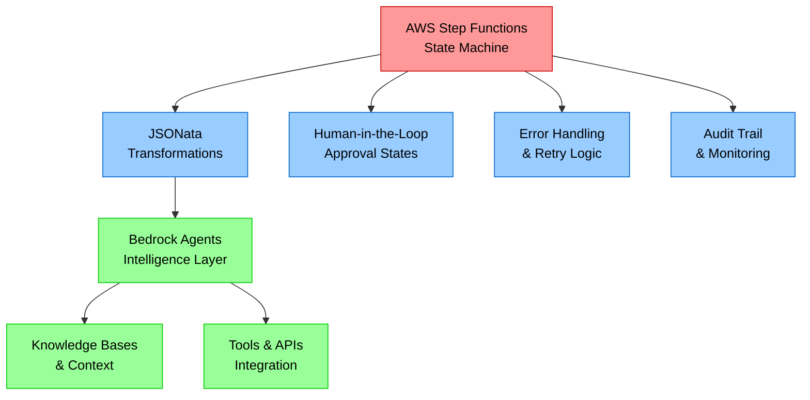
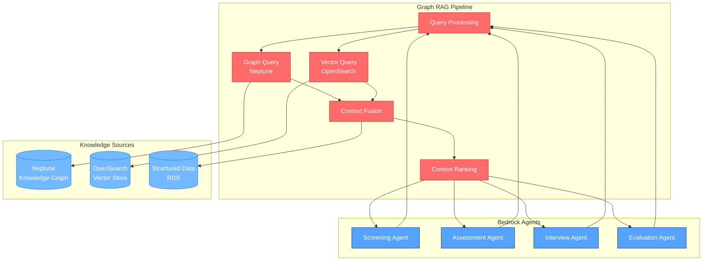

# Technical Overview: Step Functions + JSONata + Bedrock Agentic Workflows
*Updated for Devcraft Session Requirements*

## Executive Summary

This document provides the technical architecture for our **Agentic Workflow** hiring automation system, built on the foundation of **AWS Step Functions with JSONata** and **Amazon Bedrock Agents**. Following Devcraft session guidance, we're implementing a state machine-driven approach where intelligent workflow orchestration, data transformations, and AI decision-making work together seamlessly.

Our architecture prioritizes **scalability**, **auditability**, and **cost-efficiency** while leveraging the latest AWS capabilities for agentic workflows.

---

## Core Architecture Principles

### **1. Step Functions-First Design**
- **Primary Orchestration:** AWS Step Functions serves as the central workflow engine
- **Visual Workflows:** Complete hiring process defined as state machines
- **Built-in Reliability:** Automatic retries, error handling, and state persistence
- **Human Integration:** Native support for human-in-the-loop approvals

### **2. JSONata-Powered Data Transformation**
- **Intelligent Routing:** JSONata expressions handle all conditional logic
- **Data Normalization:** Consistent transformations between workflow states
- **Dynamic Configuration:** Runtime data manipulation without code changes
- **Audit Trail:** All transformations visible in Step Functions execution history

### **3. Bedrock Agents for Intelligence**
- **Specialized Agents:** Each agent optimized for specific hiring tasks
- **Context-Aware:** Agents access knowledge bases and vector search
- **Tool Integration:** Native integration with AWS services and external APIs
- **Consistent Performance:** Managed scaling and reliability through Bedrock

### **4. Context-Centric Data Architecture**
- **Multi-Modal Storage:** Different data types optimized for their use cases
- **Real-Time Context:** Agents access fresh data for intelligent decisions
- **Scalable Search:** Vector and graph databases for complex queries
- **Cost Optimization:** Right-sized storage for different data access patterns

---

## Technical Stack & AWS Services

### **Core Workflow Engine**


### **Service Integration Matrix**

| **Service** | **Primary Use** | **Integration Pattern** | **Cost Optimization** |
|-------------|-----------------|------------------------|----------------------|
| **AWS Step Functions** | Workflow orchestration, state management | Express workflows for high-volume, Standard for complex logic | Pay-per-execution model |
| **Amazon Bedrock** | AI agent hosting, model inference | Agent invocation via Step Functions Task states | On-demand pricing, model selection optimization |
| **JSONata** | Data transformation, conditional routing | Embedded in Step Functions Pass and Choice states | No additional cost (native Step Functions feature) |
| **Amazon Neptune** | Knowledge graph, relationship queries | Bedrock agent tool integration | Serverless option for variable workloads |
| **Amazon OpenSearch** | Vector similarity search, candidate matching | Bedrock agent knowledge base | Reserved instances for predictable usage |
| **Amazon RDS PostgreSQL** | Structured data, analytics | Lambda functions for data access | Aurora Serverless for variable workloads |
| **Amazon DynamoDB** | Real-time state, session management | Step Functions native integration | On-demand billing for unpredictable patterns |
| **Amazon S3** | Document storage, artifacts | Direct integration with all services | Intelligent tiering for cost optimization |
| **AWS Lambda** | Human approval handlers, external integrations | Step Functions Task states with waitForTaskToken | Provisioned concurrency for consistent performance |
| **Amazon SES** | Email communications | Bedrock agent tool integration | Pay-per-email model |

---

## Detailed Technical Implementation

### **1. Step Functions State Machine Architecture**

#### **Express vs Standard Workflows**
- **Standard Workflows:** Complex hiring processes with human approvals (up to 1 year execution)
- **Express Workflows:** Simple candidate notifications and status updates (up to 5 minutes)

#### **State Types Utilization**
```json
{
  "Comment": "Hiring Process Technical Implementation",
  "StartAt": "ValidateInput",
  "States": {
    "ValidateInput": {
      "Type": "Pass",
      "Comment": "JSONata validation and normalization",
      "Parameters": {
        "validatedCandidate.$": "$exists($.candidateData.resume) and $exists($.candidateData.email) ? $.candidateData : $error('Invalid candidate data')",
        "processId.$": "$uuid()",
        "timestamp.$": "$now()"
      },
      "Next": "IntakeAgent"
    },
    
    "IntakeAgent": {
      "Type": "Task",
      "Comment": "Bedrock Agent for resume processing",
      "Resource": "arn:aws:bedrock:us-east-1:account:agent/intake-agent-id",
      "Parameters": {
        "sessionId.$": "$.processId",
        "inputText.$": "$.validatedCandidate",
        "enableTrace": true
      },
      "ResultPath": "$.intakeResult",
      "Retry": [
        {
          "ErrorEquals": ["Bedrock.ThrottlingException"],
          "IntervalSeconds": 2,
          "MaxAttempts": 3,
          "BackoffRate": 2.0
        }
      ],
      "Catch": [
        {
          "ErrorEquals": ["States.ALL"],
          "Next": "HandleIntakeError",
          "ResultPath": "$.error"
        }
      ],
      "Next": "TransformForScreening"
    },
    
    "TransformForScreening": {
      "Type": "Pass",
      "Comment": "JSONata transformation for screening context",
      "Parameters": {
        "screeningInput.$": "$merge([$.intakeResult.candidateProfile, {\"companyContext\": $.companyContext, \"jobRequirements\": $.jobDescription.requirements, \"screeningCriteria\": $.companyContext.coreValues}])",
        "candidateId.$": "$.intakeResult.candidateId",
        "stage": "screening"
      },
      "Next": "ScreeningAgent"
    },
    
    "ScreeningAgent": {
      "Type": "Task",
      "Resource": "arn:aws:bedrock:us-east-1:account:agent/screening-agent-id",
      "Parameters": {
        "sessionId.$": "$.processId",
        "inputText.$": "$.screeningInput"
      },
      "ResultPath": "$.screeningResult",
      "Next": "EvaluateScreeningResult"
    },
    
    "EvaluateScreeningResult": {
      "Type": "Choice",
      "Comment": "JSONata-based conditional routing",
      "Choices": [
        {
          "Variable": "$.screeningResult.recommendation",
          "StringEquals": "PASS",
          "Next": "CreateAssessment"
        },
        {
          "And": [
            {
              "Variable": "$.screeningResult.recommendation",
              "StringEquals": "NEEDS_REVIEW"
            },
            {
              "Variable": "$.screeningResult.confidence",
              "NumericGreaterThan": 0.7
            }
          ],
          "Next": "HumanScreeningReview"
        }
      ],
      "Default": "RejectCandidate"
    }
  }
}
```

### **2. JSONata Transformation Patterns**

#### **Data Normalization**
```javascript
// Standardize candidate data across different input formats
$merge([
  $.candidateData,
  {
    "normalizedSkills": $.candidateData.skills[].{
      "name": $lowercase($trim(.)),
      "category": $lookup($.skillCategories, $lowercase($trim(.)))
    },
    "experienceYears": $number($match($.candidateData.experience, /(\d+)/).groups[0]),
    "educationLevel": $.candidateData.education ? $max($.candidateData.education.level) : "unknown"
  }
])
```

#### **Conditional Routing Logic**
```javascript
// Complex routing based on multiple criteria
$.screeningResult.score >= 8.0 ? "DirectToInterview" :
$.screeningResult.score >= 6.0 and $.candidateData.experienceYears >= 3 ? "TechnicalAssessment" :
$.screeningResult.score >= 5.0 ? "HumanReview" : "AutoReject"
```

#### **Context Aggregation**
```javascript
// Combine data from multiple workflow stages
{
  "finalEvaluation": {
    "candidateId": $.candidateId,
    "overallScore": $round(($sum([
      $.screeningResult.score * 0.3,
      $.assessmentResult.score * 0.4,
      $.interviewResult.score * 0.3
    ])), 2),
    "strengths": $distinct($append($append(
      $.screeningResult.strengths,
      $.assessmentResult.strengths
    ), $.interviewResult.strengths)),
    "concerns": $filter($append($append(
      $.screeningResult.concerns,
      $.assessmentResult.concerns
    ), $.interviewResult.concerns), function($v) { $v != null }),
    "recommendation": $overallScore >= 7.5 ? "STRONG_HIRE" :
                     $overallScore >= 6.5 ? "HIRE" :
                     $overallScore >= 5.5 ? "LEAN_HIRE" : "NO_HIRE"
  }
}
```

### **3. Bedrock Agents Configuration**

#### **Agent Architecture Pattern**
```yaml
# Intake Agent Configuration
IntakeAgent:
  foundationModel: "anthropic.claude-3-5-sonnet-20241022-v2:0"
  instruction: |
    You are an Intake Agent responsible for processing candidate resumes.
    Extract structured information and normalize data into standard JSON format.
    Validate completeness and flag missing critical information.
  
  knowledgeBases:
    - resumeParsingPatterns
    - dataValidationRules
    - industryStandards
  
  tools:
    - name: "pdf_parser"
      description: "Extract text and structure from PDF resumes"
    - name: "data_validator"
      description: "Validate extracted candidate data"
    - name: "duplicate_checker"
      description: "Check for existing candidates in database"
  
  guardrails:
    - piiDetection: true
    - biasDetection: true
    - contentFiltering: true

# Screening Agent Configuration  
ScreeningAgent:
  foundationModel: "anthropic.claude-3-5-sonnet-20241022-v2:0"
  instruction: |
    You are a Screening Agent that evaluates candidates against company values.
    Analyze profiles systematically and provide evidence-based recommendations.
    Use vector search to find similar successful candidates for comparison.
  
  knowledgeBases:
    - companyCoreValues
    - screeningCriteria
    - historicalDecisions
  
  tools:
    - name: "vector_search"
      description: "Find similar candidate profiles using OpenSearch"
    - name: "knowledge_graph_query"
      description: "Query relationships between skills and success factors"
    - name: "bias_detector"
      description: "Detect potential bias in evaluation"
```

#### **Knowledge Base Integration**
```python
# Knowledge Base Structure for Bedrock Agents
knowledge_bases = {
    "companyCoreValues": {
        "source": "s3://hiring-kb/company-values/",
        "vectorStore": "opensearch",
        "chunkingStrategy": "semantic",
        "embeddingModel": "amazon.titan-embed-text-v1"
    },
    "technicalStandards": {
        "source": "s3://hiring-kb/technical-standards/",
        "vectorStore": "opensearch", 
        "chunkingStrategy": "hierarchical",
        "embeddingModel": "amazon.titan-embed-text-v1"
    },
    "historicalDecisions": {
        "source": "rds://hiring-db/decisions",
        "queryInterface": "sql",
        "accessPattern": "structured"
    }
}
```

### **4. Graph RAG Context Management Architecture**

#### **Graph RAG Implementation Strategy**

Our system implements **Graph RAG (Retrieval-Augmented Generation)** as the core context management strategy, providing Bedrock Agents with rich, relationship-aware context for intelligent decision making.



#### **Knowledge Graph Schema (Neptune)**

**Entity Types:**
```cypher
// Core entities in our hiring knowledge graph
CREATE CONSTRAINT candidate_id FOR (c:Candidate) REQUIRE c.id IS UNIQUE;
CREATE CONSTRAINT skill_name FOR (s:Skill) REQUIRE s.name IS UNIQUE;
CREATE CONSTRAINT company_name FOR (co:Company) REQUIRE co.name IS UNIQUE;
CREATE CONSTRAINT role_title FOR (r:Role) REQUIRE r.title IS UNIQUE;

// Entity definitions
(:Candidate {
  id: string,
  name: string,
  experience_years: integer,
  level: string,
  outcome: string,
  performance_rating: float,
  hire_date: date
})

(:Skill {
  name: string,
  category: string,
  difficulty_level: integer,
  market_demand: float,
  growth_trend: string
})

(:Company {
  name: string,
  industry: string,
  size: string,
  tech_stack: [string],
  culture_score: float
})

(:Role {
  title: string,
  level: string,
  department: string,
  required_skills: [string],
  success_criteria: [string]
})

(:CoreValue {
  name: string,
  description: string,
  weight: float,
  evaluation_criteria: [string]
})
```

**Relationship Types:**
```cypher
// Relationship definitions with properties
(:Candidate)-[:HAS_SKILL {proficiency: float, years: integer}]->(:Skill)
(:Candidate)-[:WORKED_AT {duration: integer, role: string}]->(:Company)
(:Candidate)-[:DEMONSTRATES {evidence: string, strength: float}]->(:CoreValue)
(:Candidate)-[:SIMILAR_TO {similarity_score: float, shared_attributes: [string]}]->(:Candidate)

(:Skill)-[:RELATED_TO {correlation: float, co_occurrence: float}]->(:Skill)
(:Skill)-[:REQUIRED_FOR {importance: float, frequency: float}]->(:Role)
(:Skill)-[:LEADS_TO {transition_probability: float, time_frame: integer}]->(:Skill)

(:Role)-[:AT_COMPANY {openings: integer, success_rate: float}]->(:Company)
(:Role)-[:REQUIRES_VALUE {importance: float}]->(:CoreValue)

(:Company)-[:VALUES {priority: integer}]->(:CoreValue)
(:Company)-[:USES_TECH {adoption_level: string}]->(:Skill)
```

#### **Vector Store Schema (OpenSearch)**

**Index Structure:**
```json
{
  "mappings": {
    "properties": {
      "content_id": {"type": "keyword"},
      "content_type": {"type": "keyword"},
      "title": {"type": "text"},
      "content": {"type": "text"},
      "content_embedding": {
        "type": "knn_vector",
        "dimension": 1536,
        "method": {
          "name": "hnsw",
          "space_type": "cosinesimil",
          "engine": "nmslib"
        }
      },
      "metadata": {
        "properties": {
          "candidate_id": {"type": "keyword"},
          "skill_tags": {"type": "keyword"},
          "experience_level": {"type": "keyword"},
          "outcome": {"type": "keyword"},
          "performance_score": {"type": "float"},
          "created_date": {"type": "date"}
        }
      }
    }
  }
}
```

**Document Types:**
- **Candidate Profiles:** Embedded resume content and extracted skills
- **Success Patterns:** Profiles of successful hires with performance data
- **Job Requirements:** Embedded job descriptions and success criteria
- **Interview Insights:** Historical interview feedback and outcomes
- **Assessment Results:** Technical evaluation patterns and benchmarks

#### **Graph RAG Query Engine**

**Context Retrieval Implementation:**
```python
class GraphRAGEngine:
    def __init__(self, neptune_client, opensearch_client):
        self.neptune = neptune_client
        self.opensearch = opensearch_client
        self.embedding_model = "amazon.titan-embed-text-v1"
    
    async def retrieve_context(self, candidate_id: str, query_intent: str, depth: int = 2) -> dict:
        """
        Retrieve Graph RAG context combining graph relationships and vector similarity
        """
        # 1. Graph-based context retrieval
        graph_context = await self._get_graph_context(candidate_id, depth)
        
        # 2. Vector-based semantic context
        vector_context = await self._get_vector_context(candidate_id, query_intent)
        
        # 3. Fuse and rank contexts
        fused_context = self._fuse_contexts(graph_context, vector_context, query_intent)
        
        return fused_context
    
    async def _get_graph_context(self, candidate_id: str, depth: int) -> dict:
        """
        Query Neptune for relationship-based context
        """
        query = f"""
        MATCH (c:Candidate {{id: '{candidate_id}'}})
        OPTIONAL MATCH (c)-[:HAS_SKILL]->(skill:Skill)
        OPTIONAL MATCH (skill)-[:RELATED_TO]-(related_skill:Skill)
        OPTIONAL MATCH (c)-[:WORKED_AT]->(company:Company)
        OPTIONAL MATCH (c)-[:DEMONSTRATES]->(value:CoreValue)
        
        // Find similar successful candidates
        OPTIONAL MATCH (similar:Candidate)-[:HAS_SKILL]->(skill)
        WHERE similar.outcome = 'HIRED' AND similar.performance_rating >= 8.0
        
        RETURN c, 
               collect(DISTINCT skill) as skills,
               collect(DISTINCT related_skill) as related_skills,
               collect(DISTINCT company) as companies,
               collect(DISTINCT value) as demonstrated_values,
               collect(DISTINCT {{
                 candidate: similar,
                 shared_skills: count(skill),
                 performance: similar.performance_rating
               }}) as similar_candidates
        """
        
        result = await self.neptune.execute_query(query)
        return self._process_graph_result(result)
    
    async def _get_vector_context(self, candidate_id: str, query_intent: str) -> dict:
        """
        Query OpenSearch for semantic similarity context
        """
        # Get candidate embedding
        candidate_profile = await self._get_candidate_profile(candidate_id)
        candidate_embedding = await self._generate_embedding(candidate_profile)
        
        # Search for similar contexts
        search_body = {
            "size": 10,
            "query": {
                "bool": {
                    "must": [
                        {
                            "knn": {
                                "content_embedding": {
                                    "vector": candidate_embedding,
                                    "k": 10
                                }
                            }
                        }
                    ],
                    "filter": [
                        {"term": {"metadata.content_type": query_intent}},
                        {"range": {"metadata.performance_score": {"gte": 7.0}}}
                    ]
                }
            }
        }
        
        result = await self.opensearch.search(
            index="hiring_context",
            body=search_body
        )
        
        return self._process_vector_result(result)
    
    def _fuse_contexts(self, graph_context: dict, vector_context: dict, query_intent: str) -> dict:
        """
        Fuse graph and vector contexts with intelligent ranking
        """
        return {
            "graph_relationships": graph_context,
            "semantic_similarities": vector_context,
            "contextual_insights": self._generate_insights(graph_context, vector_context),
            "relevance_scores": self._calculate_relevance(graph_context, vector_context, query_intent),
            "recommended_actions": self._suggest_actions(graph_context, vector_context, query_intent)
        }
```

#### **Bedrock Agent Integration**

**Graph RAG Tool Configuration:**
```yaml
# Tool definition for Bedrock Agents
GraphRAGTool:
  name: "graph_rag_query"
  description: "Query Graph RAG system for rich contextual information about candidates"
  inputSchema:
    type: "object"
    properties:
      candidate_id:
        type: "string"
        description: "Unique identifier for the candidate"
      query_intent:
        type: "string"
        enum: ["screening", "assessment", "interview", "evaluation"]
        description: "The type of context needed for decision making"
      context_depth:
        type: "integer"
        minimum: 1
        maximum: 3
        description: "Number of relationship hops to traverse in knowledge graph"
      similarity_threshold:
        type: "number"
        minimum: 0.0
        maximum: 1.0
        description: "Minimum similarity score for vector search results"
    required: ["candidate_id", "query_intent"]
  
  # Lambda function that implements the Graph RAG query
  actionGroup:
    actionGroupExecutor:
      lambda: "arn:aws:lambda:region:account:function:graph-rag-query"
```

**Enhanced Agent Prompts with Graph RAG:**
```yaml
ScreeningAgent:
  instruction: |
    You are a Screening Agent with access to Graph RAG context management system.
    
    For each candidate evaluation, use the graph_rag_query tool to:
    1. Understand skill relationships and how they cluster in successful candidates
    2. Find similar candidates who were successfully hired and their patterns
    3. Analyze career progression paths that led to success
    4. Identify value demonstrations that correlate with performance
    
    Graph RAG provides you with:
    - **Skill Networks:** How skills relate and complement each other
    - **Success Patterns:** Characteristics of high-performing hires
    - **Career Trajectories:** Common paths that lead to success
    - **Cultural Indicators:** How candidates demonstrate company values
    
    Use this rich context to make evidence-based decisions that go beyond surface-level resume matching.
    
    Always query Graph RAG with query_intent="screening" and context_depth=2 for comprehensive context.
```

#### **Performance Optimization**

**Caching Strategy:**
```python
# Redis-based caching for Graph RAG results
class GraphRAGCache:
    def __init__(self, redis_client):
        self.redis = redis_client
        self.ttl = 3600  # 1 hour cache
    
    async def get_cached_context(self, candidate_id: str, query_intent: str) -> dict:
        cache_key = f"graphrag:{candidate_id}:{query_intent}"
        cached_result = await self.redis.get(cache_key)
        
        if cached_result:
            return json.loads(cached_result)
        return None
    
    async def cache_context(self, candidate_id: str, query_intent: str, context: dict):
        cache_key = f"graphrag:{candidate_id}:{query_intent}"
        await self.redis.setex(
            cache_key, 
            self.ttl, 
            json.dumps(context, default=str)
        )
```

**Query Optimization:**
- **Parallel Execution:** Run graph and vector queries concurrently
- **Result Caching:** Cache frequently accessed contexts
- **Index Optimization:** Optimize Neptune and OpenSearch indices for common query patterns
- **Batch Processing:** Process multiple candidates in parallel where possible

#### **Graph RAG Benefits**

**1. Contextual Intelligence**
- **Deep Understanding:** Multi-hop relationship traversal reveals hidden patterns
- **Semantic Similarity:** Vector search finds conceptually similar candidates
- **Historical Learning:** System improves with each successful hire

**2. Decision Quality**
- **Evidence-Based:** All decisions backed by relationship data and similarity patterns
- **Consistency:** Similar candidates evaluated against similar contextual benchmarks
- **Bias Reduction:** Objective relationship-based context reduces subjective bias

**3. Scalability**
- **Efficient Retrieval:** Optimized queries return relevant context quickly
- **Incremental Learning:** Knowledge graph grows automatically with new data
- **Parallel Processing:** Multiple agents can query context simultaneously

This Graph RAG implementation transforms our hiring system from simple keyword matching to intelligent, context-aware decision making that leverages the full power of relationship data and semantic understanding.

---

## Performance & Cost Optimization

### **Step Functions Optimization**
- **Express Workflows:** Use for high-volume, short-duration processes
- **Parallel States:** Execute independent agent calls concurrently
- **Map States:** Process multiple candidates in batches
- **Choice Optimization:** Minimize state transitions with efficient JSONata logic

### **Bedrock Cost Management**
```python
# Model Selection Strategy
model_selection = {
    "intake": "anthropic.claude-3-haiku-20240307-v1:0",  # Fast, cost-effective
    "screening": "anthropic.claude-3-5-sonnet-20241022-v2:0",  # Balanced reasoning
    "assessment": "anthropic.claude-3-5-sonnet-20241022-v2:0",  # Complex evaluation
    "interview": "anthropic.claude-3-haiku-20240307-v1:0",  # Template generation
    "evaluation": "anthropic.claude-3-5-sonnet-20241022-v2:0",  # Critical decisions
    "communication": "anthropic.claude-3-haiku-20240307-v1:0"  # Simple text generation
}

# Estimated costs per candidate
cost_breakdown = {
    "step_functions": "$0.025",  # ~100 state transitions
    "bedrock_inference": "$0.15",  # ~6 agent calls
    "data_storage": "$0.01",  # S3, DynamoDB, RDS
    "compute": "$0.05",  # Lambda functions
    "total_per_candidate": "$0.225"  # Well under $10 target
}
```

### **Data Storage Optimization**
- **DynamoDB On-Demand:** Variable workload patterns
- **RDS Aurora Serverless:** Automatic scaling for analytics
- **S3 Intelligent Tiering:** Automatic cost optimization
- **OpenSearch Reserved Instances:** Predictable vector search workload

---

## Monitoring & Observability

### **Step Functions Monitoring**
```python
# CloudWatch Metrics for Step Functions
metrics_to_track = [
    "ExecutionsFailed",
    "ExecutionsSucceeded", 
    "ExecutionTime",
    "ExecutionsAborted",
    "ExecutionsTimedOut"
]

# Custom metrics via JSONata in Step Functions
custom_metrics = {
    "candidate_processing_time": "$.executionTime",
    "human_approval_wait_time": "$.approvalStates[].waitTime",
    "agent_response_time": "$.agentStates[].duration",
    "decision_confidence_scores": "$.results[].confidence"
}
```

### **Bedrock Agent Monitoring**
- **Invocation Metrics:** Response time, error rates, token usage
- **Knowledge Base Performance:** Query latency, retrieval accuracy
- **Tool Usage:** API call success rates, external service dependencies
- **Cost Tracking:** Token consumption, model usage patterns

### **End-to-End Observability**
- **X-Ray Tracing:** Complete request flow across all services
- **CloudWatch Dashboards:** Real-time workflow status and performance
- **Custom Alarms:** SLA violations, error rate thresholds
- **Audit Logging:** Complete decision trail for compliance

---

## Security & Compliance

### **Data Protection**
- **Encryption:** All data encrypted in transit (TLS 1.3) and at rest (KMS)
- **Access Control:** IAM roles with least-privilege principles
- **Network Security:** VPC isolation, private subnets, security groups
- **Secrets Management:** AWS Secrets Manager for API keys and credentials

### **Compliance Framework**
- **GDPR:** Data retention policies, right to deletion, consent management
- **SOC 2:** Audit logging, access controls, security monitoring
- **CCPA:** Data privacy controls, opt-out mechanisms
- **Industry Standards:** Bias detection, fair hiring practices

---

## Implementation Timeline

### **Phase 1: Foundation (Weeks 1-4)**
- Set up Step Functions state machines with basic JSONata transformations
- Deploy initial Bedrock agents with simple prompts
- Implement core data storage (DynamoDB, S3, RDS)
- Create human approval Lambda functions

### **Phase 2: Intelligence (Weeks 5-8)**
- Enhance Bedrock agents with knowledge bases and tools
- Implement OpenSearch vector search and Neptune knowledge graph
- Add complex JSONata logic for conditional routing
- Integrate external systems (email, task management)

### **Phase 3: Production (Weeks 9-12)**
- End-to-end testing with real candidate data
- Performance optimization and cost tuning
- Security hardening and compliance validation
- Monitoring and alerting setup

### **Phase 4: Scale (Weeks 13-16)**
- Production deployment with gradual rollout
- Performance monitoring and optimization
- Success metrics validation
- Documentation and knowledge transfer

This technical architecture provides a robust, scalable, and cost-effective foundation for our agentic hiring workflow, leveraging the latest AWS capabilities while maintaining the flexibility to evolve with changing requirements.
