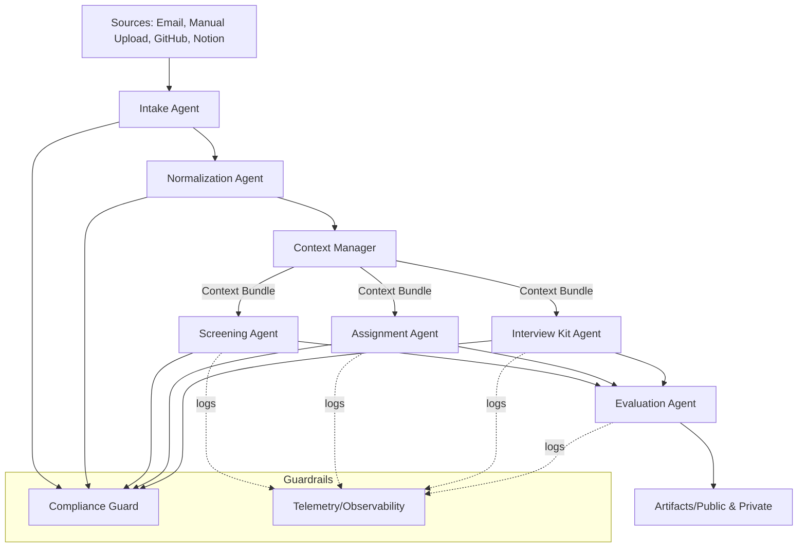
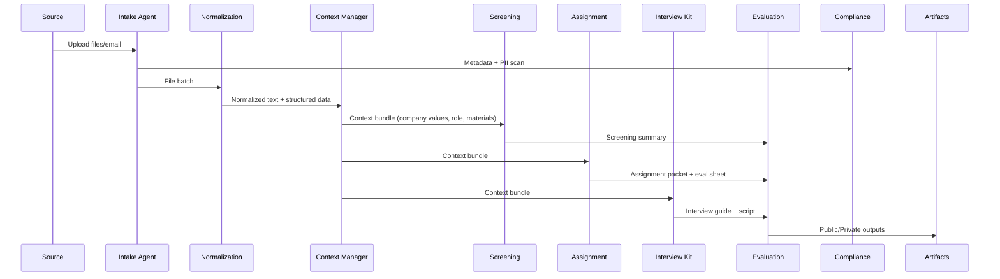

# Vendor-Agnostic, Context-Centric Multi-Agent Architecture

Purpose: Define a scalable, auditable architecture to automate the hiring lifecycle end-to-end. Designed to be portable across model providers (OpenAI, Anthropic, Google, local), vector stores, and cloud vendors.

## Core Principles
- Context-first: Agent actions are driven by curated context bundles from context/ and artifacts/.
- Modularity: Replace/upgrade models and tools without changing contracts.
- Observability & Guardrails: Every decision is logged, explainable, and policy-checked.
- Customization: Company/team values and role competencies parameterize all stages.

## Key Components (Agents & Services)
- Orchestrator (Workflow Engine): Manages stage transitions; enforces policies and checkpoints.
- Intake Agent: Collects files (email/manual/links), extracts metadata, and queues normalization.
- Normalization Agent: Converts docx/pptx/xlsx/pdf/md/images to normalized text + structured data; OCR for images.
- Context Manager: Builds context bundles (company values, role, stage history, candidate materials); supports Graph RAG.
- Screening Agent: Generates executive summary, strengths/risks, competency match.
- Assignment Agent: Selects/mints take-home assignments; produces evaluation sheets.
- Interview Kit Agent: Produces BEI + technical interview guides and scripts.
- Evaluation Agent: Aggregates stage evaluations; compiles decision rationale.
- Compliance Guard: PII detection/redaction; bias checks; legal question filters.
- Telemetry/Observability: Structured logs, traces, prompt/response archives; quality scoring.
- Admin Console (optional): Human-in-the-loop approvals and overrides.

## High-Level Data Flow

## Sequence (Single Candidate Walkthrough)

## Vendor-Agnostic Layers
- Model Abstraction: Define a simple interface (generate, embed, extract) with pluggable providers.
- Tooling Adapters: Email, storage, OCR, converters as swappable adapters.
- Storage: Object store for raw/normalized artifacts; relational/NoSQL for metadata; vector/graph store for retrieval.
- Message Bus (optional): Queueing for ingestion and long-running tasks.

## Ingestion & Normalization
- Supported Inputs: pdf, docx, md, pptx, xlsx/csv, urls (github), images (jpeg/png), eml.
- Conversions:
  - docx → md + text; pptx → pdf + text; xlsx → csv + JSON; images → OCR text; pdf → text.
- Metadata Extraction: Name, email, roles, skills, dates, institutions; confidence scores.
- PII & Compliance: Redact before storage if required; tag with sensitivity levels.

## Context Fabric & Retrieval
- Context Bundles: Deterministically constructed inputs including company values, role profile, stage history, candidate facts.
- Graph RAG: Relationships between candidate entities, experiences, skills, and role requirements.
- Caching: Stage-level cache keyed by inputs; invalidate on context update.

## Guardrails & Observability
- Policy Checks: EEO-safe language, role relevance filters, red-flag detectors.
- Quality Scoring: 1–10 scale per artifact; threshold ≥ 8.5/10.
- Audit Trail: Prompt+response, decisions, approver IDs, timestamps.

## Data Contracts (Simplified)
- CandidateMaterial
  - id, candidate_id, source, mime_type, original_uri, normalized_uri, checksum
- ContextBundle
  - company_id, role_id, values[], competencies[], stage_history[], materials[]
- ScreeningReport
  - candidate_id, summary, strengths[], risks[], competency_scores{}, value_alignment{}
- AssignmentPacket
  - role_id, instructions_uri, rubric_uri, submission_channel
- InterviewKit
  - candidate_id, sections[], questions[], scripts[]
- EvaluationSummary
  - candidate_id, stage_scores{}, decision, rationale

## Deterministic Demo Guidance
- Fix seeds, prompts, and context bundles; snapshot inputs.
- Use recorded outputs fallback if live calls fail.

## Extensibility Roadmap
- Add ATS integrations (Greenhouse/Lever) via adapter pattern.
- Add email bi-directional comms and scheduling.
- Expand performance/OKR modules leveraging same context fabric.
