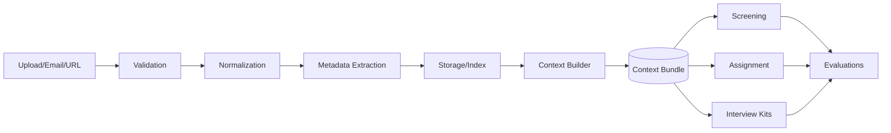

# Ingestion & Context Fabric Specification

Purpose: Define the ingestion pipeline, normalization, metadata extraction, and deterministic context bundle construction (Context Fabric) used by all agents.

## Supported Inputs & Normalization
- File Types: pdf, docx, md, pptx, xlsx/csv, images (jpeg/png), eml, URLs (GitHub/Notion)
- Converters:
  - docx → markdown + plain text
  - pptx → pdf + plain text
  - xlsx/csv → normalized CSV + JSON tables
  - images → OCR text (with language auto-detect)
  - pdf → plain text with layout-aware parser
- Validation: checksum, file size, mime-type, virus scan (stubbed in demo)

## Metadata Extraction
- Entities: person names, emails, roles, companies, dates, skills, institutions
- Strategy: rule-based + model-assisted; produce confidence scores per field
- Schema (CandidateMaterialMetadata):
  - candidate_id, source, mime_type, language, detected_entities[], confidence_map{}

## Storage & Referencing
- Raw bucket: immutable storage for uploaded artifacts
- Normalized bucket: derived text/json assets
- Metadata DB: references between raw and normalized assets; retention tags

## Context Bundle Construction (Deterministic)
- Inputs: company values, role profile, competencies, hiring stages, candidate materials, stage history
- Assembly Rules:
  - Fixed ordering: values → role → stage → candidate facts → materials excerpts
  - Size policy: prioritize high-confidence, recent, role-relevant excerpts
  - Hash-based bundle ID for caching and reproducibility
- ContextBundle Schema (simplified):
  - company_id, role_id, values[], competencies[], weights{}, stage_history[], materials[], excerpts[]

## Graph RAG Layer
- Nodes: Candidate, Role, Skill, Experience, Artifact, Stage
- Edges: hasSkill, workedAt, studiedAt, matchesCompetency, relatesToRole
- Usage: Retrieve top-k subgraphs matching current stage intent
- Update: Incremental graph updates on new materials or stage outputs

## Pipeline Orchestration


## Determinism & Caching
- Bundle ID: SHA-256 over ordered inputs + config
- Cache Policy: hit if all inputs & config unchanged; invalidate on any delta

## Configuration Example (YAML)
```yaml
company_id: acme
role_id: mid_backend
values:
  - Technical Excellence
  - Ownership
competencies:
  - Python
  - Distributed Systems
weights:
  values_alignment: 0.3
  competencies: 0.5
  experience_relevance: 0.2
excerpt_policy:
  max_tokens: 4000
  prefer_recent: true
```

## Quality Controls
- Normalization quality score (0–1)
- OCR confidence thresholds
- Entity extraction precision/recall sampling
- Periodic human spot checks

## Open Items
- Preferred OCR engine and language packs
- License constraints for converters
