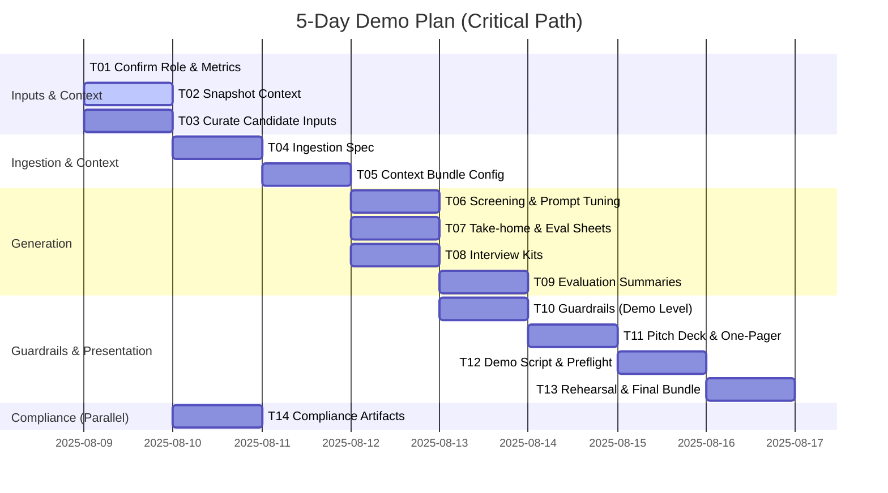

# Ordered Task Breakdown and Dependencies

Purpose: Provide a single, logically ordered list of tasks with dependencies to reach a client-ready demo quickly, while setting foundations for the full product.

## Assumptions
- We will demo for 1–2 roles and 2 candidates each.
- Existing prompts and artifacts will be reused where possible.
- Deterministic demo mode with fixed seed and context bundles.

## Workstreams
- WS1: Inputs & Context
- WS2: Ingestion & Normalization (spec-first for demo)
- WS3: Screening & Assignments
- WS4: Interview Kits
- WS5: Evaluations & Decisioning
- WS6: Observability & Guardrails (demo-level)
- WS7: Security/Compliance (policy + demo checklist)
- WS8: Presentation & Sales Collateral

## Ordered Tasks (T#)
1. T01 Confirm client target role(s), values emphasis, and demo success metrics [WS1]
2. T02 Snapshot company values, competencies, hiring stages in context/ [WS1] (dep: T01)
3. T03 Curate sample candidate inputs (PDF resumes, GitHub links, 1 md portfolio) [WS1] (dep: T01)
4. T04 Define ingestion & normalization spec (formats, converters, OCR, metadata schema) [WS2] (dep: T03)
5. T05 Build deterministic context bundle config (weights, excerpt policy) [WS1/WS2] (dep: T02,T04)
6. T06 Run screening pipeline, iterate prompts to hit quality ≥8.5 [WS3] (dep: T05)
7. T07 Select/adapt take-home assignments and generate evaluation sheets [WS3] (dep: T05)
8. T08 Generate interview kits (BEI + technical) per candidate [WS4] (dep: T05)
9. T09 Compile evaluation summaries and decision rationale [WS5] (dep: T06–T08)
10. T10 Implement demo-level guardrails: EEO filter, PII redaction policy, checklist [WS6] (dep: T06–T08)
11. T11 Prepare pitch deck outline and one-pager draft [WS8] (dep: T06–T09)
12. T12 Draft demo script and preflight checklist [WS8] (dep: T11)
13. T13 Rehearse demo; capture issues; finalize artifacts bundle [WS8] (dep: T12)
14. T14 Package compliance artifacts (security overview, retention policy, DPA template pointers) [WS7] (parallel)

## Critical Path
T01 → T02/T03 → T04 → T05 → T06/T07/T08 → T09 → T11 → T12 → T13

## RACI (Demo Edition)
- Responsible: Product/Eng lead for WS2–WS5; GTM lead for WS8; Compliance for WS7
- Accountable: Founder/Owner
- Consulted: Hiring Manager (role competencies), Legal (EEO)
- Informed: Stakeholders attending demo

## Timeline (Mermaid Gantt)

## Deliverables
- Screening reports, assignment packets + evaluation sheets, interview kits, evaluation summaries
- Pitch deck outline, one-pager, demo script, preflight checklist
- Compliance packet (overview, retention, DPA template pointers)

## Quality Gates
- Quality score ≥8.5 on generated artifacts
- Compliance checklist green (EEO-safe, PII redaction)
- Deterministic outputs for demo inputs

## Risks & Mitigations
- Model variance → fixed seed, few-shot exemplars, cache outputs
- Ingestion edge cases → limit formats for demo; document fallback
- Time compression → enforce scope discipline; parallelize WS7/WS8 where safe

## Next Actions
- Execute T02–T05 immediately; assign owners; track daily burndown
- Prepare presentation materials per 07_presentation directory
