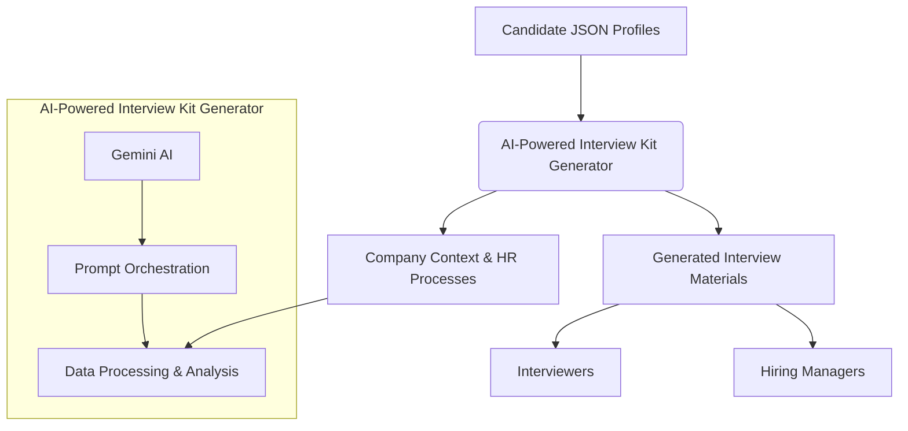

# Gefjon Growth: System Architecture

## High-Level Diagram

## Component Breakdown

*   **AI-Powered Interview Kit Generator**: The core of the system, driven by Gemini AI, responsible for processing candidate data and generating interview materials. It includes:
    *   **Gemini AI**: The large language model that performs the intelligent analysis and content generation.
    *   **Prompt Orchestration**: Manages the execution of various prompts (from `ai_docs/prompts/hiring/`) to guide the AI's output.
    *   **Data Processing & Analysis**: Extracts key insights from candidate profiles and aligns them with company values and job requirements.
*   **Company Context & HR Processes (`context/`)**: A structured knowledge base containing:
    *   **Company Information**: Mission, values, OKRs for candidate alignment.
    *   **HR Processes**: Hiring stages, evaluation processes, and best practices.
    *   **Team-Specific Context**: Information about individual teams for role matching.
*   **Generated Interview Materials (`artifacts/`)**: Stores the output of the system, including:
    *   **Candidate Contexts**: Executive briefings with core value alignment.
    *   **Detailed Interview Guides**: Tailored interview plans with specific BEI questions and technical problems.
    *   **Full Interview Scripts**: Verbatim scripts for consistent interviewer experience.
*   **Candidate JSON Profiles (`data/`)**: Raw input data containing candidate information.

## Data Flow

1.  **Data Ingestion**: Raw candidate JSON profiles are ingested from the `data/` directory.
2.  **AI Processing**: The Gemini AI, guided by prompts from `ai_docs/`, processes the candidate data. This processing is enriched by contextual information from the `context/` directory (company values, HR processes, team specifics).
3.  **Material Generation**: The AI generates personalized interview kits, including candidate contexts, interview guides, and full scripts.
4.  **Artifact Storage**: The generated interview materials are stored in the `artifacts/` directory, with a clear separation between public and private materials.
5.  **Utilization**: Interviewers and hiring managers access the generated materials to conduct consistent, thorough, and personalized candidate evaluations.

## Deployment Model

Gefjon Growth is primarily deployed as a Python application, leveraging the Gemini CLI for AI orchestration. It can be run:

*   **Locally**: For development and testing environments.
*   **Containerized (Docker)**: For consistent and isolated deployments in production environments.
*   **Integrated into CI/CD**: Workflows can be automated within CI/CD pipelines for continuous generation of interview materials.

<!-- architecture.md last updated from commit: 64fb3086b3a467d041068352872f75484f2d2a47 -->